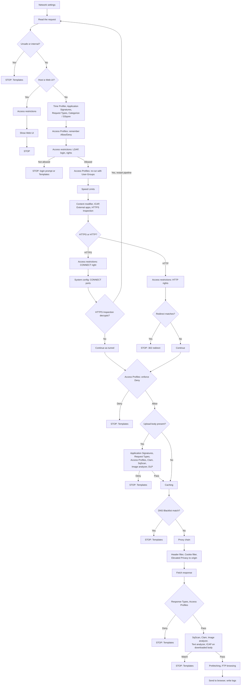

# Start here and operations — legacy site snapshot

Source: www.safesquid.com/docs/ | Retrieved: 2026-08-19 | Section: Start here (cross-referenced with Infrastructure/Policies sections in index)

---

## Architecture and request pipeline
Source URL: https://www.safesquid.com/docs/architecture.html

**This page has no equivalent in the current Mintlify site — highest priority migration candidate.** It contains the full request-processing flowchart (two versions: prose "Chart A/B" and a text flowchart) showing every Web UI section in the exact order SafeSquid calls them for a live request.

SafeSquid sits between client browsers and the Internet (or upstream proxies). Each connection is handled by a worker that processes one HTTP transaction at a time, or a CONNECT tunnel for HTTPS.

### Two configuration layers
- **Web UI (policy)** — Access restrictions, Access Profiles, filters, scanners, stored as sections in config.xml. What most administrators edit daily.
- **startup.ini (process)** — Listen fallback, threads, log levels, TLS and sync tunables. Edited on the appliance filesystem.

### Setup order (not live processing order)
1. Network settings — listen port
2. Access restrictions — who may use the proxy, including login if required
3. Access Profiles — which sites and content
4. Everything else — HTTPS Inspection, antivirus, filters, Caching (these use the people/labels from steps above)

### What happens to a live request (full call order)
1. **Network settings** — already listening on the port
2. **System configuration** — timeouts, buffers, CONNECT port range
3. **Read the request** — which site, HTTP or HTTPS (not a Web UI section)
4. If destination unsafe/internal → **Templates** block page, STOP
5. If Host is the Web UI (`safesquid.cfg`): skip Time Profiler, Application Signatures, Request Types, Categorize Web-Sites, SSqore, and Access Profiles entirely. **Access restrictions** decides console access; Access Profiles Deny cannot lock you out of the console.
6. Otherwise, normal visit: **Time Profiler → Application Signatures → Request Types → Categorize Web-Sites → SSqore** (SSqore only runs if site is still uncategorized) — these attach labels, do not block.
7. **Access Profiles** — remember Allow/Deny, do not block yet.
8. **Access restrictions** — Integrate LDAP consulted here; must log in → prompt/STOP until success; not allowed → Templates/STOP; remember HTTP/HTTPS/Bypass rights and User-Groups.
9. **Access Profiles** runs again (User-Groups from step 8 can change the match).
10. **Speed Limits** — can delay/block.
11. **Content modifier / External applications / ICAP / HTTPS Inspection / Subscription** — request-modify stage; any can finish the request locally.
12. **HTTPS or HTTP fork (never both):**
    - HTTPS: Access restrictions CONNECT right → System config CONNECT port range → HTTPS Inspection (if decrypts, restart at step 3; else continue as tunnel).
    - HTTP: Access restrictions HTTP/proxy/transparent rights → Redirect (first match → 302, STOP).
13. **Access Profiles** — now enforce Deny (unless temporary bypass) → Templates STOP. HTTPS Inspection can also block here.
14. If request has upload body: **Application Signatures → Request Types → Access Profiles → Clam antivirus → SqScan → Image analyzer → DLP** — first denial → Templates STOP. **DLP inspects this upload only, not the response that comes back.**
15. **Caching**
16. **DNS Blacklist** — matching block policy → Templates STOP.
17. **Proxy chain** — upstream or direct.
18. **Header filter → Cookie filter → Elevated Privacy → Content modifier** on headers sent to origin.
19. **Fetch the response** (cache hit or Internet).
20. **Response Types → Access Profiles** (MIME/response labels; Deny → Templates STOP).
21. **SqScan → Clam antivirus → Image analyzer → Text analyzer → ICAP** — inspect downloaded body. Match → Templates STOP. **DLP does not run here.**
22. **Prefetching** (linked HTML objects) → **FTP browsing** (ftp:// only) → Templates if needed → send to browser → write logs.

### Key clarifications
- HTTPS Inspection does not "continue" the HTTPS request — it decrypts and re-runs the inner HTTP from step 3.
- Clam antivirus and SqScan inspect both uploads and downloads. DLP inspects uploads only.
- Direct (unbuffered) downloads skip the downloaded-body scanners.
- Access restrictions entries can grant Bypass for Header filter, Cookie filter, Redirect, Content modifier, Proxy chain, Text analyzer, DNS Blacklist, antivirus, ICAP, and DLP — separate from Access Profiles temporary bypass cookies.

### Policy matching styles across sections
- **Dual allow/deny lists** — Access restrictions, Cookie filter, Header filter (list order depends on section default policy).
- **First match** — Clam antivirus, HTTPS Inspection, Redirect, DNS Blacklist block policies, several scanners.
- **All matches** — Access Profiles (secondary), Speed Limits, Content modifier, Application Signatures.
- **Last match** — DLP MIME policies (OCR uses cumulative score vs Threshold).
- **Groups** — Menu groups (Accelerators, Real time content security) contain child sections only; no policy lists of their own.

### Two worked examples from the source
1. **Blocked HTTPS visit to a social site:** Network/read/host checks pass → categorized Social → Access Profiles remembers Deny (no block yet) → Access restrictions allows HTTPS right → HTTPS branch, inspection off, stays tunneled → Access Profiles now enforces Deny → Templates block page.
2. **DLP on upload, malware on download:** user POSTs a spreadsheet → after Access Profiles Allow, upload body inspected (Clam → SqScan → Image analyzer → DLP) → DLP MIME match → Templates, stops before Caching/origin see the body. Later GET of an executable is Allowed by Access Profiles → Caching misses → SqScan/Clam match on downloaded body → Templates block. DLP does not run on that download.

### Debug headers
When System configuration → Send Debugging Headers To is CLIENT/SERVER/BOTH, SafeSquid adds identity and policy headers to inspect the pipeline live. Prefer CLIENT only on a test network. CLI: `man safesquid` (section 7).

### Request pipeline diagram (Mermaid — renders natively in Mintlify)

The source site presents this as a text-based "Chart B" flowchart. Reconstructed here as proper Mermaid syntax so it renders as an actual diagram rather than a numbered list — use this version in the migrated MDX page, keep the numbered walkthrough above as the prose explanation alongside it.

Note the loop-back at `P -->|Yes, restart pipeline| B` — this is the "HTTPS Inspection does not continue the request, it decrypts and restarts from Read the request" behavior called out explicitly in the source text. Preserve that loop-back edge; it's one of the more important mechanics on this page and easy to lose if this gets redrawn by hand later.

---

## SafeSquid daemon
Source URL: https://www.safesquid.com/docs/daemon.html

SafeSquid is the main proxy process on the appliance. Accepts client connections, applies Web UI policy, forwards allowed traffic.

### Binary and service
- Binary: `/opt/safesquid/bin/safesquid`; service user `ssquid` (group root)
- PID file: `/var/run/safesquid/safesquid.pid`
- Init script: `/etc/init.d/safesquid`; systemd unit: `/etc/systemd/system/safesquid.service`
- Options: `-f` foreground (debugging), `-v` print build version

Most tunables (listen address, thread limits, log levels) are in `/opt/safesquid/startup.ini`, not the command line.

### Service control
`/etc/init.d/safesquid {start|stop|restart|status|foreground}`

### Important paths
- Policy: `/usr/local/safesquid/security/policies/config.xml`
- Web UI: `/usr/local/safesquid/ui_root/` — browse at `http://safesquid.cfg/`
- Logs: `/var/log/safesquid/`
- Cache: `/var/cache/safesquid/`
- Startup settings: `/opt/safesquid/startup.ini`, `/opt/safesquid/setup.ini`

CLI manual after install: `man safesquid`. Background UPDATE hooks refresh application signatures, content signatures, categorisation feeds. License state managed under Subscription.

---

## Debug response headers
Source URL: https://www.safesquid.com/docs/debug-headers.html

SafeSquid can attach diagnostic info as `X-SafeSquid-*` and module-specific headers. This is the supported way to see which profiles, categories, and filters applied to a request.

### Enable/disable (System configuration → Send Debugging Headers To)
- **NONE** — production default. **CLIENT** — headers on responses to browser. **SERVER** — headers on requests to origin/upstream. **BOTH.**

Enable CLIENT or BOTH only on a test profile or management network — these headers can reveal usernames, groups, and policy decisions.

### Always included when enabled
`X-Powered-By`, `X-SafeSquid-Client-ID`, `X-SafeSquid-User`, `X-SafeSquid-User-Groups`, `X-SafeSquid-Profiles`, `X-SafeSquid-Categories`/`X-SafeSquid-Ref-Categories`, `X-SafeSquid-Request-Types`, `X-SafeSquid-Response-Types`, `X-SafeSquid-Application-Signatures`, `X-SafeSquid-Time-Profiles`.

### Module/policy headers (examples)
`X-SafeSquid-Instance`, `X-SafeSquid-Subscription`, `X-Registered-Domain`, `X-SafeSquid-Access-Policy`, `X-SafeSquid-Template`, `X-Cookie-Filter`, `X-Text-Analyzer`, `X-DNSBL-Filter`, `X-Clam-AV`, `X-Virus-Scan`, `X-DLP-Check`, `X-Image-Filter`, `X-Elevated-Privacy`, `X-URL-Cat`, `X-REF-Cat`.

Correlate `X-SafeSquid-Client-ID` with Detailed logs client_id/request_id. CLI: `man safesquid-debug-headers`.

---

## startup.ini tunables
Source URL: https://www.safesquid.com/docs/startup.html

**No equivalent structure found in current Mintlify site.** Many appliance behaviours are set in `/opt/safesquid/startup.ini` (defaults in `/opt/safesquid/default/startup.ini`), loaded before SafeSquid starts — not edited via Web UI sections. Restart required after edits.

**Two layers:** Web UI/sectionMaster = policy XML. startup.ini = process and host tunables.

### Key tunable groups
- **Listen/identity:** `LISTEN_IP`/`LISTEN_PORT` (fallback default), `HOSTNAME`/`DOMAIN`
- **Threads/memory/sockets:** `MAXTHREADS`, `MAX_FDS` (~4× threads), `STACKSIZE`, `OVERLOAD_FACTOR`, `SOCKET_TIMEOUT`, `THREAD_TIMEOUT`, `MAX_CONCURRENT`, `HEAP_MEM`, `SOCK_MEM`, `SEND_SOCKET_BUFFERS`/`RECEIVE_SOCKET_BUFFERS` (0 = no limit), `TCP_KEEPIDLE_TIME`, `TCP_KEEPINTVL_TIME`, `TCP_KEEPCNT_COUNTS`, `CLIENT_DEFER_ACCEPT`
- **CPU placement:** `LISTEN_CPUS` (default 0,1), `CPU_RESERVATION` (default 1)
- **Auth cache:** `PASSWORD_CACHE_SIZE`, `PASSWORD_CACHE_EXPIRE_TIME`
- **Logging:** `LOG_LEVEL`, `LOG_SIZE_LIMIT`, `PROCESS_OLD_LOGS`, `DATE_TIME_FORMAT`, `NATIVE_UDP_*`/`EXTENDED_UDP_*`/`CONFIG_UDP_*`
- **Master sync:** `MASTER_IP`/`MASTER_PORT`, `NEVER_SYNC`/`ALWAYS_SYNC` (default `NEVER_SYNC=cache`), `SYNCTIME`
- **Updates/HTTPS:** `UPDATE_INTVL`, `UPDATE_RETRY_DELAY`, `FORCE_SNI`, `USE_SESSION_TICKETS`, `CLIENT_CIPHERS_LIST`/`SERVER_CIPHERS_LIST` (TLS ≤1.2), `CLIENT_CIPHERS_SUITE`/`SERVER_CIPHERS_SUITE` (TLS 1.3)
- **Categorisation/identity side channels:** `DNS_CAT_ZONE` (default `.c.ssquid.in`, set to `.` to disable), `USER_IP_DB_FILE` (SQLite IP→username map, e.g. VPN clients), `OPENVPN_CLIENT_HEAD`, `IPV6_DETECT_SITE`
- **Reporting DB:** `REAL_TIME_DB_WRITE`, `STATEMENT_COUNT`, `MAX_MAIL_THRESHOLD`, `MIN_MAIL_THRESHOLD`, `KEEP_DATA`
- **Debugging:** `MALLOC_CHECKING` (glibc MALLOC_CHECK_ mode)

CLI: `man safesquid-startup`.

---

## Cloud / categorisation feeds
Source URL: https://www.safesquid.com/docs/feeds.html

SafeSquid categorises websites and refreshes signature databases using cloud services, scheduled updates, and local caches. **Valid Subscription is required** for cloud signature downloads and for Application Signatures/SSqore processing per connection.

### Pieces
- **SSqore** — CCS URL categorisation during request profiling.
- **Categorize Web-Sites** — local overrides, take precedence over cloud results for matching hosts on the hot path.
- **Application Signatures** — vendor `applications4` database plus custom rules; downloaded on UPDATE schedule, skipped when subscription expired.
- **Content Signatures** — vendor `content4.xml` plus libmagic MIME database under `/var/lib/safesquid/content_signatures/`.
- **DNS_CAT_ZONE** (startup.ini, default `.c.ssquid.in`)
- **UPDATE_INTVL / UPDATE_RETRY_DELAY** (startup.ini)

### Offline behaviour
When cloud lookups/downloads fail, SafeSquid relies on last-loaded on-disk databases and SSqore cache entries. New hosts may get no categories until connectivity returns.

### How to verify
Reports → Modules Status. Detailed logs categories/application_signatures columns. Native logs with CATEGORY enabled. CLI: `man safesquid-feeds`.

---

## Integrations
Source URL: https://www.safesquid.com/docs/integrations.html

### Directory and identity
Integrate LDAP/Active Directory; Kerberos/SSO (keytab at `/usr/local/safesquid/security/HTTP.keytab`); PAM stack `/etc/pam.d/safesquid`; IP-to-user map via `USER_IP_DB_FILE` in startup.ini.

### Scanning and adaptation
Clam antivirus (local clamd socket); SqScan (built-in in-memory scanner); ICAP (third-party REQMOD/RESPMOD); DLP; Image analyzer.

### Categorisation and feeds
SSqore (cloud CCS); Categorize Web-Sites (local overrides); Application/Content Signatures (vendor databases); Subscription (gates cloud processing).

### Network services
WCCP; Proxy chain; BIND/DNS stubs; rbldnsd-style DNS blacklists; `DNS_CAT_ZONE` in startup.ini.

### Operations
Monit `/etc/monit/conf.d/safesquid.monit`; systemd/init; logrotate `/etc/logrotate.d/safesquid`; Master sync via `MASTER_IP`/`NEVER_SYNC`/`ALWAYS_SYNC`.

CLI: `man safesquid-integrations`.

---

## Tools and Reports
Source URL: https://www.safesquid.com/docs/tools.html

Not policy sections — health-check and audit utilities.

### Reports
Dashboard/Statistics; Native/Detailed/Config logs; Active Connections, Connection Pool, DNS Cache, Password Cache, SSL Certs/Cache (live state); License/Users Info, Modules Status; LDAP Entries.

### Support utilities
Support (tarball + license refresh); `password` (encrypt passwords for policy fields, e.g. HTTPS Inspection cached cert password); Upload templates; Subscription; Categorize Web-Sites.

### CLI and files
`/etc/init.d/safesquid {start|stop|restart|status|foreground|space_clean}`. Man pages after install: `man safesquid`, `man safesquid-access`, `man safesquid-tools`, section-specific `man safesquid-*`. Policy file: `/usr/local/safesquid/security/policies/config.xml`. Process tunables: `/opt/safesquid/startup.ini`.

---

## First configuration
Source URL: https://www.safesquid.com/docs/first-configuration.html

Onboarding path for a new administrator with a working appliance. Full six-step walkthrough: (1) confirm service running, (2) confirm listen address, (3) lock down Access restrictions (Default Access Policy = Deny, add one Allow entry for your network — note: SafeSquid uses hyphen ranges, **not CIDR**), (4) point a browser and test via Detailed logs, (5) add a simple Access Profiles DENY rule and confirm block page + log reason, (6) troubleshooting workflow (note time/IP/URL → Detailed logs filter_name/filtering_reason → debug headers on test network only).

**Warning callout in source:** "Blank match fields mean 'match any.' An Allow entry with nothing filled in can open the proxy to everyone. Always set IP, Interface, or identity criteria."

Next steps suggested: Authentication (Kerberos/SSO), Integrate LDAP, HTTPS Inspection, SSqore/Categorize Web-Sites, Application Signatures, SqScan/Clam antivirus, Subscription, Architecture.

---

## Access restrictions
Source URL: https://www.safesquid.com/docs/access.html

The primary security perimeter: who may connect, whether they authenticate, which proxy features they may use, User-Groups/bypass flags.

### Core mechanics
Validated against sources/src/access.cpp — AccessSection::check(), check_and_setup(), set_auth_methods_supported().

**Default policy Deny (recommended):** walk Allow list top-down, first enabled row whose gates pass wins; if matched, walk Deny list — a Deny match revokes access; no Allow match → denied. With Default Allow, order reverses.

**Inner gate order per row:** Profiles → Interface → IP → LDAP Profiles. Any failure skips to next row.

**Security note — X-Forwarded-For:** when present, XFF **replaces** the TCP client IP for IP matching. A client sending `X-Forwarded-For: 127.0.0.1` can match localhost rows and get CONFIG (Web UI) access. **Expose the proxy only on trusted networks.**

**Two-pass authentication:** first pass (no credentials) issues a 401/407 challenge if gates pass and pamauth=TRUE or User name is set; second pass populates `connection->dn` with LDAP groups.

**Kerberos/SSO** (UI label; internal field `ntlm_authentication`) — requires `HTTP.keytab`.

**DLP bypass** requires BOTH the Allow bypassing access right AND the DLP bypass checkbox — either alone leaves DLP active.

### Rule fields
IP Address (hyphen ranges, **CIDR not supported**, uses XFF when present); Interface (listen socket); System authentication (Cache → PAM → LDAP bind, User name is regex filter); User name/Password (exact match when System auth off); LDAP Profiles (exact match against connection DN); Access rights (CONFIG, PROXY, HTTP, TRANSPARENT, CONNECT, BYPASS — independent); MAX Concurrent Connections (keyed username@client-ip).

### Recommended entry ordering
IP/interface no-auth rows first → profile-bypass rows → LDAP Profiles before PAM regex → PAM regex/entry-credential rows → profile-gated rows → PAM catch-all last → Deny exceptions paired with Allow ranges.

CLI: `man safesquid-auth` (see also Authentication page).

---

## Authentication
Source URL: https://www.safesquid.com/docs/auth.html

Three mechanisms: **Kerberos/SSO** (global, requires keytab, browser SSO), **System authentication** (per-entry, PAM then optional LDAP bind), **entry User name/Password** (fixed credentials, fine for one lab account, avoid at scale).

### Which to choose
AD domain + joined browsers → Kerberos/SSO. No SSO yet, local/LDAP passwords → System authentication. Single test account → entry credentials.

### Login order under System authentication
1. Password cache (recent success/fail)
2. PAM (`/etc/pam.d/safesquid`, typically pam_unix)
3. LDAP bind (when Integrate LDAP configured and user DN known)

Cache size/expiry: `PASSWORD_CACHE_SIZE`/`PASSWORD_CACHE_EXPIRE_TIME` in startup.ini.

### When is a login prompt shown?
When the matching entry has Kerberos/SSO enabled and Negotiate hasn't succeeded yet, OR System authentication enabled, OR User name filled in. IP/interface-only matches proceed without a prompt.

### Where authentication runs in the pipeline
After Time Profiler and Request Types, before Speed Limits and content filters.

### Common problems
Repeated prompts → check keytab/SPN/clock skew, clear Password Cache. Valid user denied → check Allow list match, LDAP Profiles, Interface, IP. PAM failures → `/etc/pam.d/safesquid`, native `pam:` lines. LDAP failures → enable LDAP log level.

---

## Access Profiles
Source URL: https://www.safesquid.com/docs/profiles.html

The central content-policy hub. Access restrictions decide who connects; Access Profiles decide what they may fetch. **Unlike Access restrictions (first match), every matching row in Default and Secondary Policies applies** — later rows see tags changed by earlier rows.

### Profile pipeline (label build order before Access Profiles runs)
1. Time Profiler → time_schedules
2. Request Types → request_types
3. Domain categorization → website_categories
4. Access Profiles → profiles + action
5. Response Types on response headers/body → updates response_types; **Access Profiles runs again**

Access restrictions User-Groups populate `user_groups` (not `profiles`) — Access Profiles' User Groups gate matches those tags.

### List order
Clear `connection->profiles`, set action=ALLOW → walk Default Policies top-down (every match applies) → walk Secondary Policies top-down (same, cumulative) → final action not Allow → block (bypass cookie may apply).

### Action values
**Allow** (default) · **Deny** (block; bypass cookie possible with Allow bypassing right) · **Do not bypass** (hard block, no cookie) · **Inherit** (keep action from earlier rows — use when a row only adds/removes tags).

### Examples
1. LAN users + category deny — Default: User Groups LAN_USERS, add "users", Inherit. Secondary: Categories Social, profiles "users", Deny.
2. Time-gated exception — Time Profiler adds LUNCH_TIME; Secondary matches Time Schedule LUNCH_TIME, Allow streaming.
3. Response-side deny — Response Types adds `executable_download`; Secondary matches, Deny (may not trigger until response headers arrive and profiles_update() runs again).

---

## Logging and troubleshooting
Source URL: https://www.safesquid.com/docs/logging.html

"When a user says 'the proxy blocked me' or 'nothing loads,' logs are how you prove what SafeSquid did." Start with Detailed logs; add Native families only for the module being debugged.

### Which log to open first
- One user/URL wrongly blocked/allowed → Detailed logs
- Login/Kerberos/PAM/LDAP → Detailed logs then Native (`security:`, `ldap:`, `pam:`)
- "It worked yesterday" → Config logs
- Unsure which profile matched → Detailed logs + debug headers on a test client

### Log families
- **Native** — internal diagnostics from `putlog()`, tagged lines (e.g. `security:`, `ldap:`, `cache:`). File: `/var/log/safesquid/native/safesquid.log`
- **Detailed** — one row per client transaction (tab-separated): username, URL, status, filter_name, filtering_reason, profiles, categories, user groups. File: `/var/log/safesquid/extended/extended.log`
- **Config** — who changed what: section, action, arguments, URL, reason. File: `/var/log/safesquid/config/config.log`
- **Performance** — resource/throughput stats. File: `/var/log/safesquid/performance/performance.log`
- **Syslog** — native messages also go to syslog in foreground mode; init script ident `safesquid.init`.

### LOG_LEVEL bitmask (startup.ini)
SECURITY (8388608), LDAP (4), PROFILES (67108864), REQUEST (1), NETWORK (2), WARN (16777216), ERROR (33554432), DEBUG (134217728, very verbose — enable only temporarily; default excludes DEBUG at 134217727; full debug = 268435455). Other families: HEADER, COOKIE, REDIRECT, REWRITE, CACHE, FORWARD, SSL, CATEGORY, ANTIVIRUS, ICAP, MODULE.

**Warning:** do not leave full DEBUG enabled in production — grows disks quickly, harder to read.

### Detailed log key columns
client_id, request_id (correlate lines), client_ip, username, interface, method, url, status, size, filter_name, filtering_reason, profiles, user_groups, categories, request_profiles, application_signatures, bypassed.

### Rotation/remote
`LOG_SIZE_LIMIT` (default 1G), `PROCESS_OLD_LOGS` (0 delete, 1 compress, 2 close only — appliance default), UDP forwarding via `NATIVE_UDP_*`/`EXTENDED_UDP_*`/`CONFIG_UDP_*`.

### Policy trace
Enable **Trace Entry** on a single Web UI policy row to log when it's evaluated — without turning on global DEBUG.

### Troubleshooting workflow
Note time/IP/username/URL → search Detailed logs for filter_name/filtering_reason → enable matching native family (usually SECURITY), reproduce once → auth issues: check `security:`/`ldap:` → surprise changes: check Config logs same window → turn DEBUG and CLIENT debug headers off when finished.
