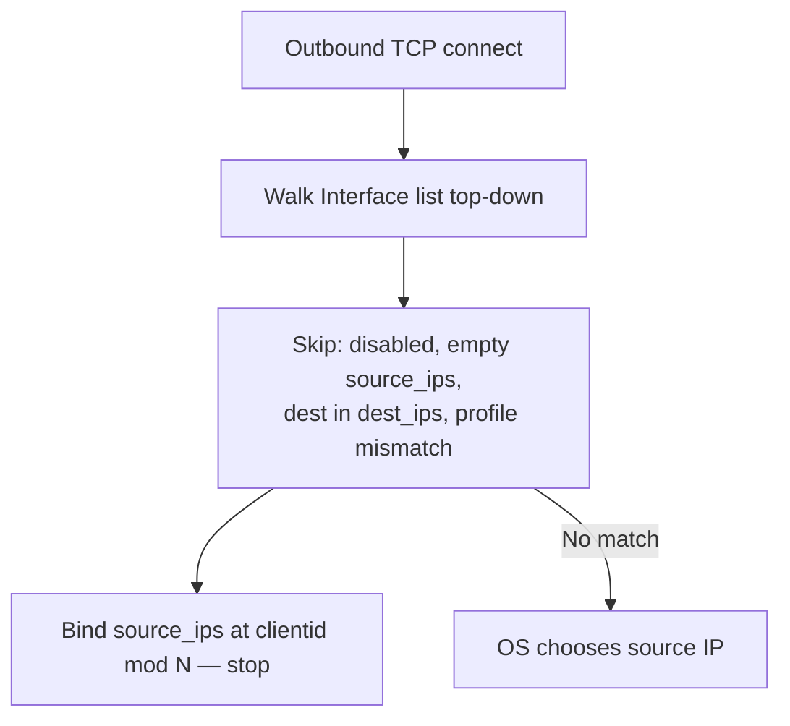
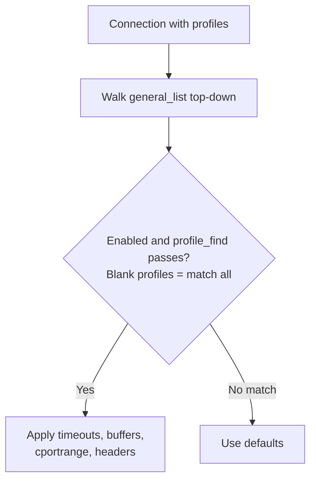
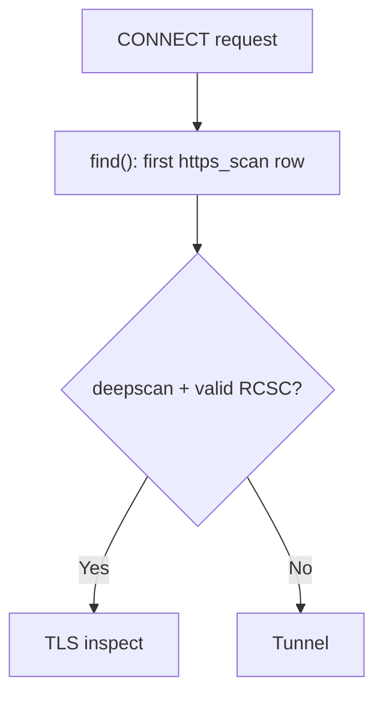

# Infrastructure and access — legacy site snapshot

Source: www.safesquid.com/docs/ | Retrieved: 2026-08-19 | Section: Infrastructure and access

---

## Network settings
Source URL: https://www.safesquid.com/docs/network.html

The Network section (safesquid-network(5)) defines client listen sockets and outbound source IP selection for origin connections.

### Core mechanics
Validated against sources/src/network.cpp — NetworkSection::check(), interface_select(), Interface constructor.

**Listen — startup bind.** Every enabled Listen row with port != -1 binds at startup. If no enabled row matches startup.ini LISTEN_IP and LISTEN_PORT, an additional fallback bind runs on those defaults. Restart required after Listen changes.

**Interface — first match wins.** Outbound walks Interface rows top-down: skip disabled; skip empty Source IP after load; skip when destination is in Excluded Destination IPs; require profile_find() (connection profiles plus hostname/service tags). First match picks source_ips[clientid % N].

**Source IP on host only.** Non-local Source IPs are dropped silently at load. If all IPs are dropped, the row is skipped at runtime.

### Listen fields
- **IP / Port** — Bind address and client port. Blank IP = dual-stack any when IPv6 available.
- **Bindings** — SSL_TRANSPARENT, CAPTIVE_PORTAL implemented; SSL_AUTHENTICATION / SSL_BRIDGE have no effect.

### Interface fields
- **Profiles** — Blank matches all. Typical tag: ALTERNATE OUTBOUND IP.
- **Excluded Destination IPs** — Hyphen ranges; destination in list skips row (CIDR not supported).
- **Source IP** — Comma-separated local addresses; only host IPs kept; rotated by client id.

### Outbound interface selection

### Examples
1. **Single proxy port** — Listen enabled, blank IP, port 8080. Result: all interfaces accept on 8080 after restart; Access controls who may connect.
2. **Excluded destination** — Source IP 10.0.0.5, dest_ips 10.0.0.0-10.255.255.255. Result: outbound to 10.x skips row; public destinations may match and bind 10.0.0.5.
3. **Source IP not on host** — Source IP 198.51.100.99 not assigned to appliance. Result: IP ignored at load; row skipped — no outbound bind from this row.

### How to verify
Restart after Listen changes. `curl -x http://APPLIANCE:8080 http://example.com/`. Enable NETWORK logs; confirm bind and interface_select lines. Match listen socket in Access Interface for CONFIG vs PROXY tests.

---

## System configuration (General)
Source URL: https://www.safesquid.com/docs/general.html

The General section (safesquid-general(5)) sets global hostname, connection pool, debug headers, and per-connection compression/buffering policy rows.

### Core mechanics
Validated against sources/src/global.cpp — GeneralSection::find(), cportrange_check(), compressin_get(), bufferchunked_get().

**First matching policy row.** Each getter walks Compression and buffering policies top-down. First enabled row whose profiles pass profile_find() wins. Empty profiles match all. No match → built-in defaults.

**CONNECT ports (cportrange).** cportrange_check() applies only when a row matched. Port must be in the row list or CONNECT is blocked. When no row matched, all CONNECT ports are allowed (unless blocked elsewhere).

**Compression and chunked buffering.** compressin zero → identity-only upstream Accept-Encoding; non-zero → full encodings (TRUE and AUTO behave the same today). bufferchunked: 0 never, 2 always, 1 encoded-only when Content-Encoding is identity.

### General policy row selection

### Global fields
- **Proxy hostname** — Identity in Via and Kerberos scripts; blank uses system hostname.
- **Connection pool size / timeout** — Resizes upstream serverpool immediately on config update.
- **Send Debugging Headers To** — CLIENT, SERVER, BOTH, or NONE — see Debug headers.
- **Dynamic Categorization** — Referer categories applied to dependency requests.

### Examples
1. **CONNECT HTTPS only** — First matching row cportrange 443 only. Result: CONNECT to 443 allowed; other ports blocked with security-restrictions template.
2. **Profile-specific buffering** — Row 1 profiles text-filter, maxdbuffer 128K above catch-all maxdbuffer 0. Result: text-filter connections buffer up to 128K; others stream without full download buffer.
3. **No row match** — All policy rows disabled for connection. Result: CONNECT port check allows any port; default timeouts apply.

### How to verify
Test CONNECT to allowed and blocked ports. Enable Trace Entry on a policy row; check native logs. Debug headers CLIENT in browser devtools when enabled.

---

## Integrate LDAP
Source URL: https://www.safesquid.com/docs/ldap.html

The LDAP section (safesquid-ldap(5)) syncs directory users and groups into memory for Access LDAP Profiles and LDAP bind authentication.

### Core mechanics
Validated against sources/src/ldap_profile.cpp — init_routine_unlocked(), set_default_domain(), set_dn(), do_auth().

**Full sync — all valid servers.** Each enabled valid LDAP servers row binds and runs paged to_cache() in one update cycle. Maps accumulate entries from every successful server.

**Default @domain.** First valid row's Ldap Domain becomes default via set_default_domain(). Logins without @ get @domain appended and uppercased for map keys.

**Auth — first matching server.** do_auth() walks servers until domain (and optional base DN) match; stops on bind success or invalid credentials.

**Code quirk:** `ldapgroupfilter` is stored in config but not used in search code — groups come from Group Identifier attributes and DN OUs.

### Examples
1. **Active Directory** — domain corp.example.com, login attributes sAMAccountName, group identifier memberOf. Result: cache keys like JDOE@CORP.EXAMPLE.COM; group strings for LDAP Profiles after sync.
2. **Bare username** — default domain corp.example.com; user logs in "jane". Result: lookup JANE@CORP.EXAMPLE.COM in maps.
3. **Section off** — global Enabled off. Result: maps cleared; auth returns incomplete; LDAP Profiles never match.

### How to verify
Open LDAP Entries after cache thread runs. Enable LDAP + SECURITY logs. Sign in; confirm LDAP profile application in Detailed logs.

---

## HTTPS Inspection (SSL Cert)
Source URL: https://www.safesquid.com/docs/sslcert.html

HTTPS Inspection controls CONNECT handling and optional TLS man-in-the-middle (Deep Scan) for HTTP inside HTTPS. Requires a valid RCSC (root CA) loaded from activation; the policy engine returns no policy when the section is off or misconfigured.

**Note:** the live page has character-encoding corruption (em-dashes and quotes render as garbled sequences like "ΓÇö"). Content below has been cleaned during ingestion — verify against the source XML/man page if exact wording matters for a specific field.

### Core mechanics
Source: sources/src/sslcert.cpp — SSLcertSection::find(), check(), deep_scan_check().

- **Deep Scan (MITM):** if enabled for the connection, SafeSquid performs full man-in-the-middle interception by generating a forged, trusted certificate for the client using the defined Root CA.
- **Upstream Validation:** SafeSquid builds an OpenSSL X509_STORE and validates the upstream origin server's certificate against known CA authorities.
- **Strict Error Handling:** handlers validate domain mismatches, missing certificates, and maximum allowable OpenSSL error levels. Failures drop the connection to prevent MITM attacks from malicious servers.

### CONNECT policy flow

### Schema fields
**Global:** Enabled — master switch. Off: policy engine returns NULL, Deep Scan never enables.

**Rule-based (per connection):**
- Enabled, Comment, Profiles (first matching enabled row wins, negated tags `!profile` supported)
- **DeepScan** — TRUE: client TLS handshake, decrypt HTTP for inspection. FALSE: tunnel without decrypting (use for non-HTTP TLS — Drive, Subversion, WinSCP).
- **Block Access to Sites without SSL Certificate** — default TRUE, blocks if upstream presents no cert.
- **Acceptable Errors in SSL Verification** — max OpenSSL error tolerated; 0 is strictest.
- **Block domain mismatch** — default TRUE; when FALSE, hostname/IP mismatch errors are explicitly allowed.

### Code quirks — Setup subsection unused at runtime
Setup rows (Proxy Host, Encrypted Password, SSL Cache Store Size) are loaded into configuration but **not used by current SSL setup code.** The root CA loads using the global activation password only, not Setup row passphrases. Cache sizing is internal and not applied from this field. Treat Setup as operator reference until wired in code — use activation for the RCSC passphrase and SSL Certs/Cache for certificate files.

### Examples
1. **Inspect general web browsing** — Enabled, valid RCSC, Profiles blank, DeepScan TRUE, strict certificate checks, clients trust RCSC public cert. Result: HTTP inside HTTPS decrypted and filtered normally.
2. **Tunnel non-HTTP TLS** (Drive, Git, RDP-over-TLS) — Row A (top) profiles for known non-HTTP apps, DeepScan FALSE; Row B blank profiles, DeepScan TRUE. Result: matching non-HTTP CONNECT tunnels without decryption; general HTTPS still inspected.
3. **Allow self-signed upstream with strict client trust** — relaxed error level + domain mismatch FALSE for internal host profiles, strict for public sites.

### Recommended practice
Deploy RCSC to all managed clients before enabling Deep Scan broadly. Use DeepScan FALSE rows for non-HTTP-over-TLS protocols. Do not rely on Setup Encrypted Password for RCSC unlock — use the activation passphrase.

### How to verify
CONNECT to an HTTPS site; confirm filters see decrypted content when DeepScan is TRUE. Enable SSL log level. Check Detailed logs for CONNECT handling and upstream certificate errors. Refresh SSL Certs/Cache after RCSC or trusted-CA changes.

---

## Forward proxy
Source URL: https://www.safesquid.com/docs/forward.html

The Forward section (safesquid-forward(5)) configures upstream proxy routing, enabling SafeSquid to chain requests to parents, siblings, or Cache Array Routing Protocol (CARP) clusters.

**Note:** source page has character-encoding corruption; cleaned below.

### Core mechanics
Source: sources/src/forward.cpp — CARP hash, blank Proxy stop, ICP peer selection.

- **CARP Hashing:** deterministic 32-bit bitwise rotation hash combining requested URL and peer hostname. Highest hash score wins.
- **Self-Resolution (Loop Prevention):** if SafeSquid's own hostname generates the highest CARP hash, it resolves the request directly instead of forwarding.
- **Cache Coordination:** forwarding to another CARP array member sets CONNECTION_NOCACHE so the object caches only on the designated owner.

### Important fields
- **Proxy** — upstream hostname/IP. Blank on a matching row stops candidate collection without forwarding (place intentional "direct" stop rows carefully). Rows matching this instance's own hostname are skipped.
- **Type** — HTTP, SOCKS4/5, or CONNECT tunnel. Port defaults to 3128 (HTTP/SOCKS) or 443 (CONNECT) when Port is 0.
- **Applies to** — protocol flags HTTP/FTP/CONNECT.
- **ICP peer type / port** — when global CARP is off: NONE = fixed priority 1; PARENT forwards on ICP miss; SIBLING forwards only on ICP HIT.

### Processing order
1. If forwarding disabled or Access Bypass → Forward is set, skip.
2. Walk rows top to bottom; add each enabled matching row with non-self Proxy to candidates.
3. Blank Proxy on a matching row stops collection immediately.
4. CONNECT requests skip ICP/CARP selection used for plain HTTP.
5. Select one peer: CARP hash, ICP priorities, or random tie-break.

### Examples
1. **All HTTP through one upstream** — Proxy upstream.example.com, Port 3128, Type HTTP, Applies to HTTP+CONNECT.
2. **Profile-specific upstream with direct stop** — Row 1 Profiles "USE PARENT PROXY" → parent.internal:8080; Row 2 blank profiles, blank Proxy → direct.
3. **CARP among two peers** — two rows, different hosts, CARP on. For each URL, CARP picks one peer or handles locally if this proxy wins the hash.

### How to verify
Enable FORWARD log level. Confirm upstream sees traffic from SafeSquid. Enable Trace Entry on one row to see candidate collection.

---

## FTP browsing
Source URL: https://www.safesquid.com/docs/ftp.html

The FTP section (safesquid-ftp(5)) configures global FTP-over-HTTP gateway behaviour. No policy list — only global fields.

### Core mechanics
Validated against sources/src/proto_ftp.cpp and FtpSection in sources/src/global.cpp.

- **Anonymous credentials** — when client sends no username, SafeSquid substitutes configured Username/Password before USER/PASS.
- **Passive mode** — on: PASV data connections. Off: PORT/active with local bind on the same interface as the control connection.
- **Sort defaults** — directory HTML listings use Sort field/order when client omits CGI sort parameters.

### Global fields
Passive mode, Timeout (0 uses OS TCP keepalive interval), Username/Password (anonymous defaults), Sort order/field.

### Examples
1. **Anonymous behind firewall** — passive on, anonlogin anonymous. Result: PASV data channel; listing/download without client credentials.
2. **Access denies FTP** — Access lacks proxy/FTP right for client. Result: denied before FTP settings apply.

### How to verify
Open an ftp:// URL through the proxy. Toggle passive if LIST works but RETR fails. Check Detailed logs and REQUEST native logs.

---

## WCCP
Source URL: https://www.safesquid.com/docs/wccp.html

WCCP works with WCCP routers to redirect traffic to SafeSquid without setting a proxy in each browser.

**Globals/subsections:** Enabled; WCCP policies. All enabled WCCP policies can be used for router communication. Coordinate service group IDs and passwords with the network team.

See also: Network settings, Integrations, Architecture, Logging.

---

## Subscription
Source URL: https://www.safesquid.com/docs/subscription.html

Subscription is a Web UI application for license status and activation key management. It does **not** define proxy policy rows; it controls whether the appliance considers the subscription valid and whether update feeds and signature modules can run.

### What you can do here
View current subscription/license info (also under Reports → License/Users Info). Upload an activation key file when renewing or registering.

### How subscription affects the proxy
- On each request, SafeSquid sets or clears `SUBSCRIPTION_EXPIRED` on the connection from subscription validity checks.
- When expired, **Application Signatures processing is skipped entirely** for that connection.
- Background subscription accounting refreshes entitlement and drives scheduled update hooks (signatures, categorisation feeds, trusted CA updates).
- **An expired subscription is not the same as Access restrictions DENY** — users may still connect while signature-dependent labelling and some update paths stop.

### Examples
1. **Renew after expiry** — upload new activation key, wait for refresh, confirm License/Users Info shows valid dates and application signature updates resume.

### How to verify
Reports → License/Users Info and Modules Status. Native SECURITY logs for `subscription: expired` on test requests.

---

## SSqore
Source URL: https://www.safesquid.com/docs/ssqore.html

**This page has no equivalent anywhere in the current Mintlify documentation — confirm with the product team whether SSqore is still an active feature before treating this as current.**

SSqore categorizes websites by the likely nature of their content. It queries SafeSquid's Content Categorisation Service (CCS) and adds category names to the connection so Access Profiles and filters can match on them. Globals only — no policy list.

### Global settings
- **Enabled** — when off, URL categorization is skipped entirely and no CCS categories are added.
- **Heuristic** — **code quirk: stored in configuration but NOT read by the runtime module.** Toggling it does not change behavior today. Treat as a stored placeholder, not a working control.

### How categorization works
During request profiling, SSqore resolves the request host (and referer host) against CCS. Returned categories merge into `website_categories`/connection profiles used by Access Profiles. Results cache under `/var/lib/safesquid/ssqore/cache`. Uncategorized URLs may be queued for later retry.

### Recommended practice
Keep SSqore enabled when Access Profiles depend on cloud categories. Do not rely on Heuristic until wired in code. Monitor subscription and feed status.

### How to verify
Enable CATEGORY log level; look for `SSqoreSection::` and category assignment lines. Open Detailed logs for a browsed URL; confirm category tags. Test an Access Profile matching a known SSqore category.

See also: Cloud/categorisation feeds, Access Profiles, Categorize Web-Sites, Subscription, Logging.
