# Policies, filtering, performance, and security scanners — legacy site snapshot

Source: www.safesquid.com/docs/ | Retrieved: 2026-08-19

---

## Speed Limits
Source URL: https://www.safesquid.com/docs/limits.html

Source: sources/src/limits.cpp — token-bucket rate, quota counters, request cap enforcement.

- **Bandwidth shaping** — token-bucket per LimitGroup; `downloadrate` throttles globally across the group.
- **Quota tracking** — `maxdbytes`/`maxubytes`/`maxrequests` updated incrementally; cached payloads can bypass quota deductions (LIMIT_CACHE).
- **Enforcement** — `maxrequests` violation → instant block, HTTP 429, `LMS_TOO_MANY_REQUESTS`, `TCP_DENIED` log.

**Code quirk: `Action` field (Allow/Deny) is stored in config but NOT read by limits code** — limits apply purely on numeric thresholds regardless of Action.

### Limit enforcement flow

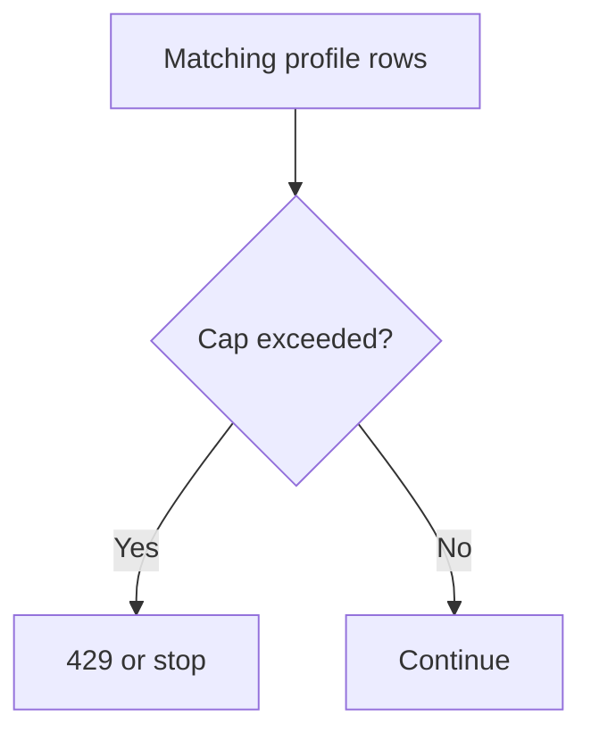

### How the list processes
Every enabled row matching profiles is evaluated (no first-match stop). Request limit exceeded → HTTP 429 + row Template. Download/upload — remaining bytes are the tightest cap among matching rows. Download rate — lowest non-zero rate among matching rows wins. Flags: "Limit cache transfers" (count cached responses), "Per-request limit" (each request gets full quota, no accumulation), "Group limit" (share rate bucket across matching connections). Counters reset on a ~10s window.

### Examples
1. Guest cap: Profiles Guest, Download limit 50MB, rate 512000 B/s → guests capped at ~500KB/s and 50MB per window.
2. Request flood cap: maxrequests 100, template too-many-requests → HTTP 429 after 100 in window.
3. Per-request 5MB: Download limit 5MB + "Per-request limit" flag → cap applies per request, not shared window.

---

## Request Types
Source URL: https://www.safesquid.com/docs/reqProfiles.html

Labels HTTP requests with tags consumed by Access Profiles and other filters — **does not block traffic itself.**

### Processing order
1. Application Signatures (unless subscription expired)
2. Domains and Urls — substring match (tab-prefixed host+path, **not regex**); every matching row applies
3. Request Types rows — all gates must pass (reqprofiles → method → protocol → mime → port → post size → file → host → headers); every match applies

**Code quirks:** `urlcommand` field is parsed in config but not evaluated — use Protocol or File instead. Post Data Size runtime logic inverts UI labels (uses Content-Length only) — treat as experimental.

**Smart TLD:** when Host Name regex misses and Smart TLD is on, the same regex retries against the site name (host without public suffix).

### Row gate order

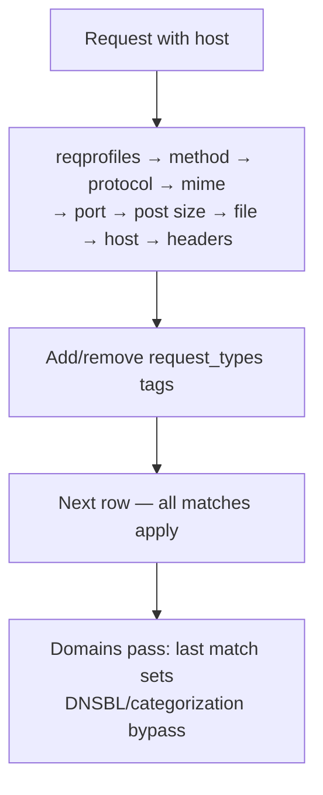

### Examples
Uncachable query URLs (File regex `cgi-bin|\?`, add uncachable_req); CONNECT method tagging; Domains bypass DNSBL and Categorization for a partner host.

---

## Response Types
Source URL: https://www.safesquid.com/docs/respProfiles.html

Labels HTTP responses for Access Profiles and content filters — does not block by itself. **Two-pass evaluation:** on response headers (no body buffer), then again on buffered body with detected MIME/size. Every matching enabled row applies — no first-match stop.

MIME regex tries Content-Type header then detected body type. Extension regex tries URL (query stripped) then attachment filename. Content size tests apply only when non-zero.

**Code quirk:** multipart/byterange UI toggle has no effect in code.

### Row gate order

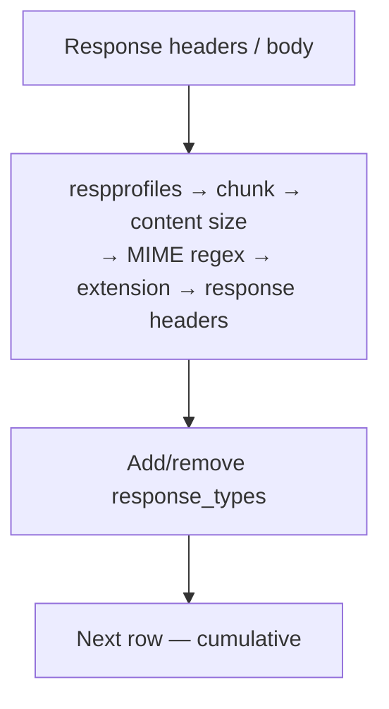

---

## Time Profiler
Source URL: https://www.safesquid.com/docs/timeProfiles.html

Tags connections with time labels from the appliance local clock; Access Profiles Time Schedule matches these tags.

**Code quirk: Weekday active flag is stored but not checked** — weekday bounds always apply. Template default of 0 alone matches Sunday only — set explicit ranges.

**Match modes:** ABSOLUTE (single start/end timestamp) or ALL RANGES (current month + day-of-month + time-of-day must each fall in window).

### Match flow

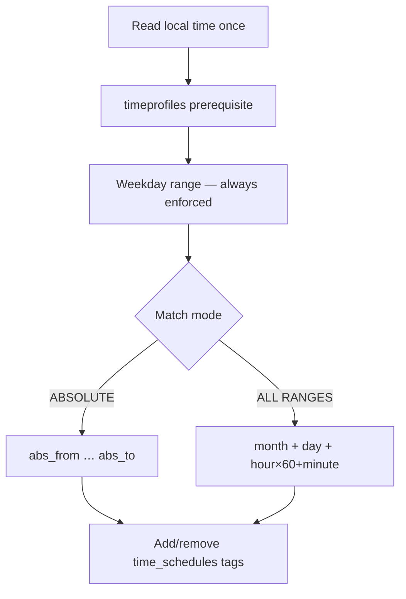

---

## Templates
Source URL: https://www.safesquid.com/docs/templates.html

Configures block pages and error bodies. Resolution: walk rows top-down, skip disabled/empty Name, Profiles gate must pass, case-insensitive Name match — first match wins; else built-in `PAGES[]` defaults; else log undefined template error.

**FILE** — preloaded at config load. **EXECUTABLE** — runs at send time, stdout must be a valid HTTP response (requires `ENABLE_EXTERNAL`). `send_block_template()` adds `X-SafeSquid-Template` header.

### Template resolution

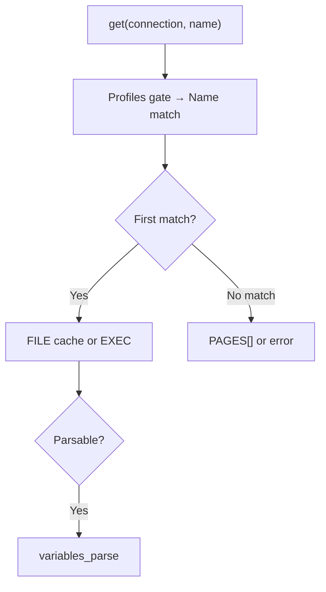

---

## Application Signatures
Source URL: https://www.safesquid.com/docs/applicationSignatures.html

Tags requests with application strings (Webmail, BitTorrent, Chrome, etc.) via exact string compare, especially by Access Profiles (Request Types field) and Request Types.

If `SUBSCRIPTION_EXPIRED` is set, **processing is skipped entirely** for that connection.

**Code quirk: global Enabled switch is stored but request-time matching only checks each rule's own Enabled flag** — global off does NOT stop the signature loop by itself; per-rule Enabled off does.

Rows walked top-to-bottom, no first-match stop — every enabled rule whose tests pass may add/remove tags. Tags from earlier rules in the same pass are visible to later rules via the "Application signatures" prerequisite field. `urlcommand` fields are loaded but not evaluated — leave blank.

---

## Content Signatures
Source URL: https://www.safesquid.com/docs/contentSignatures.html

Maintains the content-signature database and libmagic MIME detection used across SafeSquid — helps identify actual file types past deceptive extensions. **For live response labelling by MIME/extension, use Response Types instead.**

**Major code quirk: `content_signatures_update()` and `content_signatures_update_post()` are empty stubs — list rows do NOT add or remove connection tags at request time in current code.** Custom rows still merge into `content4.xml` and matter for database maintenance, autocomplete in other sections (e.g. DLP), and libmagic setup — but not live traffic tagging.

Legacy UI options (Transfer Encoding Chunk, multipart byte-range, Trace Entry) are not bound to any template field here — no effect (same labels on Response Types DO affect matching there).

---

## Suggested Profiles
Source URL: https://www.safesquid.com/docs/buitins.html

**UI-only naming aid — no C++ section loads this configuration at runtime.** Shows built-in profile label suggestions for the Cookie filtering profile-tag picker. Does not enforce policy, add connection tags, or appear in the request pipeline. To actually enforce cookie behavior, configure Cookie filter and reference the same tag names in Access Profiles `cookie_profiles`.

---

## Categorize Web-Sites
Source URL: https://www.safesquid.com/docs/category-editor.html

Local website category override tool. Categories assigned here feed in-memory categorisation alongside cloud feeds (SSqore/DNS zone) — **local overrides take precedence for matching hosts on the hot path.** Subsections: search/edit/bulk-upload/refresh local category assignments. Request Types Domains/Urls can set Bypass DNSBL and Categorization to skip DNS Blacklist/categorisation for specific hosts.

---

## Cookie filter
Source URL: https://www.safesquid.com/docs/cookies-filtering.html

Source: sources/src/cookies.cpp — dual-list Allow/Deny walk, **last match in pass wins** (unlike most SafeSquid lists which use first-match).

**Dual-list engine:** if global Policy is Deny, walk Allow first then Deny; if Allow, walk Deny first then Allow. Within each list pass, the last matching row sets the outcome.

**Time-based evaluation quirk:** expiry ranges are checked against the cookie's literal `Expires` attribute, not the proxy's system time.

**Major runtime limitation: domain/path/expiry filters on a row apply only when Direction is IN (Set-Cookie). The live request/response hooks call filtering with outbound (Cookie) direction only — Set-Cookie rows are configured for server→browser cookies but are NOT applied by the active filter path in this codebase.**

Matching cookie fields are silently stripped (`HEADER_FILTERED`). Order matters — because last match wins, a lower row can override an upper row in the same list.

---

## Header filter
Source URL: https://www.safesquid.com/docs/header-filtering.html

Source: sources/src/header.cpp. Global Allow/Deny switch; **first match in list pass wins** (contrast with Cookie filter's last-match). If Policy Deny: walk Allow then Deny. If Allow: walk Deny then Allow (second pass can restore what first pass removed).

**Insert list** is independent of the filter list — injects new headers with variable expansion (e.g. `$_USERNAME_$`). Both Type and Value must be non-empty for Insert to apply. On Allow/Deny rows, Type is a regex on header name; on Insert rows, Type is the literal header name to add.

---

## Text analyzer
Source URL: https://www.safesquid.com/docs/keywords-filtering.html

Source: sources/src/keywords.cpp. **Cumulative scoring engine** — unlike first-match modules, evaluates ALL enabled matching rules; each keyword regex match adds its Score to a running total. Early exit once threshold breached (saves CPU). Block when total ≥ Threshold, HTTP 451, `POLICY_DO_NOT_BYPASS`.

Only scans payloads whose Content-Type matches the row's Mime type regex (blank defaults to text family). Rows with Score 0 or blank Keyword are never applied. Negative scores reduce the running total.

---

## DNS Blacklist
Source URL: https://www.safesquid.com/docs/dnsbl.html

Source: sources/src/dnsbl.cpp. Runs a **sequence of heuristic checks** on the Host header before/alongside blocklist checks: host-name length validation, homograph detection, unique-host-count under an uncategorized registered domain — all run BEFORE policy rows when website categories are empty.

Processing order: category check (first match, no DNS) → request-type check (first match, no DNS) → DNSBL check (append `DNSBL Domain` suffix, resolve A record, compare to Blocked IPs — **failed lookups are treated as 0.0.0.0; include that address to block lookup failures**) → IP/GeoIP check (host A record, reverse-DNSBL answer, GeoIP country vs Threatful Countries).

Entire module is skipped if the connection carries the DNSBL bypass right, or the request targets the SafeSquid interface itself.

### Check order

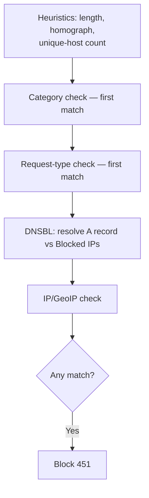

---

## URL redirect
Source URL: https://www.safesquid.com/docs/redirect.html

Source: sources/src/redirect.cpp. **First-match, top-to-bottom, PCRE with capture groups** (`$1`, `$2` in the Redirect field). If `send302` is false, SafeSquid internally fetches the rewritten URL and serves it transparently; if true, returns HTTP 302 to the client.

`Applies to`: URL (request), LOCATION HEADER (response Location rewriting), or BOTH — tested as two separate passes. Options bitmask: decode URL before match, encode/decode path after substitution.

### First-match flow

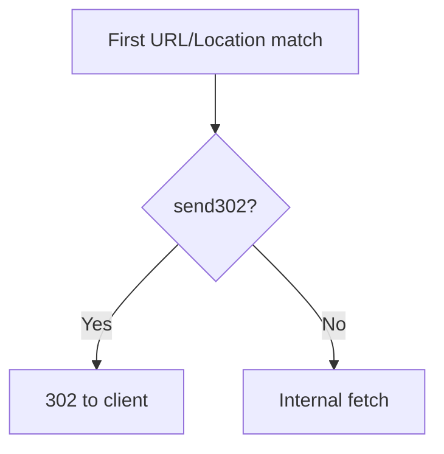

---

## Content modifier (Rewrite)
Source URL: https://www.safesquid.com/docs/rewrite.html

Source: sources/modules/rewrite/rewrite.cpp. PCRE search-and-replace on headers/body. Four hook points: `REWRITE_CLIENT` (request headers), `REWRITE_SERVER` (response headers), `REWRITE_BODY` (response body, MIME-gated), `REWRITE_POST` (upload body). First applicable row per pass; body rewrites require a matching MIME regex (empty matches any body when other gates pass).

Example use: injecting a SafeSearch preference cookie for YouTube, stripping the Server response banner, HTML body substitution.

---

## Elevated privacy
Source URL: https://www.safesquid.com/docs/elevated.html

Source: sources/modules/elevated/elevated.cpp. **First match wins** — on each request/response header pass, the first matching enabled row sets the privacy level for the connection.

### Privacy levels (cumulative)
- **NOT-REQUIRED** — bypass, no stripping.
- **LOW** — drop third-party Cookie/Set-Cookie.
- **STANDARD** — LOW + remove Referer and Origin.
- **PARANOID** — STANDARD + remove User-Agent (**may break browser-variant detection on some sites**).

Logged as `Elevated-Privacy` filter name; debug header `X-Elevated-Privacy` when enabled. Recommendation: start with LOW/STANDARD before PARANOID.

---

## External applications
Source URL: https://www.safesquid.com/docs/external.html

Source: sources/src/external.cpp. Pipes HTTP payloads (Request Header, Response Header, or Body) to an external script/binary via stdin (Pipe) or a temp file (File, path appended as last argument).

**Exit code logic is the core mechanic:** exit 0 → stdout entirely replaces the original payload, walk stops. Non-zero exit → original payload preserved, but stdout may still be parsed for intelligence (e.g. `X-username`, `X-profiles` for auth).

`Run once per session = Yes` → row only runs on the external-auth pass, not normal req/resp mod; prevents re-auth loops via `SESSION_EXTERNALONCE`. `EXTERNAL_AUTH` connections only invoke parsers with Per Session TRUE.

---

## Caching
Source URL: https://www.safesquid.com/docs/cache.html

Source: sources/src/cache.cpp. Refresh rows: first-match wins, sets min/max age, validate, and cachable flag. `cachable=FALSE` sets `CACHE_INVALID` unless `CACHE_FORCE`.

**Major code quirk: disk store is hard-disabled.** `select_store()` always returns NULL regardless of Store row configuration — new objects are **memory-only** in current builds.

**Violate RFC:** objects stored despite no-cache/no-store headers get `CACHE_VIOLATION`. When "Violate RFC" is off, reads of violation objects return NULL (not served); when on, they may be served.

### Cache read path

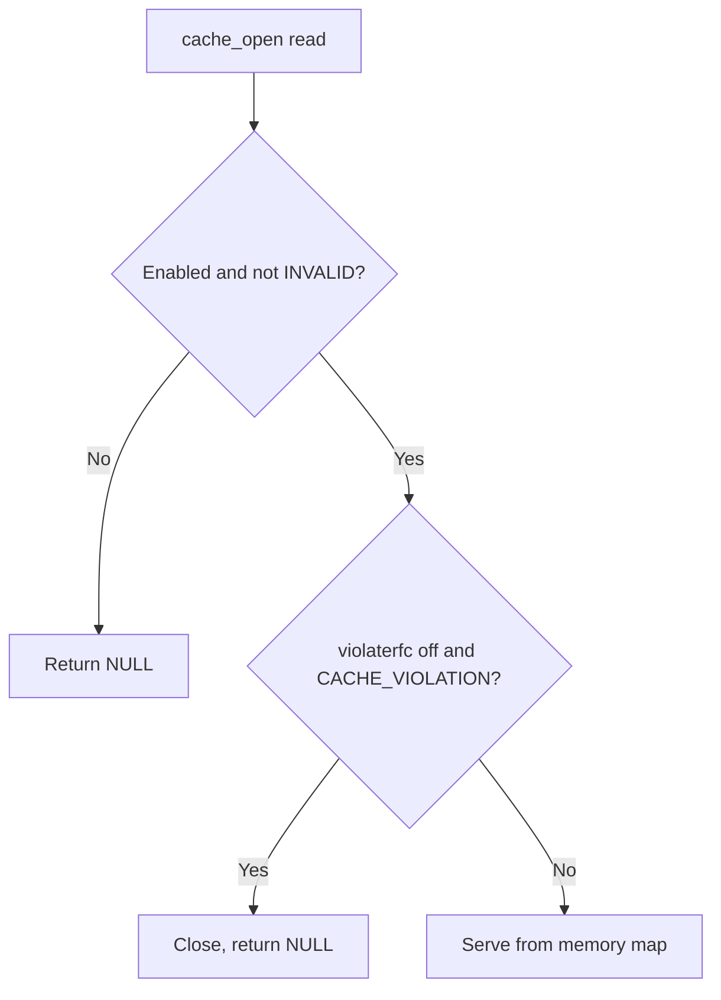

---

## Prefetching
Source URL: https://www.safesquid.com/docs/prefetch.html

Source: sources/src/prefetch.cpp. Asynchronous background worker (`prefetch_thread`) monitors a queue — does not block the client connection. Checks cache before prefetching (aborts if already cached). Uses a synthetic unattached connection with a hardcoded User-Agent to fetch from origin.

**Code quirk: the `Threads` global field is compiled out (`#if 0` in `init_threads`)** — worker count is not actually configurable via this field currently; see build notes if relying on it.

HTML parser rules: first matching row (Tag name/attribute/pattern) drives which URLs get queued. `Recursion level` — note the field help says setting 0 causes links to be followed **indefinitely**, not "no recursion" as might be assumed. Some prefetch hooks require `ENABLE_PREFETCH` at build time.

### Prefetch queue flow

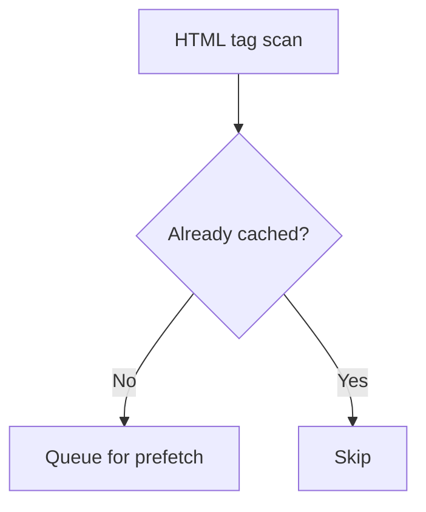

---

## Clam antivirus
Source URL: https://www.safesquid.com/docs/clamav.html

Source: sources/src/clamav.cpp. Integration with an external `clamd` daemon. **First matching row wins**, top-to-bottom. Cache optimization: objects already `CACHE_CLEAN` in SafeSquid's cache bypass scanning entirely. Internal `ResultsCache` avoids re-sending identical in-memory payloads to clamd. `ClamavPool` manages idle sockets to prevent exhaustion under concurrency.

Virus found → `POLICY_DO_NOT_BYPASS` (hard block) unless the connection has "Allow bypassing" + valid bypass cookie, then it's a soft DENY. `ClamAV hostname or socket path` — a path starting with `/` uses a local Unix socket; otherwise TCP on the ClamAV port (default 3310).

### Scan flow

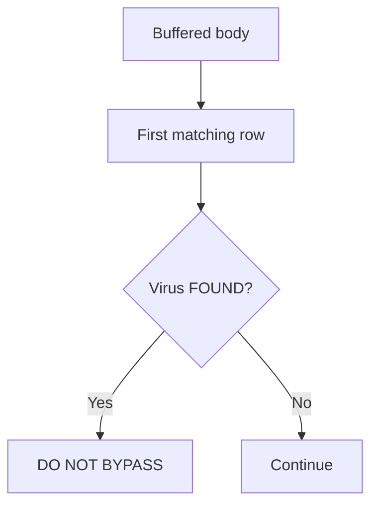

---

## SqScan
Source URL: https://www.safesquid.com/docs/sqscan.html

Source: sources/modules/sqscan/sqscan.cpp. SafeSquid's **built-in in-memory antivirus** — no external clamd process needed.

**Two significant code quirks:**
1. **`Malware Security Level` — only BYPASS changes runtime behavior.** STANDARD, HIGH, and PARANOID are stored in config but the engine uses fixed scan options regardless — they do not actually change scan depth today.
2. **`Malware Types` checkboxes are stored for operator reference only** — not forwarded to the scan API; detection uses the engine's built-in signature set regardless of what's checked.

First matching profile row wins. Use `sqscan status` in the Web UI to confirm Ready state and signature currency.

### Processing flow

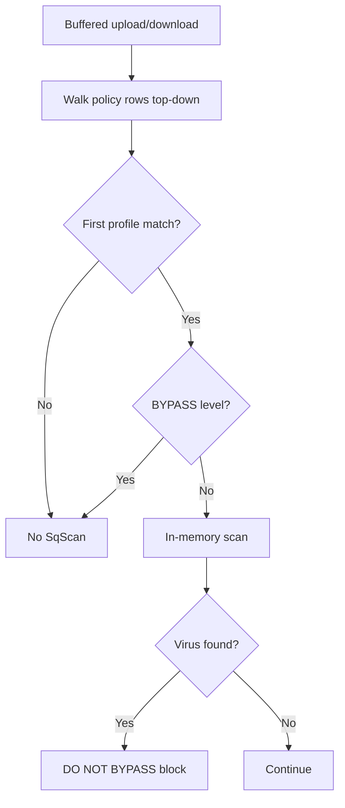

---

## Image analyzer
Source URL: https://www.safesquid.com/docs/imgfilter.html

Source: sources/modules/imgfilter/imgfilter.cpp. Scores `image/*` bodies; blocks or debug-replaces at/above threshold. Only images ≥50×50 pixels are candidates. Threshold scale roughly -10 (unlikely inappropriate) to 0 (very likely) — block when score ≥ threshold.

**Debug mode:** on responses, at/above-threshold images are blurred and annotated in-place instead of fully blocked — connection is still marked blocked internally but the block template isn't sent. Default block replacement template: `checkeredgif`.

### Processing flow

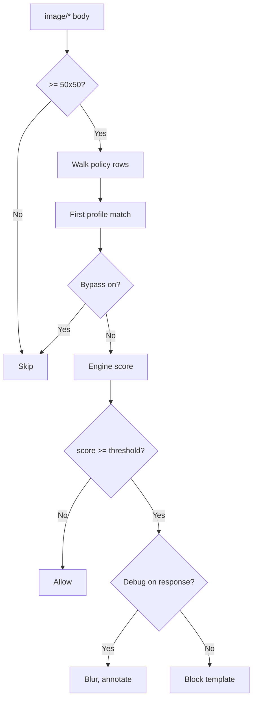

---

## DLP
Source URL: https://www.safesquid.com/docs/dlp.html

Source: sources/modules/dlp/dlp.cpp. **Runs on the request (upload) path only — never on downloaded responses.**

**MIME policy uses last-match-wins** (unusual for SafeSquid — most sections are first-match): each row whose POSIX regex matches the part MIME overwrites the action as the walk continues.

**OCR scoring:** unless MIME action is already DO NOT BYPASS, text is extracted once (text/* via text extraction, image/* via OCR); enabled OCR rows walk while score < Threshold, each keyword match adds Weight; score ≥ Threshold → DO NOT BYPASS.

Bypass severity: DENY can be bypassed with "Allow bypassing" + valid cookie; DO NOT BYPASS is never bypassable.

### Processing flow

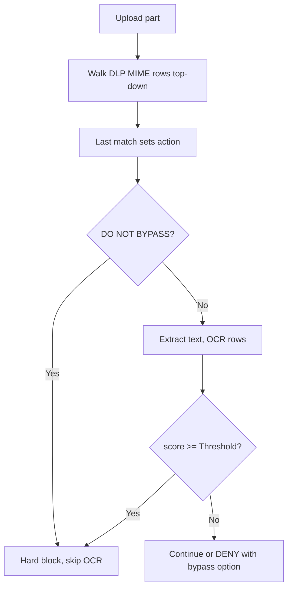

---

## ICAP
Source URL: https://www.safesquid.com/docs/icap.html

Source: sources/modules/icap/icap.cpp. Sends request/response bodies to an external ICAP server (antivirus, DLP adapters, content adaptation). Row walk with fallback: for each REQMOD/RESPMOD hook, enabled rows walked top-down; a row must match Profiles, include the Applies-to flag, and have a valid Service URL.

**Response handling:** `204 No Content` = clean, stop (later rows not tried). `200 OK` with configured threat header = block/replace, stop. `5xx` = error template, log server failure. Timeout/connection failure = try next matching row (this is the fallback mechanism — put a backup ICAP server as a lower row).

### Processing flow

```mermaid
flowchart TD
    hook[REQMOD or RESPMOD hook] --> walk[Walk ICAP rows top-down]
    walk --> row{Match profiles, flags, URL?}
    row -->|No| next[Next row]
    row -->|Yes| call[Call ICAP server]
    call --> code{Response code?}
    code -->|204| clean[Allow, stop]
    code -->|200 + threat| block[Block or replace, stop]
    code -->|5xx| error[Error template]
    code -->|timeout| next
```
