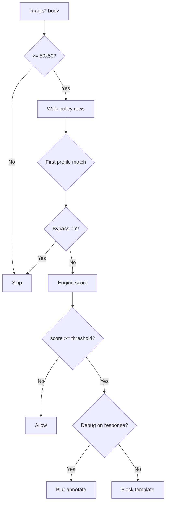

<Note>
  CLI man page: `safesquid-imgfilter(5)`
</Note>

<Frame caption="Image scoring flow">
  
</Frame>

## Overview

The `Imgfilter` section (`safesquid-imgfilter(5)`) scores `image/*` response and upload bodies and blocks or debug-replaces content when the engine score is at or above a threshold. Blocked images can be replaced with a template (default `checkeredgif`).

## Core Mechanics (C++ Source Validation)

Source: `sources/modules/imgfilter/imgfilter.cpp` — `ImgfilterSection::find()`, `check_and_block()`, `scan_image()`.

### First match wins

Walk enabled filtering policy rows top to bottom; first profile match sets threshold, bypass, debug, and template.

### MIME and size gates

Only parts whose MIME starts with `image/` are candidates. Images smaller than 50×50 pixels are skipped.

### Threshold scale

Roughly **-10** (unlikely inappropriate) through **0** (very likely). Block when engine score ≥ threshold.

### Debug mode

On responses with Debug enabled, images at or above threshold are blurred and annotated in-place; connection still marked blocked but block template not sent.

### Bypass

Bypass Image Scanning on a matching row skips buffering and scoring entirely.

## Processing flow

## Schema Fields

### Global fields

- **Enabled (enabled)** — Master switch; requires library init success.
- **Default template (dtempl)** — Fallback when row Template blank; default `checkeredgif`.
- **Library path (libpath)** — Path to imgfilter engine module.

### Policy rows

- **Profiles (profiles)** — Limit to tagged connections. Blank matches all.
- **Threshold (threshold)** — Block when score ≥ this value.
- **Bypass Image Scanning (bypass)** — Skip scan for matching profiles.
- **Debug (debug)** — Blur/annotate on response instead of block template.
- **Template (template)** — Replacement on block.

## Examples

### Block for students

- **Configuration:** Profiles STUDENT, Threshold 0, Template checkeredgif.
- **Result:** student image responses scoring ≥ 0 replaced with checkered template.

### Staff bypass

- **Configuration:** Row A Profiles STAFF Bypass on; Row B blank Threshold -2.
- **Result:** staff skip imgfilter; others scored via row B.

### Debug tuning

- **Configuration:** Debug on, Threshold -5.
- **Result:** borderline response images blurred with score annotation; still logged blocked.

## How to verify

1. Fetch image through profile with image-filter tag and imgfilter enabled.
2. Enable imgfilter log level for score lines.
3. Detailed logs show filter name imgfilter on block.
