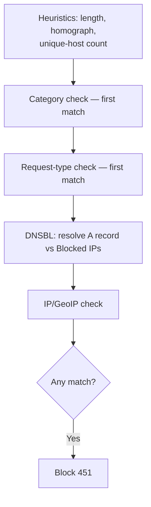

<Note>
**Migrated from the legacy documentation site.** Source: [https://www.safesquid.com/docs/dnsbl.html](https://www.safesquid.com/docs/dnsbl.html) — snapshot retrieved 2026-08-19.
This page carries the **legacy runtime mechanics and code quirks** for this feature. Conceptual and how-to coverage lives in the pages linked under Related pages — this page supplements them rather than replacing them.
</Note>

Source: sources/src/dnsbl.cpp. Runs a **sequence of heuristic checks** on the Host header before/alongside blocklist checks: host-name length validation, homograph detection, unique-host-count under an uncategorized registered domain — all run BEFORE policy rows when website categories are empty.

Processing order: category check (first match, no DNS) → request-type check (first match, no DNS) → DNSBL check (append `DNSBL Domain` suffix, resolve A record, compare to Blocked IPs — **failed lookups are treated as 0.0.0.0; include that address to block lookup failures**) → IP/GeoIP check (host A record, reverse-DNSBL answer, GeoIP country vs Threatful Countries).

Entire module is skipped if the connection carries the DNSBL bypass right, or the request targets the SafeSquid interface itself.

## Check order

## Related pages

- [DNSBL](/use_cases/dns_security/dnsbl)
- [GeoIP](/use_cases/dns_security/geoip)
- [Homograph detection](/use_cases/dns_security/homograph_detection)
