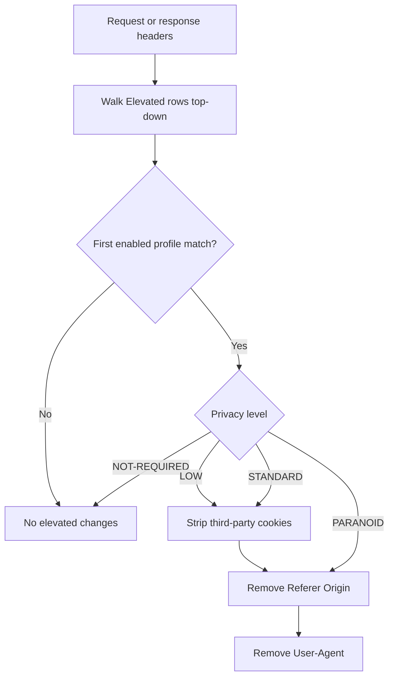

<Note>
  CLI man page: `safesquid-elevated(5)`
</Note>

<Frame caption="Privacy level selection">
  
</Frame>

## Overview

The `Elevated` section (`safesquid-elevated(5)`) reduces cross-site tracking by stripping third-party cookies and selected tracking headers. Without it, third-party cookies and related trackers can follow users from site to site.

## Core Mechanics (C++ Source Validation)

### First match wins

On each request and response header pass, enabled Elevated policy rows are walked top to bottom. The **first** matching row sets the privacy level for that connection; later rows are skipped.

### Privacy levels (action field)

- **NOT-REQUIRED** — No stripping; bypass elevated privacy.
- **LOW** — Drop third-party Cookie and Set-Cookie when cookie flag set.
- **STANDARD** — LOW plus remove Referer and Origin on outgoing requests.
- **PARANOID** — STANDARD plus remove User-Agent (may break browser-variant sites).

### Logging

Changes logged to privacy log and Detailed logs with filter name Elevated-Privacy. Debug header `X-Elevated-Privacy` reports level when Send Debugging Headers includes client.

## Processing flow

## Schema Fields

### Global fields

- **Enabled (enabled)** — Master switch. When off, processors exit without header changes.

### Policy rows

- **Profiles (profiles)** — Limit privacy level to tagged connections. Blank matches all.
- **Privacy Levels (action)** — NOT-REQUIRED, LOW, STANDARD, or PARANOID.
- **Comment (comment)** — Operator note only.

## Examples

### Standard privacy for all

- **Configuration:** One row Profiles blank, Privacy Levels STANDARD.
- **Result:** third-party cookies dropped; Referer and Origin removed on requests for all matching connections.

### Paranoid for guests, bypass for staff

- **Configuration:** Row A Profiles STAFF NOT-REQUIRED; Row B blank PARANOID.
- **Result:** staff keep full headers; others get paranoid stripping.

### Cookie-only for marketing

- **Configuration:** Profiles MARKETING USERS, Privacy Levels LOW.
- **Result:** only third-party cookies stripped; Referer and User-Agent remain.

## Recommended practice

- Start with LOW or STANDARD before PARANOID — removing User-Agent breaks some applications.
- Place NOT-REQUIRED bypass rows above broad PARANOID rows.

## How to verify

1. Browse multi-site flow; inspect request headers upstream of proxy.
2. Check `privacy.log` under Reports.
3. Enable elevated log level for native privacy lines.
4. Debug header `X-Elevated-Privacy` on client when configured.
