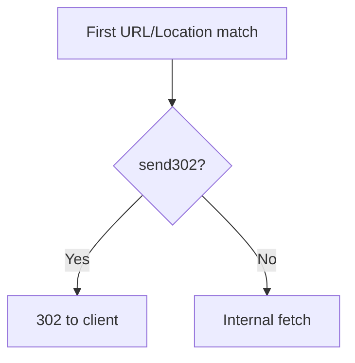

<Note>
**Migrated from the legacy documentation site.** Source: [https://www.safesquid.com/docs/redirect.html](https://www.safesquid.com/docs/redirect.html) — snapshot retrieved 2026-08-19.
This page carries the **legacy runtime mechanics and code quirks** for this feature. Conceptual and how-to coverage lives in the pages linked under Related pages — this page supplements them rather than replacing them.
</Note>

Source: sources/src/redirect.cpp. **First-match, top-to-bottom, PCRE with capture groups** (`$1`, `$2` in the Redirect field). If `send302` is false, SafeSquid internally fetches the rewritten URL and serves it transparently; if true, returns HTTP 302 to the client.

`Applies to`: URL (request), LOCATION HEADER (response Location rewriting), or BOTH — tested as two separate passes. Options bitmask: decode URL before match, encode/decode path after substitution.

## First-match flow

## Related pages

- [URL redirection](/use_cases/url_redirection/url_redirection)
- [Redirect one website to another](/use_cases/url_redirection/redirect_one_website_to_another)
