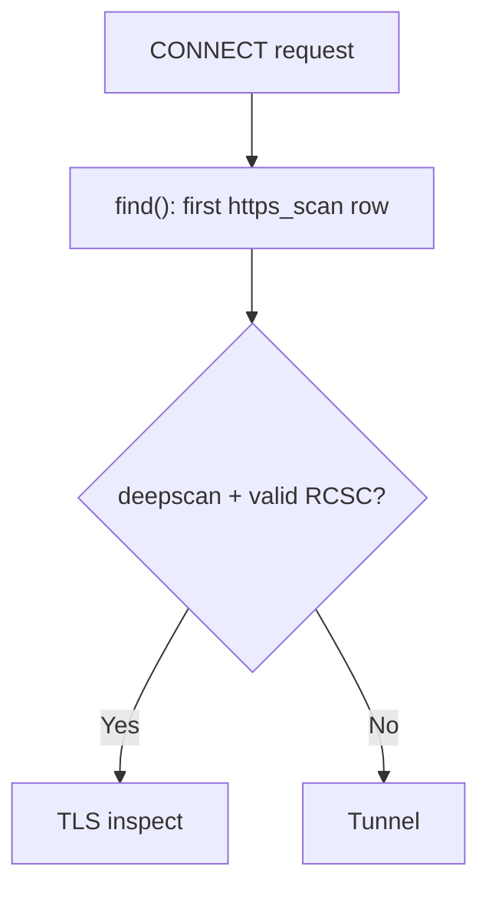

<Note>
**Migrated from the legacy documentation site.** Source: [https://www.safesquid.com/docs/sslcert.html](https://www.safesquid.com/docs/sslcert.html) — snapshot retrieved 2026-08-19.
This page carries the **legacy runtime mechanics and code quirks** for this feature. Conceptual and how-to coverage lives in the pages linked under Related pages — this page supplements them rather than replacing them.
</Note>

HTTPS Inspection controls CONNECT handling and optional TLS man-in-the-middle (Deep Scan) for HTTP inside HTTPS. Requires a valid RCSC (root CA) loaded from activation; the policy engine returns no policy when the section is off or misconfigured.

**Note:** the live page has character-encoding corruption (em-dashes and quotes render as garbled sequences like "ΓÇö"). Content below has been cleaned during ingestion — verify against the source XML/man page if exact wording matters for a specific field.

## Core mechanics
Source: sources/src/sslcert.cpp — SSLcertSection::find(), check(), deep_scan_check().

- **Deep Scan (MITM):** if enabled for the connection, SafeSquid performs full man-in-the-middle interception by generating a forged, trusted certificate for the client using the defined Root CA.
- **Upstream Validation:** SafeSquid builds an OpenSSL X509_STORE and validates the upstream origin server's certificate against known CA authorities.
- **Strict Error Handling:** handlers validate domain mismatches, missing certificates, and maximum allowable OpenSSL error levels. Failures drop the connection to prevent MITM attacks from malicious servers.

## CONNECT policy flow

## Schema fields
**Global:** Enabled — master switch. Off: policy engine returns NULL, Deep Scan never enables.

**Rule-based (per connection):**
- Enabled, Comment, Profiles (first matching enabled row wins, negated tags `!profile` supported)
- **DeepScan** — TRUE: client TLS handshake, decrypt HTTP for inspection. FALSE: tunnel without decrypting (use for non-HTTP TLS — Drive, Subversion, WinSCP).
- **Block Access to Sites without SSL Certificate** — default TRUE, blocks if upstream presents no cert.
- **Acceptable Errors in SSL Verification** — max OpenSSL error tolerated; 0 is strictest.
- **Block domain mismatch** — default TRUE; when FALSE, hostname/IP mismatch errors are explicitly allowed.

## Code quirks — Setup subsection unused at runtime
Setup rows (Proxy Host, Encrypted Password, SSL Cache Store Size) are loaded into configuration but **not used by current SSL setup code.** The root CA loads using the global activation password only, not Setup row passphrases. Cache sizing is internal and not applied from this field. Treat Setup as operator reference until wired in code — use activation for the RCSC passphrase and SSL Certs/Cache for certificate files.

## Examples
1. **Inspect general web browsing** — Enabled, valid RCSC, Profiles blank, DeepScan TRUE, strict certificate checks, clients trust RCSC public cert. Result: HTTP inside HTTPS decrypted and filtered normally.
2. **Tunnel non-HTTP TLS** (Drive, Git, RDP-over-TLS) — Row A (top) profiles for known non-HTTP apps, DeepScan FALSE; Row B blank profiles, DeepScan TRUE. Result: matching non-HTTP CONNECT tunnels without decryption; general HTTPS still inspected.
3. **Allow self-signed upstream with strict client trust** — relaxed error level + domain mismatch FALSE for internal host profiles, strict for public sites.

## Recommended practice
Deploy RCSC to all managed clients before enabling Deep Scan broadly. Use DeepScan FALSE rows for non-HTTP-over-TLS protocols. Do not rely on Setup Encrypted Password for RCSC unlock — use the activation passphrase.

## How to verify
CONNECT to an HTTPS site; confirm filters see decrypted content when DeepScan is TRUE. Enable SSL log level. Check Detailed logs for CONNECT handling and upstream certificate errors. Refresh SSL Certs/Cache after RCSC or trusted-CA changes.

## Related pages

- [SSL inspection](/use_cases/ssl_inspection/ssl_inspection)
- [Configure HTTPS inspection](/use_cases/ssl_inspection/configure_https_inspection)
- [Import certificate (Chrome/IE)](/use_cases/ssl_inspection/import_certificate_chrome_ie)
