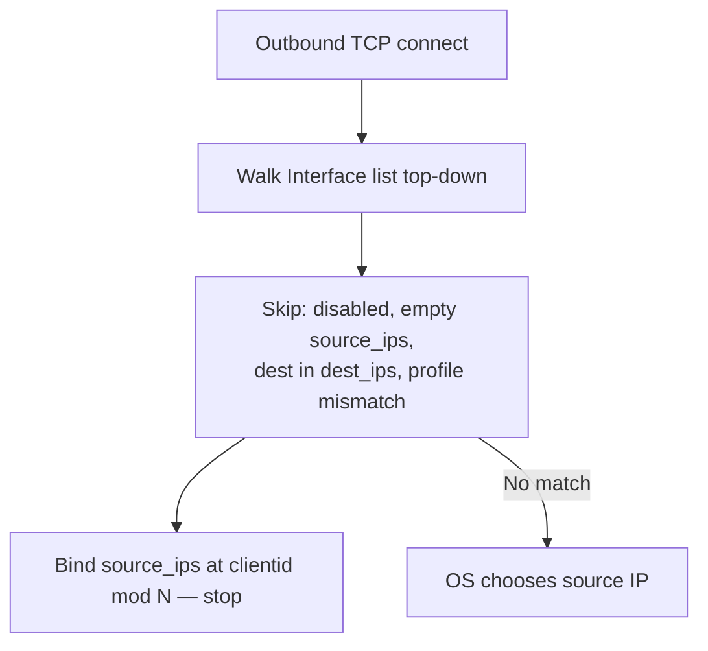

<Note>
**Migrated from the legacy documentation site.** Source: [https://www.safesquid.com/docs/network.html](https://www.safesquid.com/docs/network.html) — snapshot retrieved 2026-08-19.
This page carries the **legacy runtime mechanics and code quirks** for this feature. Related pages cover part of the same ground; this page adds detail that is not documented elsewhere.
</Note>

The Network section (safesquid-network(5)) defines client listen sockets and outbound source IP selection for origin connections.

## Core mechanics
Validated against sources/src/network.cpp — NetworkSection::check(), interface_select(), Interface constructor.

**Listen — startup bind.** Every enabled Listen row with port != -1 binds at startup. If no enabled row matches startup.ini LISTEN_IP and LISTEN_PORT, an additional fallback bind runs on those defaults. Restart required after Listen changes.

**Interface — first match wins.** Outbound walks Interface rows top-down: skip disabled; skip empty Source IP after load; skip when destination is in Excluded Destination IPs; require profile_find() (connection profiles plus hostname/service tags). First match picks source_ips[clientid % N].

**Source IP on host only.** Non-local Source IPs are dropped silently at load. If all IPs are dropped, the row is skipped at runtime.

## Listen fields
- **IP / Port** — Bind address and client port. Blank IP = dual-stack any when IPv6 available.
- **Bindings** — SSL_TRANSPARENT, CAPTIVE_PORTAL implemented; SSL_AUTHENTICATION / SSL_BRIDGE have no effect.

## Interface fields
- **Profiles** — Blank matches all. Typical tag: ALTERNATE OUTBOUND IP.
- **Excluded Destination IPs** — Hyphen ranges; destination in list skips row (CIDR not supported).
- **Source IP** — Comma-separated local addresses; only host IPs kept; rotated by client id.

## Outbound interface selection

## Examples
1. **Single proxy port** — Listen enabled, blank IP, port 8080. Result: all interfaces accept on 8080 after restart; Access controls who may connect.
2. **Excluded destination** — Source IP 10.0.0.5, dest_ips 10.0.0.0-10.255.255.255. Result: outbound to 10.x skips row; public destinations may match and bind 10.0.0.5.
3. **Source IP not on host** — Source IP 198.51.100.99 not assigned to appliance. Result: IP ignored at load; row skipped — no outbound bind from this row.

## How to verify
Restart after Listen changes. `curl -x http://APPLIANCE:8080 http://example.com/`. Enable NETWORK logs; confirm bind and interface_select lines. Match listen socket in Access Interface for CONFIG vs PROXY tests.

## Related pages

- [Operational modes](/use_cases/scaling_and_high_availability/operational_modes)
- [Transparent proxy](/use_cases/scaling_and_high_availability/transparent_proxy)
