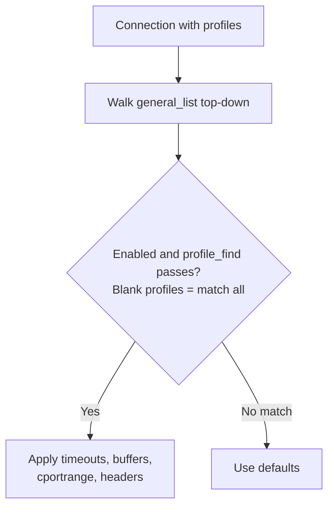

<Note>
**Migrated from the legacy documentation site.** Source: [https://www.safesquid.com/docs/general.html](https://www.safesquid.com/docs/general.html) — snapshot retrieved 2026-08-19.
This page carries the **legacy runtime mechanics and code quirks** for this feature. Related pages cover part of the same ground; this page adds detail that is not documented elsewhere.
</Note>

The General section (safesquid-general(5)) sets global hostname, connection pool, debug headers, and per-connection compression/buffering policy rows.

## Core mechanics
Validated against sources/src/global.cpp — GeneralSection::find(), cportrange_check(), compressin_get(), bufferchunked_get().

**First matching policy row.** Each getter walks Compression and buffering policies top-down. First enabled row whose profiles pass profile_find() wins. Empty profiles match all. No match → built-in defaults.

**CONNECT ports (cportrange).** cportrange_check() applies only when a row matched. Port must be in the row list or CONNECT is blocked. When no row matched, all CONNECT ports are allowed (unless blocked elsewhere).

**Compression and chunked buffering.** compressin zero → identity-only upstream Accept-Encoding; non-zero → full encodings (TRUE and AUTO behave the same today). bufferchunked: 0 never, 2 always, 1 encoded-only when Content-Encoding is identity.

## General policy row selection

## Global fields
- **Proxy hostname** — Identity in Via and Kerberos scripts; blank uses system hostname.
- **Connection pool size / timeout** — Resizes upstream serverpool immediately on config update.
- **Send Debugging Headers To** — CLIENT, SERVER, BOTH, or NONE — see Debug headers.
- **Dynamic Categorization** — Referer categories applied to dependency requests.

## Examples
1. **CONNECT HTTPS only** — First matching row cportrange 443 only. Result: CONNECT to 443 allowed; other ports blocked with security-restrictions template.
2. **Profile-specific buffering** — Row 1 profiles text-filter, maxdbuffer 128K above catch-all maxdbuffer 0. Result: text-filter connections buffer up to 128K; others stream without full download buffer.
3. **No row match** — All policy rows disabled for connection. Result: CONNECT port check allows any port; default timeouts apply.

## How to verify
Test CONNECT to allowed and blocked ports. Enable Trace Entry on a policy row; check native logs. Debug headers CLIENT in browser devtools when enabled.

## Related pages

- [Configure](/safesquid_swg/policy_management_console/configure)
- [Debug response headers](/admin_guide/start_here/debug_response_headers)
