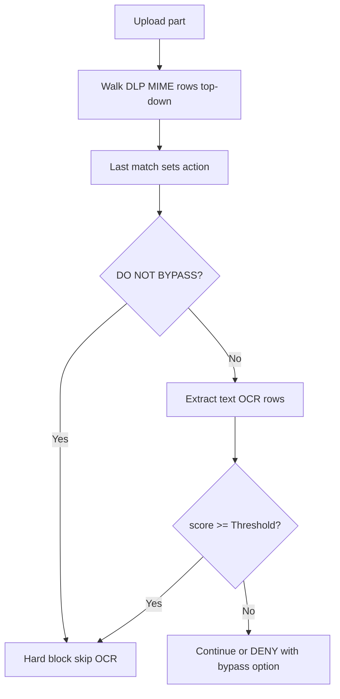

<Note>
  CLI man page: `safesquid-dlp(5)`
</Note>

<Frame caption="Upload DLP flow">
  
</Frame>

## Overview

The `DLP` section (`safesquid-dlp(5)`) inspects **uploaded** content and can block sensitive data leaving the network. MIME-based DLP policies set allow or block actions; OCR policies score text extracted from uploads against a global Threshold.

DLP runs on the request (upload) path only — not on downloaded responses. Access **Bypass** with DLP skips inspection; Access **Allow bypassing** can soften a DENY block when a valid bypass cookie is present.

## Core Mechanics (C++ Source Validation)

MIME regex compile (commas → `|`), policy walk, OCR scoring.

### MIME policy — last match wins

Unlike most SafeSquid lists, DLP MIME rows use **last matching enabled row wins**. Each row whose POSIX regex matches the uploaded part's MIME type overwrites the action as the walk continues top to bottom.

### OCR scoring

Unless MIME action is already **DO NOT BYPASS**, SafeSquid extracts text once (`text/*` uses text extraction; `image/*` uses OCR). Enabled OCR rows are walked while score \< Threshold; each keyword regex match adds Weight. Score ≥ Threshold → **DO NOT BYPASS**.

### Bypass severity

**DENY** may be bypassed with Allow bypassing and a valid bypass cookie. **DO NOT BYPASS** is never bypassed.

## Processing flow

## Schema Fields

### Global fields

- **Enabled (enabled)** — Master switch for upload inspection and OCR scoring.
- **Threshold (threshold)** — OCR keyword weights summed per upload; total ≥ Threshold yields DO NOT BYPASS.

### DLP policy rows

- **Upload Content type (mime)** — POSIX regex against part MIME. Commas become alternation (`|`). Blank matches all.
- **Profiles (profiles)** — Connection must match listed Access Profile tags.
- **Action (action)** — ALLOW, DENY, or DO NOT BYPASS.
- **Comment (comment)** — Block reason when Action is DENY or DO NOT BYPASS.

### OCR policy rows

- **Search For (keyword)** — POSIX regex against extracted text.
- **Weight (score)** — Added on match. Weight 0 skips the row.

## Examples

### Block PDF uploads

- **Configuration:** Upload Content type `application/pdf`, Action DENY, Comment `PDF uploads not permitted`.
- **Result:** any upload part whose MIME matches is blocked with that comment as reason.

### OCR keyword threshold

- **Configuration:** Threshold 100; OCR row `confidential` Weight 60; OCR row `internal use only` Weight 50.
- **Result:** image upload containing both phrases scores 110 → DO NOT BYPASS at Threshold 100.

### Last match overrides allow

- **Configuration:** Row A blank MIME ALLOW; Row B below `image/` DO NOT BYPASS.
- **Result:** image uploads match both; row B wins (last match) and hard-blocks. Non-image uploads match only row A unless OCR scores high enough.

## How to verify

1. Upload test content through a profile without DLP bypass.
2. Enable DLP in `LOG_LEVEL` for native `dlp:` lines.
3. **Reports → Detailed logs** — filter name DLP with action and score.
4. Pair Access BYPASS + DLP checkbox to confirm skip path.
