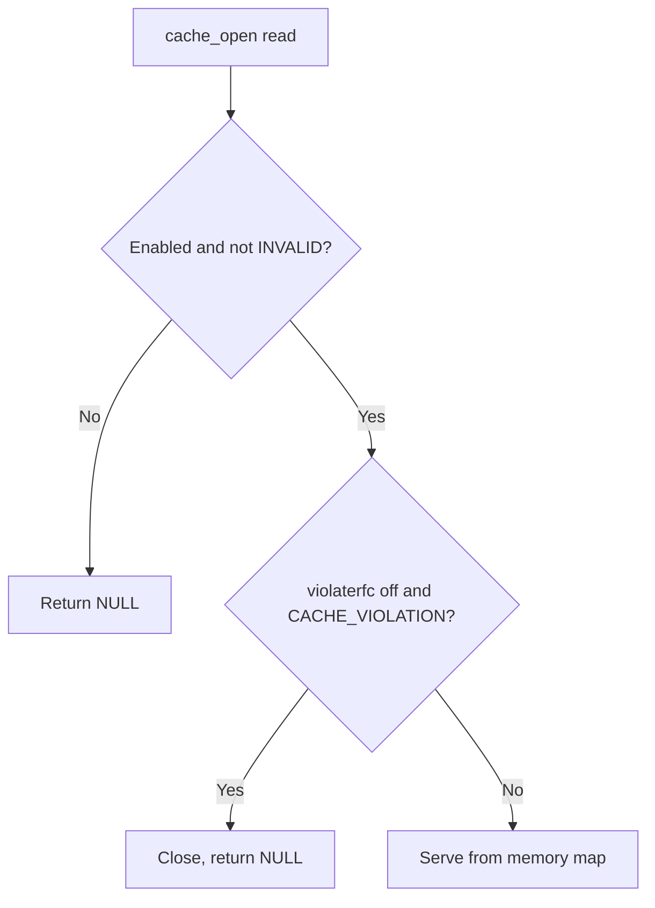

<Note>
**Migrated from the legacy documentation site.** Source: [https://www.safesquid.com/docs/cache.html](https://www.safesquid.com/docs/cache.html) — snapshot retrieved 2026-08-19.
This page carries the **legacy runtime mechanics and code quirks** for this feature. Conceptual and how-to coverage lives in the pages linked under Related pages — this page supplements them rather than replacing them.
</Note>

Source: sources/src/cache.cpp. Refresh rows: first-match wins, sets min/max age, validate, and cachable flag. `cachable=FALSE` sets `CACHE_INVALID` unless `CACHE_FORCE`.

<Warning>
**Major code quirk: disk store is hard-disabled.** `select_store()` always returns NULL regardless of Store row configuration — new objects are **memory-only** in current builds.
</Warning>

**Violate RFC:** objects stored despite no-cache/no-store headers get `CACHE_VIOLATION`. When "Violate RFC" is off, reads of violation objects return NULL (not served); when on, they may be served.

## Cache read path

## Related pages

- [Caching](/use_cases/performance_acceleration/caching)
- [Performance accelerators](/use_cases/performance_acceleration/performance_accelerators)
