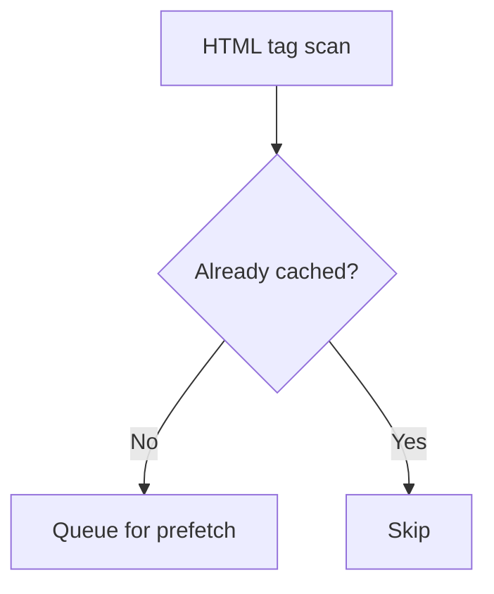

<Note>
**Migrated from the legacy documentation site.** Source: [https://www.safesquid.com/docs/prefetch.html](https://www.safesquid.com/docs/prefetch.html) — snapshot retrieved 2026-08-19.
This page carries the **legacy runtime mechanics and code quirks** for this feature. Conceptual and how-to coverage lives in the pages linked under Related pages — this page supplements them rather than replacing them.
</Note>

Source: sources/src/prefetch.cpp. Asynchronous background worker (`prefetch_thread`) monitors a queue — does not block the client connection. Checks cache before prefetching (aborts if already cached). Uses a synthetic unattached connection with a hardcoded User-Agent to fetch from origin.

<Warning>
**Code quirk: the `Threads` global field is compiled out (`#if 0` in `init_threads`)** — worker count is not actually configurable via this field currently; see build notes if relying on it.
</Warning>

HTML parser rules: first matching row (Tag name/attribute/pattern) drives which URLs get queued. `Recursion level` — note the field help says setting 0 causes links to be followed **indefinitely**, not "no recursion" as might be assumed. Some prefetch hooks require `ENABLE_PREFETCH` at build time.

## Prefetch queue flow

## Related pages

- [Pre-fetching](/use_cases/performance_acceleration/pre_fetching)
