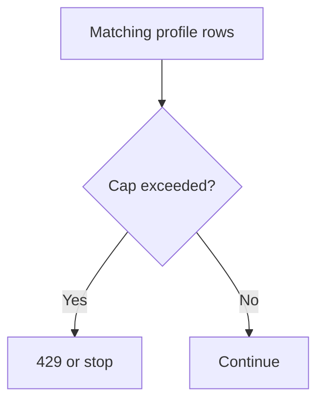

<Note>
**Migrated from the legacy documentation site.** Source: [https://www.safesquid.com/docs/limits.html](https://www.safesquid.com/docs/limits.html) — snapshot retrieved 2026-08-19.
This page carries the **legacy runtime mechanics and code quirks** for this feature. Conceptual and how-to coverage lives in the pages linked under Related pages — this page supplements them rather than replacing them.
</Note>

Source: sources/src/limits.cpp — token-bucket rate, quota counters, request cap enforcement.

- **Bandwidth shaping** — token-bucket per LimitGroup; `downloadrate` throttles globally across the group.
- **Quota tracking** — `maxdbytes`/`maxubytes`/`maxrequests` updated incrementally; cached payloads can bypass quota deductions (LIMIT_CACHE).
- **Enforcement** — `maxrequests` violation → instant block, HTTP 429, `LMS_TOO_MANY_REQUESTS`, `TCP_DENIED` log.

<Warning>
**Code quirk: `Action` field (Allow/Deny) is stored in config but NOT read by limits code** — limits apply purely on numeric thresholds regardless of Action.
</Warning>

## Limit enforcement flow

## How the list processes
Every enabled row matching profiles is evaluated (no first-match stop). Request limit exceeded → HTTP 429 + row Template. Download/upload — remaining bytes are the tightest cap among matching rows. Download rate — lowest non-zero rate among matching rows wins. Flags: "Limit cache transfers" (count cached responses), "Per-request limit" (each request gets full quota, no accumulation), "Group limit" (share rate bucket across matching connections). Counters reset on a ~10s window.

## Examples
1. Guest cap: Profiles Guest, Download limit 50MB, rate 512000 B/s → guests capped at ~500KB/s and 50MB per window.
2. Request flood cap: maxrequests 100, template too-many-requests → HTTP 429 after 100 in window.
3. Per-request 5MB: Download limit 5MB + "Per-request limit" flag → cap applies per request, not shared window.

## Related pages

- [Speed limits](/use_cases/performance_acceleration/speed_limits)
- [Manage bandwidth](/use_cases/performance_acceleration/manage_bandwidth)
