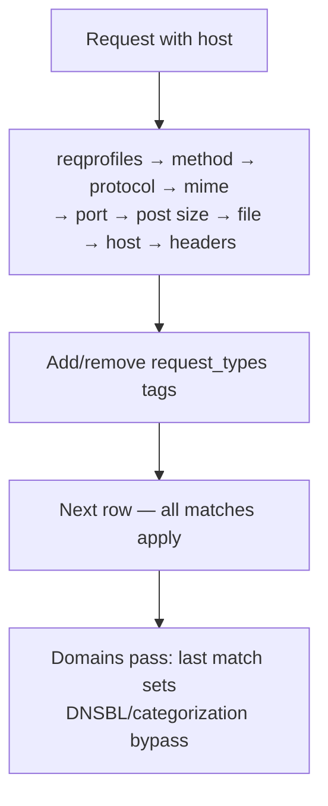

<Note>
**Migrated from the legacy documentation site.** Source: [https://www.safesquid.com/docs/reqProfiles.html](https://www.safesquid.com/docs/reqProfiles.html) — snapshot retrieved 2026-08-19.
This page carries the **legacy runtime mechanics and code quirks** for this feature. Conceptual and how-to coverage lives in the pages linked under Related pages — this page supplements them rather than replacing them.
</Note>

Labels HTTP requests with tags consumed by Access Profiles and other filters — **does not block traffic itself.**

## Processing order
1. Application Signatures (unless subscription expired)
2. Domains and Urls — substring match (tab-prefixed host+path, **not regex**); every matching row applies
3. Request Types rows — all gates must pass (reqprofiles → method → protocol → mime → port → post size → file → host → headers); every match applies

<Warning>
**Code quirks:** `urlcommand` field is parsed in config but not evaluated — use Protocol or File instead. Post Data Size runtime logic inverts UI labels (uses Content-Length only) — treat as experimental.
</Warning>

**Smart TLD:** when Host Name regex misses and Smart TLD is on, the same regex retries against the site name (host without public suffix).

## Row gate order

## Examples
Uncachable query URLs (File regex `cgi-bin|\?`, add uncachable_req); CONNECT method tagging; Domains bypass DNSBL and Categorization for a partner host.

## Related pages

- [Request profiles](/use_cases/profiling_engine/request_profiles)
- [Application Signatures](/admin_guide/policies_and_profiles/application_signatures)
