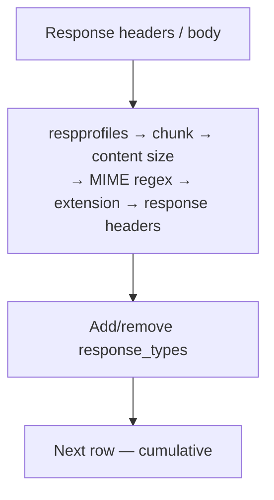

<Note>
**Migrated from the legacy documentation site.** Source: [https://www.safesquid.com/docs/respProfiles.html](https://www.safesquid.com/docs/respProfiles.html) — snapshot retrieved 2026-08-19.
This page carries the **legacy runtime mechanics and code quirks** for this feature. Conceptual and how-to coverage lives in the pages linked under Related pages — this page supplements them rather than replacing them.
</Note>

Labels HTTP responses for Access Profiles and content filters — does not block by itself. **Two-pass evaluation:** on response headers (no body buffer), then again on buffered body with detected MIME/size. Every matching enabled row applies — no first-match stop.

MIME regex tries Content-Type header then detected body type. Extension regex tries URL (query stripped) then attachment filename. Content size tests apply only when non-zero.

<Warning>
**Code quirk:** multipart/byterange UI toggle has no effect in code.
</Warning>

## Row gate order

## Related pages

- [Response profiles](/use_cases/profiling_engine/response_profiles)
- [Content Signatures](/admin_guide/policies_and_profiles/content_signatures)
