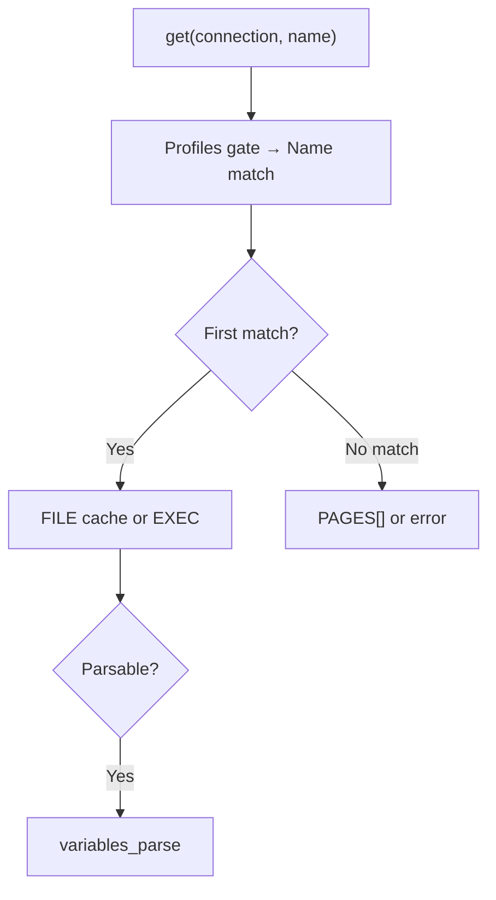

<Note>
**Migrated from the legacy documentation site.** Source: [https://www.safesquid.com/docs/templates.html](https://www.safesquid.com/docs/templates.html) — snapshot retrieved 2026-08-19.
This page carries the **legacy runtime mechanics and code quirks** for this feature. Conceptual and how-to coverage lives in the pages linked under Related pages — this page supplements them rather than replacing them.
</Note>

Configures block pages and error bodies. Resolution: walk rows top-down, skip disabled/empty Name, Profiles gate must pass, case-insensitive Name match — first match wins; else built-in `PAGES[]` defaults; else log undefined template error.

**FILE** — preloaded at config load. **EXECUTABLE** — runs at send time, stdout must be a valid HTTP response (requires `ENABLE_EXTERNAL`). `send_block_template()` adds `X-SafeSquid-Template` header.

## Template resolution

## Related pages

- [Custom templates](/use_cases/customisation/custom_templates)
- [Compliance templates](/use_cases/access_restriction/compliance_templates)
