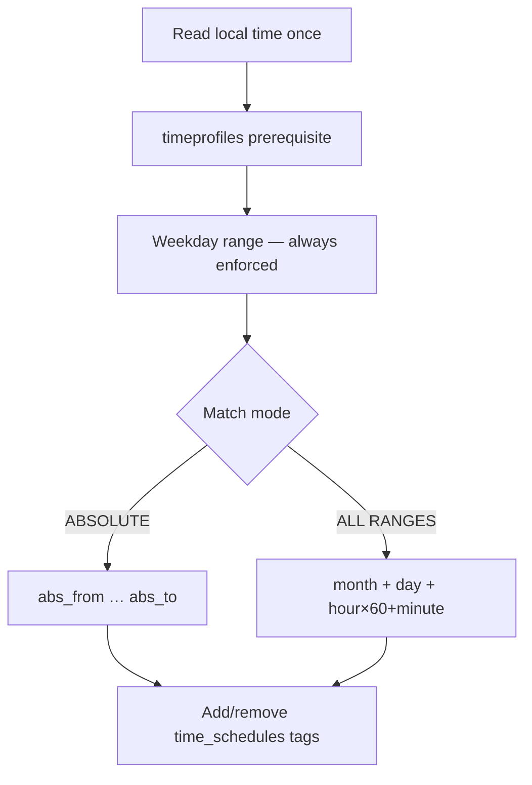

<Note>
**Migrated from the legacy documentation site.** Source: [https://www.safesquid.com/docs/timeProfiles.html](https://www.safesquid.com/docs/timeProfiles.html) — snapshot retrieved 2026-08-19.
This page carries the **legacy runtime mechanics and code quirks** for this feature. Conceptual and how-to coverage lives in the pages linked under Related pages — this page supplements them rather than replacing them.
</Note>

Tags connections with time labels from the appliance local clock; Access Profiles Time Schedule matches these tags.

<Warning>
**Code quirk: Weekday active flag is stored but not checked** — weekday bounds always apply. Template default of 0 alone matches Sunday only — set explicit ranges.
</Warning>

**Match modes:** ABSOLUTE (single start/end timestamp) or ALL RANGES (current month + day-of-month + time-of-day must each fall in window).

## Match flow

## Related pages

- [Time profiles](/use_cases/profiling_engine/time_profiles)
- [Allow social networking during lunch hours](/use_cases/access_restriction/allow_social_networking_sites_during_lunch_hours)
