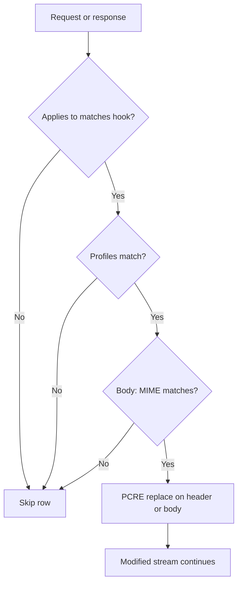

<Frame caption="Rewrite hook flow">
  
</Frame>

## Overview

The `Rewrite` section performs PCRE search-and-replace on HTTP headers and bodies. Use it to inject cookies, strip sensitive header values, or modify response body content before it reaches the client.

## Core Mechanics (C++ Source Validation)

### Hook points

- **Client header** — outgoing request headers.
- **Server header** — response headers.
- **Body** — response body during buffering; MIME regex tested against `Content-Type`.
- **Post body** — upload body modification.

### First applicable row per pass

Rows walked top to bottom. Row skipped when: disabled, Applies to flag mismatch, profiles fail, blank pattern, or MIME regex fails (body only).

### MIME gate on body

For **BODY** rewrites, a non-empty Mime type regex must match the response `Content-Type`. Empty mime matches any body when other gates pass.

## Processing flow

## Schema Fields

### Global fields

- **Enabled (enabled)** — Master switch for all rewrite hooks.

### Policy rows

- **Profiles (profiles)** — Connection must match tags. Blank matches all.
- **Mime type (mime)** — POSIX regex on Content-Type for body rewrites only.
- **Pattern (pattern)** — PCRE search pattern (required).
- **Replace (replace)** — Replacement string; supports capture groups.
- **Applies to (which)** — CLIENT HEADER, SERVER HEADER, BODY, POST BODY flags.

## Examples

### YouTube SafeSearch cookie injection

- **Configuration:** Profiles UNSAFE\_YOUTUBE, Pattern `Cookie: ([^\r\n]*)`, Replace `Cookie: ; PREF=f2=8000000;\r\n`, Applies to CLIENT HEADER.
- **Result:** matching request Cookie header rewritten to inject SafeSearch preference before origin fetch.

### Strip Server banner

- **Configuration:** Pattern on response Server header, Applies to SERVER HEADER.
- **Result:** Server field value replaced or removed per pattern.

### Body HTML substitution

- **Configuration:** Mime `text/html`, Pattern/Replace on body, Applies to BODY.
- **Result:** response HTML modified in buffered body before client delivery.

## Code note

Header rewrite uses hooks; body rewrite uses buffcheck. Both share the same policy list walk order.

## How to verify

1. Enable REWRITE in `LOG_LEVEL` for `processing:` lines showing hook target.
2. Capture before/after with View headers or raw response inspection.
3. Detailed logs on blocked connections if rewrite triggers downstream policy.
