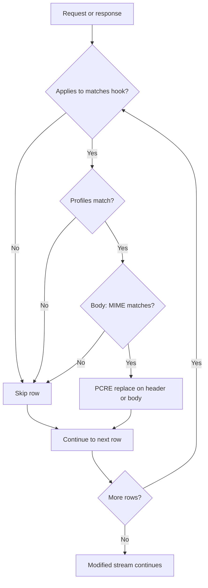

<Frame caption="Rewrite hook flow">
  
</Frame>

## Overview

The `Rewrite` section performs PCRE search-and-replace on HTTP headers and bodies. Use it to inject cookies, strip sensitive header values, or modify response body content before it reaches the client.

## Core Mechanics (C++ Source Validation)

### Hook points

- **Client header** — outgoing request headers.
- **Server header** — response headers.
- **Body** — response body during buffering; MIME regex tested against `Content-Type`.
- **POST DATA** — POST/PUT data sent when submitting a form or uploading a file.

### Every matching row applies, in list order

Rows are walked top to bottom and **every** row that matches applies. Evaluation does not stop at the first match. Each row operates on the text left by the row above it, so rewrites compose — a later row can match text an earlier row produced.

Row skipped when: disabled, Applies to flag mismatch, profiles fail, blank pattern, or MIME regex fails (body only).

The shipped default configuration relies on this. Two enabled rows both target the client `Accept` header — one replaces `avif`, the other `webp` — and a browser sends both tokens in the same header. Under first-match evaluation the second row would never run and image scanning would still receive unscannable WebP.

### One substitution per row

Each matching row performs a **single** substitution, not a global replace. A row whose pattern begins with a greedy `(.*)` therefore binds to the **last** occurrence in the header, leaving earlier occurrences untouched. To rewrite every occurrence, add a row per occurrence or anchor the pattern so it cannot skip ahead.

Pattern matching is **case-insensitive**: a pattern written `avif` matches `AVIF` in the header.

### MIME gate on body

For **BODY** rewrites, a non-empty MIME type regex must match the response `Content-Type`. Empty mime matches any body when other gates pass.

## Processing flow

## Schema Fields

### Global fields

- **Enabled (enabled)** — Master switch for all rewrite hooks.

### Policy rows

- **Profiles (profiles)** — Connection must match tags. Blank matches all.
- **MIME type (mime)** — Regex on Content-Type for body rewrites only. Console guidance: "It is highly advisable that you set this to some mime-type; otherwise, all files will be checked."
- **Pattern (pattern)** — PCRE search pattern (required).
- **Replace (replace)** — Replacement string; supports capture groups.
- **Applies to (which)** — CLIENT HEADER, SERVER HEADER, BODY, POST DATA flags. Stored values are `CLIENT`, `SERVER`, `BODY`, `POST`.

## Examples

Open **Configure → Real time content security → Content modifier → Rewriting policies**. Row
fields are Enabled, Comment, Profiles, Pattern, Replace, and Applies to.

<Frame caption="Content modifier — Rewriting policies rows">
  
</Frame>

### YouTube SafeSearch cookie injection

- **Configuration:** Profiles UNSAFE\_YOUTUBE, Pattern `Cookie: ([^\r\n]*)`, Replace `Cookie: ; PREF=f2=8000000;\r\n`, Applies to CLIENT HEADER.
- **Result:** matching request Cookie header rewritten to inject SafeSearch preference before origin fetch.

### Strip Server banner

- **Configuration:** Pattern on response Server header, Applies to SERVER HEADER.
- **Result:** Server field value replaced or removed per pattern.

### Body HTML substitution

- **Configuration:** Mime `text/html`, Pattern/Replace on body, Applies to BODY.
- **Result:** response HTML modified in buffered body before client delivery.

## Code note

Header rewrite uses hooks; body rewrite uses buffcheck. Both walk the full policy list and apply every match.

## How to verify

1. Enable REWRITE in `LOG_LEVEL` for `processing:` lines showing hook target.
2. Capture before/after with View headers or raw response inspection.
3. Detailed logs on blocked connections if rewrite triggers downstream policy.

To confirm rows compose rather than short-circuit, send one request whose header matches two enabled rows and inspect what reaches the origin. Request `http://httpbin.org/headers` through the proxy with an `Accept` header containing both `image/avif` and `image/webp`.

**Expected result:** both tokens are rewritten in the header the origin receives. If only the first is rewritten, the rows are not composing and the configuration should be re-checked.
