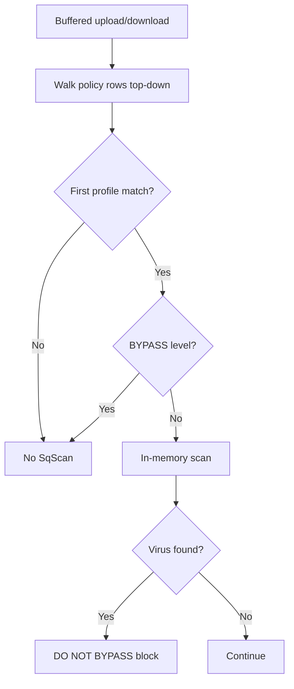

<Frame caption="SqScan policy flow">
  
</Frame>

## Overview

The `SqScan` section (`safesquid-sqscan(5)`) is SafeSquid’s built-in in-memory antivirus scanner. It scans buffered uploads and downloads without an external `clamd` process. When malware is detected, the connection is blocked with **DO NOT BYPASS**.

Use **sqscan status** in the Web UI to confirm Ready state and signature currency. See also ClamAV and ICAP for defense in depth.

## Core Mechanics (C++ Source Validation)

### First match wins

Enabled virus scanning policy rows are walked top to bottom. The **first** row whose Profiles match applies for that connection.

### Scan levels — BYPASS only

Malware Security Level **BYPASS** skips scanning. Values STANDARD, HIGH, and PARANOID are stored but the engine uses fixed scan options — only **BYPASS** changes runtime behaviour today.

### Malware Types unused

Malware Types checkboxes set bit flags on the policy but are not passed to the scanner API. Detection uses the engine’s built-in signature set.

### Enforcement

Virus detection sets the action to **DO NOT BYPASS**. Access restrictions **Bypass** with antivirus skips SqScan entirely.

## Processing flow

## Schema Fields

### Global fields

- **Enabled (enabled)** — Master switch. When off, hooks exit immediately. When on, scanning requires successful engine init (Ready in sqscan status).

### Policy rows

- **Profiles (profiles)** — Limit row to connections with these Access Profile tags. Blank matches all.
- **Malware Security Level (scan\_flag)** — BYPASS skips SqScan. Other levels label the row but do not alter scan depth in the current build.
- **Malware Types (malware\_types)** — Stored for operator reference; not forwarded to scan API.

## Examples

### Scan all users

- **Configuration:** Enabled on; one row Profiles blank, Malware Security Level STANDARD.
- **Result:** all buffered content on matching connections is scanned in memory.

### Skip scanning for admins

- **Configuration:** Row A (top) Profiles ADMIN, Malware Security Level BYPASS; Row B Profiles blank, STANDARD.
- **Result:** ADMIN connections hit row A first and skip; everyone else scanned via row B.

### EICAR verification

- **Configuration:** sqscan status shows Ready; download EICAR through scanned profile.
- **Result:** block with DO NOT BYPASS; Detailed logs show virus detection.

## How to verify

1. **sqscan status** — module Ready, signatures current.
2. Download EICAR test file through proxy.
3. Enable ANTIVIRUS log level for native `sqscan:` lines.
4. Dashboard counters: Objects Scanned, Threats Detected, Scan bypassed.
