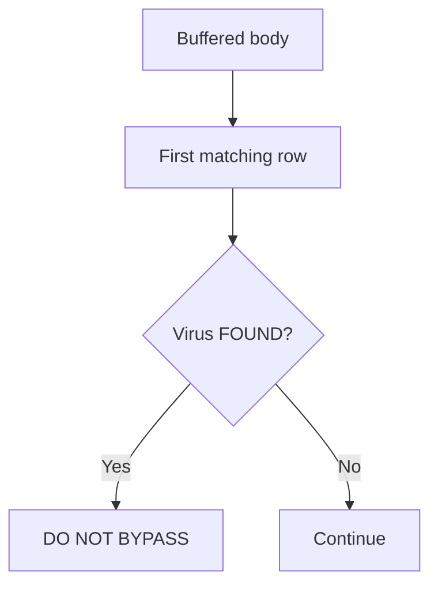

<Note>
**Migrated from the legacy documentation site.** Source: [https://www.safesquid.com/docs/clamav.html](https://www.safesquid.com/docs/clamav.html) — snapshot retrieved 2026-08-19.
This page carries the **legacy runtime mechanics and code quirks** for this feature. Conceptual and how-to coverage lives in the pages linked under Related pages — this page supplements them rather than replacing them.
</Note>

Source: sources/src/clamav.cpp. Integration with an external `clamd` daemon. **First matching row wins**, top-to-bottom. Cache optimization: objects already `CACHE_CLEAN` in SafeSquid's cache bypass scanning entirely. Internal `ResultsCache` avoids re-sending identical in-memory payloads to clamd. `ClamavPool` manages idle sockets to prevent exhaustion under concurrency.

Virus found → `POLICY_DO_NOT_BYPASS` (hard block) unless the connection has "Allow bypassing" + valid bypass cookie, then it's a soft DENY. `ClamAV hostname or socket path` — a path starting with `/` uses a local Unix socket; otherwise TCP on the ClamAV port (default 3310).

## Scan flow

## Related pages

- [ClamAV malware scanning](/use_cases/malware_scanning/clamav_malware_scanning)
- [Malware scanners](/use_cases/malware_scanning/malware_scanners)
