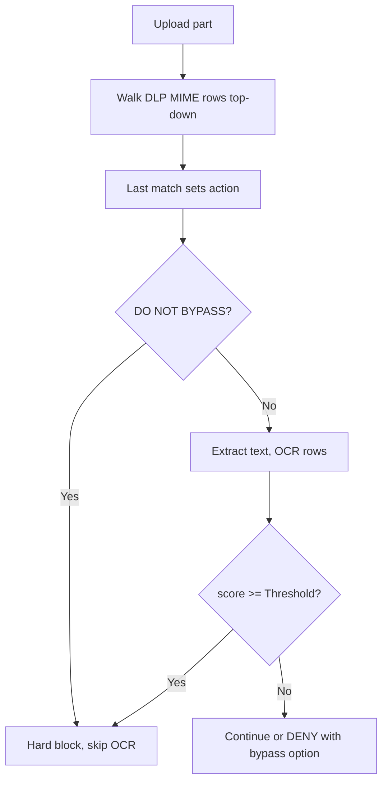

<Note>
**Migrated from the legacy documentation site.** Source: [https://www.safesquid.com/docs/dlp.html](https://www.safesquid.com/docs/dlp.html) — snapshot retrieved 2026-08-19.
This page carries the **legacy runtime mechanics and code quirks** for this feature. Conceptual and how-to coverage lives in the pages linked under Related pages — this page supplements them rather than replacing them.
</Note>

Source: sources/modules/dlp/dlp.cpp. **Runs on the request (upload) path only — never on downloaded responses.**

**MIME policy uses last-match-wins** (unusual for SafeSquid — most sections are first-match): each row whose POSIX regex matches the part MIME overwrites the action as the walk continues.

**OCR scoring:** unless MIME action is already DO NOT BYPASS, text is extracted once (text/* via text extraction, image/* via OCR); enabled OCR rows walk while score \< Threshold, each keyword match adds Weight; score ≥ Threshold → DO NOT BYPASS.

Bypass severity: DENY can be bypassed with "Allow bypassing" + valid cookie; DO NOT BYPASS is never bypassable.

## Processing flow

## Related pages

- [Data leakage prevention](/use_cases/data_leakage_prevention/data_leakage_prevention)
- [Content analyser](/use_cases/data_leakage_prevention/content_analyser)
