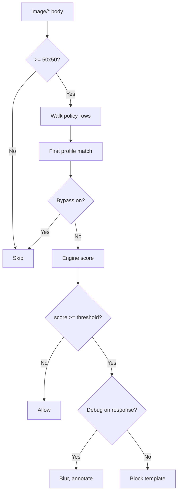

<Note>
**Migrated from the legacy documentation site.** Source: [https://www.safesquid.com/docs/imgfilter.html](https://www.safesquid.com/docs/imgfilter.html) — snapshot retrieved 2026-08-19.
This page carries the **legacy runtime mechanics and code quirks** for this feature. Conceptual and how-to coverage lives in the pages linked under Related pages — this page supplements them rather than replacing them.
</Note>

Source: sources/modules/imgfilter/imgfilter.cpp. Scores `image/*` bodies; blocks or debug-replaces at/above threshold. Only images ≥50×50 pixels are candidates. Threshold scale roughly -10 (unlikely inappropriate) to 0 (very likely) — block when score ≥ threshold.

**Debug mode:** on responses, at/above-threshold images are blurred and annotated in-place instead of fully blocked — connection is still marked blocked internally but the block template isn't sent. Default block replacement template: `checkeredgif`.

## Processing flow

## Related pages

- [Image analyser AI](/use_cases/data_leakage_prevention/image_analyser_ai)
- [Block inappropriate images](/use_cases/data_leakage_prevention/block_inappropriate_images_by_using_image_analyzer)
