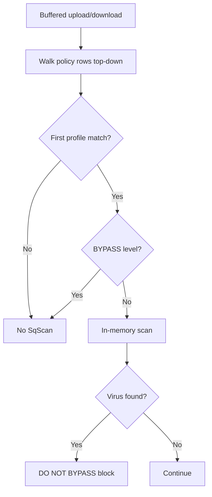

<Note>
**Migrated from the legacy documentation site.** Source: [https://www.safesquid.com/docs/sqscan.html](https://www.safesquid.com/docs/sqscan.html) — snapshot retrieved 2026-08-19.
This page carries the **legacy runtime mechanics and code quirks** for this feature. Conceptual and how-to coverage lives in the pages linked under Related pages — this page supplements them rather than replacing them.
</Note>

Source: sources/modules/sqscan/sqscan.cpp. SafeSquid's **built-in in-memory antivirus** — no external clamd process needed.

<Warning>
**Two significant code quirks:**
1. **`Malware Security Level` — only BYPASS changes runtime behavior.** STANDARD, HIGH, and PARANOID are stored in config but the engine uses fixed scan options regardless — they do not actually change scan depth today.
2. **`Malware Types` checkboxes are stored for operator reference only** — not forwarded to the scan API; detection uses the engine's built-in signature set regardless of what's checked.
</Warning>

First matching profile row wins. Use `sqscan status` in the Web UI to confirm Ready state and signature currency.

## Processing flow

## Related pages

- [SqScan](/use_cases/malware_scanning/sqscan)
- [Malware signatures](/use_cases/malware_scanning/malware_signatures)
