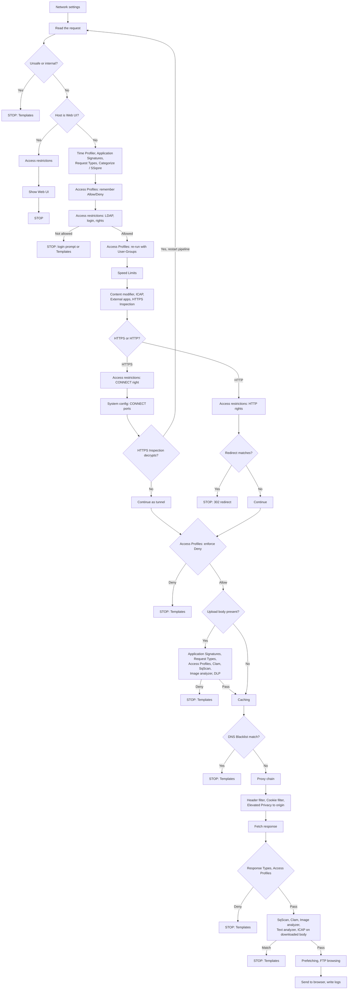

<Note>
**Migrated from the legacy documentation site.** Source: [https://www.safesquid.com/docs/architecture.html](https://www.safesquid.com/docs/architecture.html) — snapshot retrieved 2026-08-19.
This page has **no equivalent elsewhere in this documentation set**. It is migrated legacy content and has not yet been re-verified against a current build.
</Note>

**This page has no equivalent in the current Mintlify site — highest priority migration candidate.** It contains the full request-processing flowchart (two versions: prose "Chart A/B" and a text flowchart) showing every Web UI section in the exact order SafeSquid calls them for a live request.

SafeSquid sits between client browsers and the Internet (or upstream proxies). Each connection is handled by a worker that processes one HTTP transaction at a time, or a CONNECT tunnel for HTTPS.

## Two configuration layers
- **Web UI (policy)** — Access restrictions, Access Profiles, filters, scanners, stored as sections in config.xml. What most administrators edit daily.
- **startup.ini (process)** — Listen fallback, threads, log levels, TLS and sync tunables. Edited on the appliance filesystem.

## Setup order (not live processing order)
1. Network settings — listen port
2. Access restrictions — who may use the proxy, including login if required
3. Access Profiles — which sites and content
4. Everything else — HTTPS Inspection, antivirus, filters, Caching (these use the people/labels from steps above)

## What happens to a live request (full call order)
1. **Network settings** — already listening on the port
2. **System configuration** — timeouts, buffers, CONNECT port range
3. **Read the request** — which site, HTTP or HTTPS (not a Web UI section)
4. If destination unsafe/internal → **Templates** block page, STOP
5. If Host is the Web UI (`safesquid.cfg`): skip Time Profiler, Application Signatures, Request Types, Categorize Web-Sites, SSqore, and Access Profiles entirely. **Access restrictions** decides console access; Access Profiles Deny cannot lock you out of the console.
6. Otherwise, normal visit: **Time Profiler → Application Signatures → Request Types → Categorize Web-Sites → SSqore** (SSqore only runs if site is still uncategorized) — these attach labels, do not block.
7. **Access Profiles** — remember Allow/Deny, do not block yet.
8. **Access restrictions** — Integrate LDAP consulted here; must log in → prompt/STOP until success; not allowed → Templates/STOP; remember HTTP/HTTPS/Bypass rights and User-Groups.
9. **Access Profiles** runs again (User-Groups from step 8 can change the match).
10. **Speed Limits** — can delay/block.
11. **Content modifier / External applications / ICAP / HTTPS Inspection / Subscription** — request-modify stage; any can finish the request locally.
12. **HTTPS or HTTP fork (never both):**
    - HTTPS: Access restrictions CONNECT right → System config CONNECT port range → HTTPS Inspection (if decrypts, restart at step 3; else continue as tunnel).
    - HTTP: Access restrictions HTTP/proxy/transparent rights → Redirect (first match → 302, STOP).
13. **Access Profiles** — now enforce Deny (unless temporary bypass) → Templates STOP. HTTPS Inspection can also block here.
14. If request has upload body: **Application Signatures → Request Types → Access Profiles → Clam antivirus → SqScan → Image analyzer → DLP** — first denial → Templates STOP. **DLP inspects this upload only, not the response that comes back.**
15. **Caching**
16. **DNS Blacklist** — matching block policy → Templates STOP.
17. **Proxy chain** — upstream or direct.
18. **Header filter → Cookie filter → Elevated Privacy → Content modifier** on headers sent to origin.
19. **Fetch the response** (cache hit or Internet).
20. **Response Types → Access Profiles** (MIME/response labels; Deny → Templates STOP).
21. **SqScan → Clam antivirus → Image analyzer → Text analyzer → ICAP** — inspect downloaded body. Match → Templates STOP. **DLP does not run here.**
22. **Prefetching** (linked HTML objects) → **FTP browsing** (ftp:// only) → Templates if needed → send to browser → write logs.

## Key clarifications
- HTTPS Inspection does not "continue" the HTTPS request — it decrypts and re-runs the inner HTTP from step 3.
- Clam antivirus and SqScan inspect both uploads and downloads. DLP inspects uploads only.
- Direct (unbuffered) downloads skip the downloaded-body scanners.
- Access restrictions entries can grant Bypass for Header filter, Cookie filter, Redirect, Content modifier, Proxy chain, Text analyzer, DNS Blacklist, antivirus, ICAP, and DLP — separate from Access Profiles temporary bypass cookies.

## Policy matching styles across sections
- **Dual allow/deny lists** — Access restrictions, Cookie filter, Header filter (list order depends on section default policy).
- **First match** — Clam antivirus, HTTPS Inspection, Redirect, DNS Blacklist block policies, several scanners.
- **All matches** — Access Profiles (secondary), Speed Limits, Content modifier, Application Signatures.
- **Last match** — DLP MIME policies (OCR uses cumulative score vs Threshold).
- **Groups** — Menu groups (Accelerators, Real time content security) contain child sections only; no policy lists of their own.

## Two worked examples from the source
1. **Blocked HTTPS visit to a social site:** Network/read/host checks pass → categorized Social → Access Profiles remembers Deny (no block yet) → Access restrictions allows HTTPS right → HTTPS branch, inspection off, stays tunneled → Access Profiles now enforces Deny → Templates block page.
2. **DLP on upload, malware on download:** user POSTs a spreadsheet → after Access Profiles Allow, upload body inspected (Clam → SqScan → Image analyzer → DLP) → DLP MIME match → Templates, stops before Caching/origin see the body. Later GET of an executable is Allowed by Access Profiles → Caching misses → SqScan/Clam match on downloaded body → Templates block. DLP does not run on that download.

## Debug headers
When System configuration → Send Debugging Headers To is CLIENT/SERVER/BOTH, SafeSquid adds identity and policy headers to inspect the pipeline live. Prefer CLIENT only on a test network. CLI: `man safesquid` (section 7).

## Request pipeline diagram (Mermaid — renders natively in Mintlify)

The source site presents this as a text-based "Chart B" flowchart. Reconstructed here as proper Mermaid syntax so it renders as an actual diagram rather than a numbered list — use this version in the migrated MDX page, keep the numbered walkthrough above as the prose explanation alongside it.

Note the loop-back at `P -->|Yes, restart pipeline| B` — this is the "HTTPS Inspection does not continue the request, it decrypts and restarts from Read the request" behavior called out explicitly in the source text. Preserve that loop-back edge; it's one of the more important mechanics on this page and easy to lose if this gets redrawn by hand later.

## Related pages

- [SafeSquid SWG architecture (deployment topology)](/safesquid_swg/architecture/architecture)
- [Access Profiles](/admin_guide/policies_and_profiles/access_profiles)
- [Debug response headers](/admin_guide/start_here/debug_response_headers)
