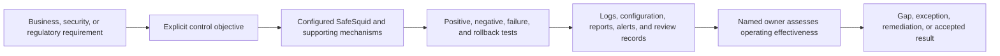

# Make Every Assurance Statement Testable

Security assurance requires more than enabling a feature. A useful control statement identifies the objective, mechanism, scope, dependencies, limitations, expected evidence, retention owner, review frequency, and failure response.

## Assurance model

SafeSquid documentation can explain mechanisms and evidence. It cannot determine legal applicability, certify an organization, or prove that a control operated effectively throughout an audit period.

## Control statement format

| Element | Required question |
| --- | --- |
| Objective | What risk or requirement is the control intended to address? |
| Mechanism | Which SafeSquid policy, security processor, integration, and supporting service participates? |
| Scope | Which users, devices, networks, applications, traffic, and time periods are covered? |
| Dependencies | Which identity, PKI, DNS, time, update, scanner, storage, or SIEM services must work? |
| Limitations | Which protocols, applications, bypasses, encryption modes, data forms, or failure states are not covered? |
| Test | What permitted, prohibited, adjacent, failure, and rollback cases prove the intended boundary? |
| Evidence | Which configuration, event fields, reports, alerts, and review records are produced? |
| Retention | Where is evidence stored, protected, timed, retained, and disposed? |
| Owner | Who reviews the control, responds to failures, approves exceptions, and accepts residual risk? |

## Evidence domains

<CardGroup cols={2}>
  <Card title="Deployment assurance" icon="server" href="/getting_started/verify_your_setup">
    Build, activation, routing, trust, service health, and first-traffic proof.
  </Card>

  <Card title="Policy assurance" icon="shield-check" href="/secure/overview">
    Positive and negative policy outcomes with complete decision context.
  </Card>

  <Card title="Identity assurance" icon="user-check" href="/connect/overview">
    User and device attribution, group resolution, failure behavior, and access evidence.
  </Card>

  <Card title="Operational assurance" icon="activity" href="/operate/overview">
    Monitoring, change, backup, restoration, failover, upgrade, and incident records.
  </Card>

  <Card title="Audit and forensics" icon="scan-search" href="/use_cases/audit_and_forensics/audit_forensics">
    Transaction reconstruction, protected evidence, reporting, and SIEM continuity.
  </Card>

  <Card title="Evidence checklist" icon="clipboard-list" href="/assurance/evidence-checklist">
    Track deployment and control proof locally in the browser without sending production information.
  </Card>
</CardGroup>

## India-first mapping approach

Mappings begin with applicable Indian obligations and sector requirements, including CERT-In directions, the Digital Personal Data Protection framework, RBI technology and cyber-risk directions, and SEBI CSCRF. They then relate equivalent control objectives to NIST, ISO/IEC 27001, PCI DSS, SOC 2, and common privacy obligations.

Each mapping must:

- Link to the authoritative requirement.
- Quote or paraphrase only the minimum necessary control objective.
- Identify whether SafeSquid contributes, supports evidence, or is not applicable.
- State required external processes and systems.
- Avoid claims of automatic, complete, or certified compliance.
- Record the release and configuration scope tested.

## Executive review questions

A CISO or reviewer should be able to answer:

1. Which approved web paths can bypass SafeSquid, and who owns each exception?
2. Which encrypted traffic is inspected, excluded, or technically unavailable for inspection?
3. Can every enforced decision be attributed to a user, device, source, rule, action, and time?
4. What happens when identity, DNS, NTP, update, scanning, logging, or SIEM services fail?
5. How quickly can the service be restored without silently removing required controls?
6. Which evidence proves the controls operated during the review period?
7. Which claims remain pending lab validation?

<Warning>
  Do not place customer evidence, internal topology, credentials, private keys, activation material, or restricted support records in public documentation or public AI prompts.
</Warning>