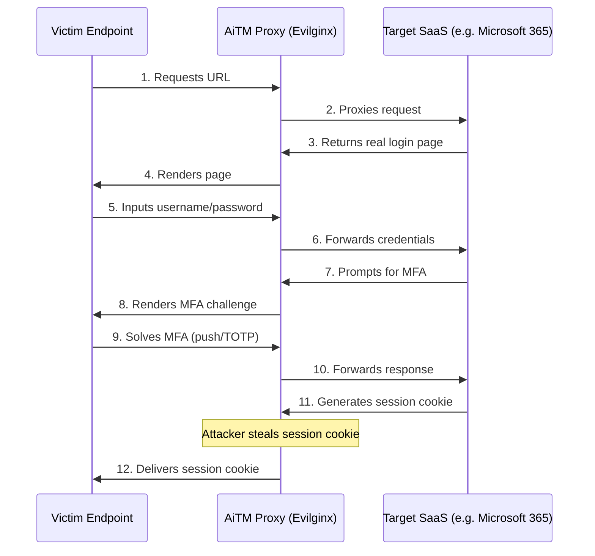
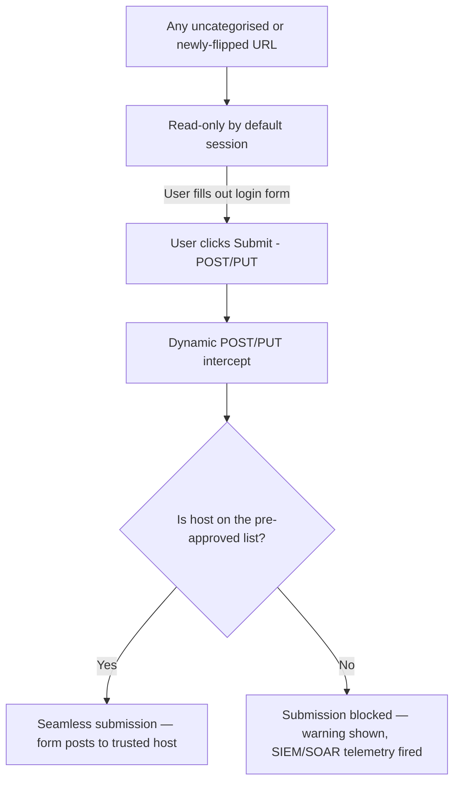

***

## The Fake Mailbox on the Sidewalk

An attacker places a physical, fake mailbox on a busy public sidewalk. It looks identical to an official bank deposit box. Municipal inspectors cannot patrol every square inch of the city continuously. Trusting customers drop envelopes of cash directly into the slot. Within thirty minutes, the attacker dismantles the mailbox and flees. Security teams only catalog the fraud hours after the theft.

Zero-hour phishing runs the same play online. Attackers generate fresh, unclassified landing pages mimicking Microsoft 365 or a corporate banking platform. Reputation databases require hours or days to catalog malicious URLs — that delay is the zero-hour window. During it, traditional secure gateways allow the page to load because threat feeds stay silent. The user types a password. The browser transmits it. The attacker steals the identity.

> *Definition – Zero-hour phishing*: A phishing campaign launched on infrastructure with no prior reputation history, exploiting the delay between a malicious site going live and threat-intelligence feeds classifying it.

Standard multi-factor authentication does not stop this. Modern zero-hour campaigns exploit eight distinct, high-impact techniques.

***

## Eight Techniques Behind Modern Zero-Hour Campaigns

### 1. Dynamic brand spoofing (Phishing-as-a-Service)

Phishing-as-a-Service kits like LogoKit bypass static detection by never hosting a pre-rendered clone. Client-side JavaScript reads the victim's email address from the URL, then rewrites the page DOM in real time, pulling the target's real logo and branding from public databases. Because the server-side HTML holds no static brand references, automated scanners see only a generic page. The browser renders the customized portal after the page loads — invisible to a static-content scanner.

### 2. Exploiting trusted cloud infrastructure

Attackers rarely register new, low-reputation domains. They compromise legitimate sites or abuse free-tier cloud platforms instead, hosting landing pages on Azure, AWS, Cloudflare, Netlify, or Discord. A secure gateway inspecting a link to `web.core.windows.net` or `discordapp.com` assigns a high trust score based on the parent domain, letting the attacker inherit that trust and slip past reputation filters.

### 3. Adversary-in-the-Middle (AiTM) reverse proxies

Widespread MFA adoption drove the rise of AiTM reverse proxies like Evilginx. Rather than hosting a fake login page, the attacker sits a reverse proxy between the user and the real service:

The proxy fetches the real login page and serves it to the victim. It captures the password and MFA response as they're entered, forwards them to the legitimate provider, and — once authenticated — intercepts the resulting session cookie before it reaches the user. The attacker replays the stolen session token to hijack the session, bypassing MFA entirely.

### 4. QR code phishing (quishing)

Attackers embed malicious links inside QR codes in email attachments or images. Standard secure email gateways inspect text, metadata, and attachment structure, but routinely ignore image-based QR codes. Scanning the code moves the session off the monitored corporate computer and onto an unmanaged mobile device, executing over cellular or home Wi-Fi — bypassing endpoint agents, secure gateways, and corporate DNS controls in one motion.

### 5. The extension blind spot

Browser extensions now carry near-total access to the browsing environment. A malicious or compromised extension can exfiltrate data, capture keystrokes, or abuse saved credentials while masquerading as a productivity tool. Compromised developer accounts on the Chrome Web Store have driven mass distribution of rogue extensions past standard review. With agentic AI, a malicious extension can act autonomously using the user's saved identity and access tokens — and antivirus and secure gateways remain completely blind to code executing inside a trusted browser process.

### 6. Shadow AI and generative AI data leaks

Employees routinely feed proprietary code, financial models, and corporate strategy into public AI platforms without IT approval. Only 40% of organizations pay for official AI subscriptions, yet employees at more than 90% of firms use personal AI tools on the job regardless. Pasting confidential data into a multi-turn AI conversation creates a data-leak risk that traditional Cloud Access Security Brokers struggle to monitor — adding as much as $670,000 to the average cost of a data breach.

### 7. Host-level keyloggers and memory scraping on BYOD

On unmanaged and BYOD endpoints, advanced "form-grabbing" keyloggers capture the full contents of web input fields — including passwords and card numbers — before browser-side encryption applies. Infostealers like Raccoon Stealer and LummaC2 go further, extracting active session cookies directly from the endpoint's filesystem, local state files, and browser cache. A secure gateway that only inspects data in transit is blind to both.

### 8. Static vs. continuous posture gaps

Traditional Zero Trust Network Access evaluates device posture once, at login. If a device's posture degrades mid-session — firewall disabled, EDR terminated — the session stays fully active because the gateway never re-checks it. Compromised hosts maintain persistent connections to sensitive applications for as long as the session lasts.

***

## Eliminating Zero-Hour Risk with Submit-on-Trust

Protecting against zero-hour threats means abandoning the legacy gateway and isolation models that try to predict site safety *before* the user interacts with it. The alternative is an architectural shift: **submit-on-trust** — every page may load, but no form can post unless the destination host is explicitly trusted.

- **Read-only by default** — Users can view content on uncategorised or newly flipped sites without interruption. Because risk arises only at the moment of data submission, this avoids blocklists and web delays entirely; browsing stays natural until the user actively tries to share credentials or session data.
- **Trusted-submit whitelist** — Administrators pre-approve high-volume, verified destinations — search engines (`accounts.google.com`), government sites (`*.gov.in`), enterprise cloud portals (`login.microsoftonline.com`) — so forms submit seamlessly where legitimate business actually happens.
- **Dynamic POST/PUT intercept** — When a user clicks Login, Pay, or Send, the browser session is intercepted to inspect the form's HTML `action` attribute. If the destination host isn't on the administrator-maintained trusted-submit list, the request is blocked immediately, the credentials never leave the browser, and a clear security warning is shown.
- **Wildcard and regex rules** — Security teams approve entire SaaS estates (`*.dropbox.com`) or define precise pathways (`https://bank.icici.com/auth/*`) with a single configuration entry, keeping the policy engine lean.
- **Instant telemetry** — Every blocked submission is an active attack attempt. Each one triggers a violation event with full execution context, routed immediately to enterprise SIEM/SOAR pipelines for rapid triage and threat hunting.
- **No reputation lag** — Enforcement is tied to user intent — the act of submitting data — not historical domain scores. This protects the organization during the critical sub-50-minute window when a zero-hour phishing domain is live and completely unchecked by external threat feeds.

By cutting the attacker off at the point of exfiltration — while granting seamless form access to trusted destinations — this approach nullifies zero-hour phishing without breaking everyday browsing.

***

## Traditional Barriers vs. This Approach

| Attack vector | Legacy barrier | Submit-on-trust capability | Secure outcome |
|---|---|---|---|
| PhaaS brand spoofing (LogoKit) | SEGs miss dynamic DOM changes because URL reputation is unchecked | Read-only by default & dynamic POST/PUT intercept | Users can load the page, but entering credentials blocks the data from posting |
| AiTM reverse proxies (Evilginx) | Proxies use high-reputation domains that bypass SWG filters | Trusted-submit whitelist blocks forms posting to rogue proxy hosts | Stolen session credentials never leave the browser; session theft is neutralized |
| QR code phishing (quishing) | Bypasses local devices entirely; executes on personal cell networks | Endpoint extension manages credential actions across platforms | Exfiltration of passwords to non-trusted destinations is instantly blocked |
| Evasive redirection & CAPTCHAs | Crawlers cannot bypass CAPTCHAs, preventing automated blocking | Reputation-independent, intent-based enforcement at submission | Zero-hour domains are blocked without requiring reputation-feed categorization |

***

## FAQ

**What is a submit-on-trust policy?**
It's a security framework where every web page is allowed to load freely, but form submissions — POST or PUT requests — are strictly blocked unless the destination domain is explicitly listed on an administrator-maintained trusted-submit whitelist.

**How does this address reputation lag in threat-intelligence feeds?**
Traditional gateways rely on feeds that can take hours to categorize a new domain. Submit-on-trust is reputation-independent: it evaluates the destination of the form submission at the exact moment the user clicks submit. If the host isn't trusted, the submission is blocked — eliminating risk during the critical sub-50-minute window when a phishing site is live but undetected.

**Does this disrupt everyday browsing?**
No. Because enforcement is read-only by default, users can visit, read, and browse uncategorized, new, or personal pages without interruption. The check triggers only at the moment of data submission, so everyday browsing sees zero friction.

**Can it stop session hijacking and AiTM attacks?**
Yes. During an AiTM attack, the user is tricked into submitting credentials to an attacker's proxy rather than the real corporate application. The proxy domain isn't on the trusted-submit whitelist, so the form submission is blocked — preventing both password harvesting and session-cookie theft.

## Related posts

- [What is SafeSquid SWG](/architecture/what_is_safesquid_swg) - product architecture behind submit-on-trust enforcement.
- [Last Mile Reassembly of Drive-By Malware](/blog/2025-06-02-Last-Mile-Reassembly-of-Drive‑By-Malware) - the same last-mile blind spot, applied to malware delivery instead of credential theft.
- [Getting Started](/getting_started/welcome) - deploy and validate SafeSquid in production.
