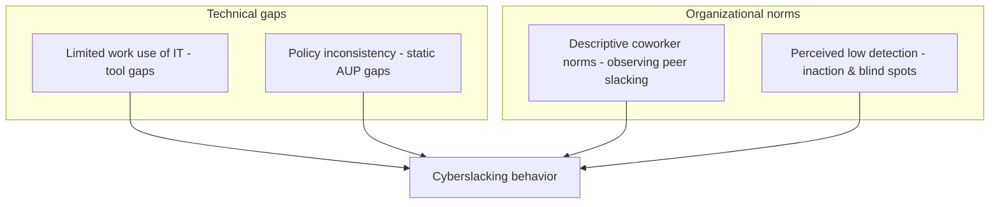
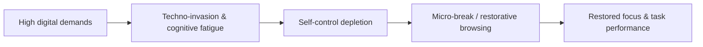

***

## Beyond "Time Theft"

Cloud computing, high-speed internet, and mobile devices erased the workplace's physical and temporal boundaries — and with them, the old excuse for treating **cyberslacking** (or cyberloafing: the unauthorized personal use of corporate IT during work hours) as a simple productivity problem. Contemporary research reframes it as a sociotechnical problem sitting at the intersection of workplace cybersecurity, insider-risk management, and organizational psychology.

The tension is real: overly aggressive, invasive monitoring triggers psychological backlash, degrades trust, and paradoxically drives employees toward *covert* deviance that's harder to see. A lack of controls, conversely, exposes the enterprise to breaches, legal liability, and real productivity loss. Resolving that tension means moving from a zero-tolerance surveillance mindset to an evidence-led, behavioral security paradigm.

> *Definition – Cyberslacking*: Employee use of company bandwidth and work hours for non-business web activity — social networking, entertainment streaming, casual gaming, or unauthorized AI tools.

***

## The Risk Goes Well Beyond Wasted Hours

A firewall is a heavy castle gate built to keep outside invaders at bay. But what happens when a trusted courier with valid keys leaves a side door open — or an imposter walks in wearing the king's disguise? That's the core challenge of insider risk: perimeter defenses assume an external adversary, and the calculus breaks down completely once the threat is an authenticated user with legitimate access.

Security teams need to recognize five distinct insider profiles, not treat users as a monolith:

- **Malicious insiders** — deliberate abuse for personal gain or revenge. Former GE engineer Jean Patrice Delia downloaded over 8,000 proprietary turbine calibration models to start a rival firm; sentenced to 24 months and $1.4 million in restitution.
- **Negligent insiders** — no malice, identical organizational impact. A City of Dallas IT worker inadvertently deleted 20.9 TB of archived police data (8.26 million files) while moving files, disrupting active court cases.
- **Compromised insiders** — legitimate credentials stolen and operated by an external attacker, often harvested via infostealers like Vidar sold on the dark web, making lateral movement nearly invisible.
- **Privileged insiders** — admins and DB managers whose misuse is especially dangerous because they can disable security agents and alter logs.
- **Third-party insiders** — contractors and vendors as a direct extension of the internal trust boundary. GE's 2020 supply-chain breach exposed the PII of 200,000+ current and former employees when its HR document vendor, Canon Business Process Services, was compromised.

**Cybersecurity and network exposure.** Unapproved apps, personal email, shopping portals, and streaming sites bypass corporate perimeter defenses — one careless click on a compromised personal blog can install ransomware or open a C2 connection. Chronic streaming and high-bandwidth downloads also clog corporate networks and degrade business-critical cloud operations.

**Data exfiltration.** Unmonitored browsing pushes employees toward unsanctioned personal cloud storage and webmail, creating blind spots for data-protection teams. The risk peaks during departures: roughly 70% of insider IP theft happens in the 90 days before a resignation. A fired employee at a New York credit union used unrevoked credentials two days after termination to delete 21.3 GB of critical data, including mortgage applications and anti-ransomware software — over $10,000 in recovery costs.

**Shadow AI.** The newest frontier. ChatGPT alone generated more than 410 million DLP policy violations in 2025 (Zscaler ThreatLabz). A developer pasting production logs into ChatGPT, a recruiter uploading a candidate spreadsheet, a sales rep inputting confidential pricing — each interaction feels like a productivity boost while quietly sending corporate assets to a public training dataset, bypassing every static DLP filter.

**Legal and reputational exposure.** Corporate networks used to access, download, or share copyrighted files, unlicensed software, or inappropriate material expose the enterprise to copyright claims, GDPR/HIPAA compliance failures, and hostile-work-environment claims.

**The surveillance paradox.** Nearly 80% of U.S. employers run some form of Electronic Performance Monitoring — emails, websites, keystrokes, even camera surveillance. Heavy-handed EPM backfires: when employees feel their autonomy and privacy are violated, they experience psychological reactance and shift to covert workarounds — personal hotspots, personal phones — that blind corporate security entirely while multiplying real risk exposure.

***

## Why It Happens: Behavioral and Technical Triggers

- **Weak policy clarity.** An Acceptable Use Policy signed once at onboarding and filed away, written in vague language ("unreasonable use," undefined), creates a compliance illusion — employees can't tell acceptable check-ins from prohibited high-risk activity.
- **Perceived certainty of detection.** Under a rational-choice framework, employees weigh the benefit of a quick personal browse against the perceived odds of being caught. Invisible or inconsistently enforced technical controls teach employees they can violate policy with impunity.
- **Social learning and normalization.** Employees learn acceptable behavior by watching peers. Watching a coworker cyberloaf without consequence drops the perceived certainty of sanctions and normalizes the behavior — especially pronounced in public-sector environments, where survey data shows employees consistently overestimate their coworkers' slacking relative to their own.
- **Limited work use of IT.** Rigid, underutilized, or poorly matched corporate tools push employees to re-adapt them, or reach for unapproved cloud services and shadow AI, for personal benefit.
- **Technology re-adaptability.** A technically literate workforce can rapidly reconfigure endpoints, switch between work and leisure interfaces, or run unmanaged software to bypass static blocks — including low-and-slow exfiltration, file-extension renaming to defeat content inspection, and shadow-AI channels like unapproved MCP servers connecting unmanaged AI agents directly to corporate endpoints.

***

## The Real Root Cause: Cognitive Ergonomics, Not Malice

Cognitive ergonomics and occupational-health research point to a different root cause than individual malice: the intense mental demands of the hyper-connected workplace.

Under the Job-Demands-Resources model and Conservation of Resources theory, cognitive capacity is a finite resource depleted by constant digital demands — "techno-invasion." Once self-control depletes, cyberslacking becomes a functional, self-regulating coping mechanism: brief micro-breaks let employees detach, recharge, and reduce techno-stress. Empirical evidence shows this self-regulated "restorative browsing" can genuinely enhance subsequent task performance and creative problem-solving.

Heavy-handed EPM disrupts that recovery cycle directly. Psychological Reactance Theory predicts that when people perceive their autonomy and privacy as threatened, they experience motivational arousal aimed at restoring that freedom — shifting behavior from open, restorative browsing to stressed, defensive cover-up behavior on personal devices, a complete loss of visibility for security teams in exchange for worse morale and higher turnover intent.

***

## The Defensible Strategy: Risk-Adaptive Behavioral Security

The evidence points away from both extremes — passive neglect and zero-tolerance surveillance — toward an integrative framework built on four pillars:

1. **Administrative foundation (NIST SP 800-53 AUP model)** — a precise, actively updated, role-tiered acceptable use policy, not a static intranet document.
2. **Privacy-preserving Security Service Edge controls** — SWG, CASB, and UEBA monitoring data movement, not keystrokes or screens.
3. **Risk-adaptive, non-invasive enforcement** — context-aware restriction based on behavior and account risk score, not blanket blocking.
4. **The trust buffer** — high employer trust is a powerful buffer against surveillance-induced reactance; when monitoring is perceived as fair and transparent, compliance shifts from external coercion to internal motivation.

### Turning the strategy into technical reality

| Operational layer | Core control mechanics | Core strategic objective |
|---|---|---|
| AUP & governance | NIST SP 800-53 compliance, cross-functional panel (HR, Legal, Security, Ops) | Eliminate ambiguity, establish legal defensibility, align policy with technology |
| Secure Web Gateway | Contextual filtering, read-only modes, HTTP method & API introspection | Prevent malware ingress, block high-risk egress, permit low-risk restorative use |
| DLP & insider risk | Dynamic access containment, data entropy analysis, policy as code | Prevent exfiltration, automate containment, maintain dynamic user risk groups |
| Management practices | SCENE nudge framework, procedural/interactional justice, real-time analytics | Reduce psychological reactance, build trust, coach rather than police |

**AUP and governance.** Write an enumerated, precisely referenceable policy (e.g. "Clause 5.2: unapproved browser extensions") so analysts can cite it directly during coaching or triage. Define "reasonable personal use" explicitly — for example, up to 30 minutes of daily personal browsing during designated breaks — while clearly naming prohibited high-risk activity: peer-to-peer file sharing, unapproved AI document processing, adult material. Govern it through a cross-functional Acceptable Use Policy Advisory Panel spanning HR, Legal, IT Security, and business operations, aligned with CISA's multi-disciplinary insider-risk guidance.

**Technical and browser controls.** Because over 95% of web traffic is encrypted, inline TLS inspection at the gateway is non-negotiable — with selective bypass for sensitive categories like personal banking and healthcare to preserve privacy. Beyond that baseline:

- **Contextual filtering, not blunt blocks** — allow educational YouTube categories and the managed training channel; intercept Shorts, music, and entertainment with a "Focus Mode" page instead of blocking the whole platform.
- **Read-only social media mode** — permit `GET` requests (feeds, search, brand dashboards) while dynamically blocking `POST`/`PUT`/`DELETE` (posting, commenting, liking).
- **Feature-level blocks** — isolate specific endpoints (e.g. `/games/*` and Instant Games on Facebook) via URL-path analysis, leaving news feed and business messaging fully intact.
- **Time and bandwidth quotas** — allocate a fixed daily non-work streaming budget (e.g. 300 MB); once exhausted, serve a "Quota Expired" page instead of a hard block.
- **Adaptive whitelists** — dynamic domain/regex rules keep legitimate business tools (LinkedIn Ads Manager, YouTube Studio, partner developer portals) functional for the roles that need them.

**DLP and insider-risk controls.** Tie behavioral risk scores to the Cloud Identity Engine so a spike automatically moves a user into a restricted Cloud Dynamic User Group — restricting sensitive-database access, blocking high-bandwidth streaming, and routing unreviewed browsing or AI-tool usage through Remote Browser Isolation, without shutting down legitimate work. Data entropy analysis catches compressed archives, encrypted zips, or renamed extensions (`.xlsx` → `.jpg`) attempting to bypass content inspection. For shadow AI specifically, use a 3-tier traffic-light model: **green** (enterprise-sanctioned tools like Copilot with enterprise data protection), **yellow** (sanctioned tools under guardrails — data redaction active, managed devices only, no regulated PII/PHI or source code), **red** (unmanaged public tools — credentials, proprietary code, and customer records technically blocked). Cloud Browser Isolation offers a middle ground for evaluating unreviewed AI engines read-only, without copy, paste, upload, or download.

**Management and behavioral interventions.** Replace blunt block pages with a **SCENE** coaching nudge: **S**ympathetic framing of the user's actual work goal, **C**itation of the specific AUP clause grounding the block in agreed rules, an **E**xplicit direct link to a sanctioned alternative ("Click here to access our secure Enterprise AI Portal"), and brief **E**ducational reinforcement on the data risk — all delivered in the moment of the decision. Train supervisors in procedural and interactional fairness, since employees treated with equity and respect are significantly less likely toward retaliatory, deviant cyberslacking. Replace generic annual training with behavior-triggered microlearning the day after a policy alert or failed phishing simulation. Surface real-time, aggregated (not individually punitive) analytics to department heads — top-visited categories, flagged distractions, bandwidth-hogging endpoints — to enable supportive coaching conversations instead of a "big brother" culture.

***

## The Evidence

**The CSU Pueblo experiment.** Researchers Morgan Shepherd and Roberto Mejias tracked actual Splunk-logged employee internet usage across two treatment stages. A mild, non-punitive AUP reminder produced an immediate 12% drop in abuse — but usage crept back to baseline within a week. A severe reminder detailing specific sanctions produced a 33% drop (from a 72% abuse baseline down to 39%) that held significantly below baseline for three-plus weeks — clear policy expectations paired with a high perceived certainty of enforcement create durable compliance.

**The Ghana PLS-SEM model.** A structural equation model across 473 public-sector responses found that perceived certainty of monitoring and direct awareness of security risk significantly deter cyberloafing — while the severity and swiftness of sanctions had no measurable effect. This tracks core criminology: employees are deterred by the certainty of being caught, not the severity of the punishment. Threatening termination is ineffective if employees believe the network is blind.

**The Virginia Tech multi-wave study.** Tracking subordinate-supervisor dyads over three time intervals, researcher Viswanath Venkatesh and collaborators found a non-linear relationship: excessive, unmitigated cyberslacking degraded job performance, but controlled, moderate slacking — short personal checks, brief breaks — had no negative effect at all. High organizational justice, where supervisors suppress bias and enforce policy transparently, was the single strongest predictor of voluntary policy compliance.

***

## Conclusion

Deterring workplace internet deviance isn't a matter of squeezing the employee harder — it's building secure, supportive, intelligent guardrails. Matching technical controls to the cognitive realities of the workforce is how enterprises eliminate security blind spots, isolate real data risk, and keep a trust-based, productive remote and hybrid workforce intact.

## Related posts

- [DNS Tunnelling: The Insider's Invisible Exit Route](/blog/2025-06-02-DNS-Tunneling) - another insider-behaviour control challenge, this time on the network side.
- [The Death of the Blocklist: Eliminating Zero-Hour Phishing](/blog/2025-05-17-Zero-Hour-Phishing-Beyond-URL-filters) - risk-adaptive enforcement applied to external phishing instead of internal misuse.
- [Getting Started](/getting_started/welcome) - deploy and validate SafeSquid in production.
