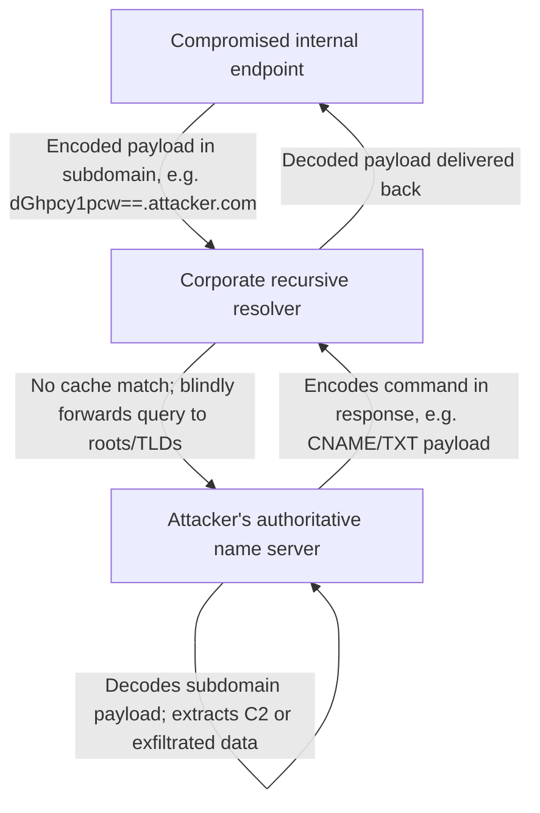
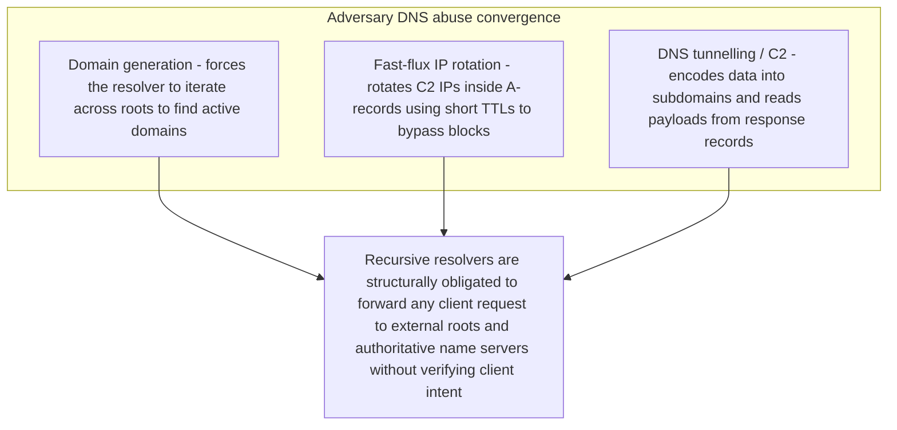

***

## The Blueprint in the Phone Directory

Consider a secure government archive: armed guards, biometric checkpoints, heavy steel vaults. No employee can carry files, USB drives, or personal devices out of the building. But in the main lobby sits a public telephone directory service — employees can pick up a phone, dial an external operator, and ask for the address of any business in the world.

If an insider wants to steal a classified blueprint, they don't bypass the physical checkpoints. They write down a page of the blueprint, translate it into alphanumeric characters, and call the operator: *"Can you give me the address for 'A-4-S-F-3-9-D-2.blueprints.com'?"* The operator's sole job is to resolve lookups — it doesn't question the meaning of the characters. It dials the authoritative registry for `blueprints.com`, which — unknown to the operator — is controlled by an accomplice, who simply writes down what came through. Over hundreds of seemingly administrative calls, the blueprint leaves the vault one address query at a time, while the guards watch and classify the calls as standard office operations.

**DNS tunnelling is the digital equivalent of this telephone-directory exploit.**

DNS converts human-readable hostnames into routable IP addresses. Because name resolution is a prerequisite for almost every network activity, outbound port 53 is universally left open and uninspected. Attackers exploit that trust to run bidirectional C2 channels, slow exfiltration streams, and persistence — turning a benign lookup protocol into a covert information highway. Three limitations in traditional controls let this happen:

- **The volume-vs-inspection gap** — enterprise networks generate millions of DNS resolutions daily; deep packet inspection of every text string on port 53 is computationally prohibitive.
- **Stateless network blind spots** — a next-gen firewall sees only that the endpoint queried the local corporate resolver, not the external C2 server the resolver later reaches on the endpoint's behalf.
- **DLP incompatibility** — DLP platforms watch HTTP, HTTPS, SMTP, and SFTP. They don't parse or rebuild DNS subdomain fragments, so structured corporate data exiting through lookup payloads is entirely invisible to them.

***

## Four Evasion Patterns That Bypass Standard Detection

**1. Upstream-only silent exfiltration.** Most detectors look for bidirectional traffic — a query matched with an active, payload-carrying response — to spot a tunnel. If an attacker's sole goal is data theft, every query can be configured to fail with `NXDOMAIN` or `ServFail`. The data still reaches the attacker's authoritative nameserver during the lookup itself; with no matching response, bidirectional checkers see nothing and the transaction reads as a harmless lookup error.

**2. The false-positive scaling nightmare.** Legitimate services — antivirus signature lookups, spam-blocklist checks (Spamhaus), network telemetry (Team Cymru) — routinely generate high-entropy DNS queries for reputation lookups. Naive entropy or rate-limiting filters flag these as malicious, forcing security teams to disable the alerts and leaving the network open to genuine tunnels.

**3. The unresolved-alias behavioral gap.** In normal browsing, a DNS lookup always precedes a real TCP/UDP connection to the resolved IP. A tunnel's entire purpose is data exchange within the lookup phase itself — it never intends to connect to the resolved domain. Tools that treat DNS packets as isolated, stateless events, without cross-referencing transport-layer state, miss this high-fidelity signal entirely.

**4. DNS tunnelling for non-C2 abuse.** Most vendor tooling assumes tunnelling exists only for post-exploitation C2 or VPN circumvention. But campaigns like **TrkCdn** embed encoded victim IDs in subdomains purely to track when a user opens a phishing email or loads CDN content, and attackers scan for open recursive resolvers using spoofed source IPs to prep future redirection or DDoS. Both are sparse, low-volume, and read as benign background noise to standard defenses.

***

## Exploitation Techniques in the Wild

- **Saitama (APT34/OilRig)** — a low-and-slow implant using plaintext DNS as its sole transport, staggering queries to a mean of just 60 per hour to evade volume-based detectors. Catching it requires stateful correlation windows spanning hours, not minutes.
- **TrickBot** — reserves the first two A-records in a response to declare payload size and offset, then encodes a sequence index in the high bits of each subsequent IPv4 octet. The malware reorders fragments by index, reassembles them in memory, and executes the compiled DLL via process hollowing.
- **SysUpdate (Iron Tiger)** — Base32-encodes a random number plus a static signature hex using a custom, non-standard alphabet, producing queries that always end in the static suffix `reeaaaaaa`. The payload is DES-CBC encrypted, exfiltrating host identifiers, PIDs, and kernel memory configuration without matching a standard Base32 pattern.
- **BRICKSTORM (WARP PANDA)** — targets VMware ESXi and vCenter, which don't support standard EDR agents. It resolves its C2 domains over DNS-over-HTTPS to trusted public resolvers (Cloudflare, Google, Quad9), nested inside a TLS session on port 443 — invisible to local tools as anything but generic HTTPS.

***

## One Mechanism Behind DGAs, Fast-Flux, and Tunnelling

Threat-intel frameworks often treat Domain Generation Algorithms, fast-flux hosting, and DNS tunnelling as separate alert categories. They're a tactical convergence — all three exploit the same weakness: **the recursive resolver's absolute protocol obligation to forward any external domain requested by an internal client.**

SUNBURST (SolarWinds) generated thousands of pseudo-random subdomains under `avsvmcloud.com` to locate its C2. Fast-flux attacks rotate A-record IPs with TTLs as short as 60 seconds to keep backend C2 nodes shifting. Decoy Dog's tunnelling sends exfiltrated data out through the query and imports instructions back through the response. In every case, the client endpoint never talks to the attacker directly — it only ever talks to the trusted local resolver, which does all the legwork of reaching the attacker-controlled authoritative nameserver.

### The flaw of implicit trust — and why DNSSEC doesn't fix it

DNS was designed decades ago prioritizing availability, speed, and scalability over access control — recursive resolvers accept queries from any host on the local segment and forward them blindly, even from highly isolated zones like PCI-DSS point-of-sale environments. Encrypted DNS protocols (DoH, DoT) compound the problem: when an endpoint or browser enables DoH to an external public resolver, it bypasses the local resolver entirely, wrapping the query in standard HTTPS on port 443 and blending it into the mass of corporate web traffic. Local tools lose all visibility.

Many practitioners assume DNSSEC solves DNS-based threats — it doesn't. DNSSEC validates the integrity and authenticity of a response to prevent spoofing and cache poisoning; it does not inspect query payloads or stop a compromised host from sending encoded data outbound. An attacker can register and cryptographically sign a malicious authoritative server with DNSSEC and keep tunnelling data completely unhindered.

***

## Centralized Protective DNS (PDNS) Architecture

Closing the covert channel means moving from decentralized, uninspected name resolution to a centralized, protective DNS architecture built on five capabilities:

1. **Category-based allow listing** — the resolver only permits queries resolving to sanctioned business categories (SaaS tools, developer repos, financial infrastructure). Uncategorized domains, parked pages, and newly registered sites are blocked by default — and an attacker's transient C2 domain is almost always uncategorized.
2. **Query-rate thresholds** — hosts exceeding a configurable QPS are flagged, halting high-volume tunnels while sparing normal browsing. Contextual protocol parsing excludes known, authenticated security-API query structures from the rate limit, avoiding the false-positive nightmare above.
3. **Subdomain length enforcement** — queries whose label exceeds a set byte length (e.g. 50 bytes) are rejected. Efficient tunnelling needs to cram as much data as possible into each label (up to the 63-character maximum); restricting length collapses the usable bandwidth of any tunnel.
4. **Entropy and pattern analysis** — inline lexical and statistical analysis calculates Shannon entropy and word-segmentation ratio on every subdomain, differentiating standard hostnames from randomized, high-entropy encoded data — catching zero-day, polymorphic C2 without needing a pre-existing signature.
5. **Real-time alerts** — every threshold trigger generates a SIEM-ready violation report with source IP, the exact malformed DNS string, query type, client port, and Active Directory user context, so SOC analysts can isolate an infected endpoint immediately.

***

## The Domain Evasion and Lifecycle Matrix

| Lifecycle stage | Adversary objective | Execution tactic | Standard defensive gap | Defensive detection barrier |
|---|---|---|---|---|
| 1. Registration & strategic aging | Establish a legitimate domain-age baseline | Register the domain, leave it dormant for 14–120 days | Automated controls typically only block domains under 30 days old | Historical registration profiling — analyze registration-to-activation velocity and registrar patterns tied to bulk malicious purchases |
| 2. Query dribbling | Earn a low-risk reputation score | Send minimal, legitimate-looking request volume | Static databases classify low-volume, no-payload domains as benign | Passive DNS graph analysis — map NS-record relationships to spot infrastructure reuse |
| 3. Pre-C2 reconnaissance | Verify target connectivity before launching the payload | Dispatch a single "ping" query to a specific subdomain | Bypasses volume-based anomaly detection as an isolated query | Subdomain length & entropy enforcement — rejects the probe if the label is long or non-linguistic |
| 4. Active tunnelling | Establish bidirectional C2 and data extraction | Continuous high-volume or low-and-slow encoded queries | Firewalls treat the queries as standard internal recursive requests | Query-rate thresholds & pattern analysis — flags high-QPS traffic or custom Base32/Base64 alphabets |
| 5. Dynamic failover & migration | Survive domain-level takedowns | Trigger a DGA lookup or shift to a secondary controller | Domain-specific blocklists fail once the controller migrates | Automated endpoint & SIEM isolation — identifies the local process spawning the lookups and isolates the host |

## Threat Mitigation Mapping

| Threat vector | Root cause | PDNS capability | Expected outcome |
|---|---|---|---|
| Low-and-slow C2 (Saitama) | Volume filters miss staggered, infrequent patterns | Category-based allow listing & entropy analysis | Blocked at the lookup phase — the un-aged, low-frequency domain is uncategorized |
| Multi-octet response encoding (TrickBot) | Gateways inspect text strings, not payload bytes split across IPs | Query-rate thresholds & subdomain length enforcement | Halts the rapid lookup streams required to pull multiple fragments, preventing in-memory DLL assembly |
| Encrypted C2 via DoH (BRICKSTORM) | Encrypted DoH queries nested in port 443 are invisible locally | Secure DoH decryption gateways & mandatory outbound blocks | Blocks public resolvers; decrypts HTTPS queries at internal gateways to restore payload visibility |
| Polymorphic C2 / DGAs (SUNBURST, Decoy Dog) | Static reputation databases can't predict algorithmic domains | Entropy & pattern analysis (Shannon & WSR) | Automatically blocks dynamic, randomized domains without pre-existing signatures |
| Upstream-only exfiltration (silent NXDOMAIN) | Gateways only inspect bidirectional traffic | Subdomain length enforcement & entropy analysis | Rejects long, high-entropy outbound queries before data reaches the C2 |
| Non-C2 tracking/scanning (TrkCdn) | Short, sparse queries evade volume/rate checks | Category-based allow listing | Blocks lookups to dynamic, un-vetted advertiser categories |
| DNSSEC-signed tunnels | Cryptographic validation doesn't inspect payload contents | Entropy & pattern analysis with length enforcement | Disregards DNSSEC status when evaluating query strings, catching encoded text regardless |

***

## Conclusion

DNS was built for trust and speed, not for secrecy checks — and that's exactly what attackers weaponize to move data under the radar. Category controls, rate and length limits, and payload-aware entropy analysis turn the DNS highway into a monitored gate: legitimate resolution keeps flowing, and covert tunnels hit a wall.

## Related posts

- [Last-Mile Reassembly of Drive-By Malware](/blog/2025-06-02-Last-Mile-Reassembly-of-Drive‑By-Malware) - another channel that hides payloads inside traffic legacy gateways treat as benign.
- [Cyberslacking Deterrence: Behavioral Security, Not Surveillance](/blog/2025-06-02-Cyberslacking) - another insider-behaviour control challenge.
- [How XSS-Powered CSRF Abuses Trust Boundaries](/blog/2025-06-02-CSRF-Abuse) - another in-session, browser-side exploitation technique.
