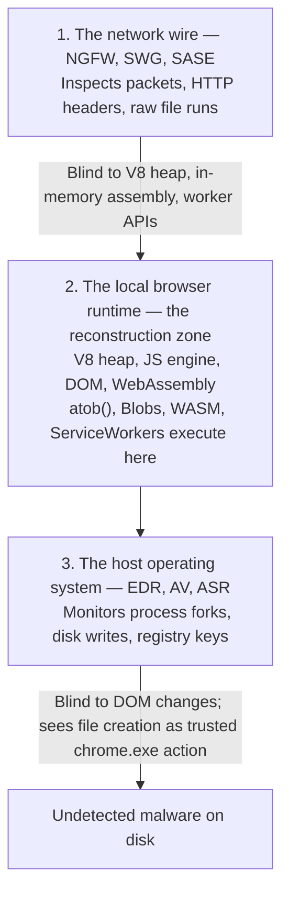

***

## Flat-Pack Smuggling, Digitally

Imagine ordering a heavy, solid oak dining table from an international retailer. If the retailer ships the fully assembled table in one wooden crate, customs inspectors at the border flag it, scan it, and evaluate it for weight, material, and compliance immediately.

Now imagine the retailer takes a different approach: dismantle the table into a flat bag of steel screws, a set of unpainted legs, and a plain wooden tabletop. Pack each part into separate, ordinary cardboard boxes and ship them via multiple trucks over several days. Individually, every shipment is entirely benign — the border team scans a box of screws and waves it through, inspects a bundle of legs and sees no threat. Only when every box reaches the buyer's living room does the buyer open the assembly manual and put the table together, using local tools, thirty minutes after the last box arrives. A functional table now exists inside the house, having bypassed every inspection point in a completely invisible, disassembled state.

In modern enterprise security, **last-mile reassembly** is the digital equivalent of flat-pack smuggling.

> *Definition – Last-mile reassembly*: Shifting a payload's decoding, decryption, and final structural assembly from the attacker's server to the local execution space of the victim's browser, so no completed malicious artifact ever traverses the network wire.

Historically, drive-by malware delivery relied on transmitting a fully formed, executable binary over HTTP/S. Perimeter defenses — Secure Web Gateways, next-gen firewalls, email security gateways — inspected the stream for known file hashes, PE headers (the `4D 5A` magic bytes), or suspicious MIME types. That forced a perpetual arms race of server-side obfuscation and domain rotation.

By moving the final assembly step into the browser, adversaries render that entire network-based analysis model obsolete. The wire carries only benign, fragmented text strings, legitimate scripting runtimes, or unmonitored protocol channels. The payload is reconstructed in-browser, completely behind the enterprise firewall — at the last mile.

***

## The Mechanics of Last-Mile Reassembly

### 1. HTML smuggling and memory-based Blob reconstruction

HTML smuggling is the foundational technique. It leverages the browser's native ability to handle Blobs — raw, immutable data structures processed directly in browser memory.

The payload is encoded as a Base64 string and stored inside a JavaScript variable, or nested inside an inline SVG tag. When the victim opens the attachment or visits the compromised page, the browser decodes the string with `window.atob()`, writes it into a `Uint8Array` byte buffer, and passes that buffer to the JavaScript `Blob` constructor — instantiating a client-side file-like object with a chosen MIME type. The script then calls `URL.createObjectURL(blob)`, generating a `blob:` URI that resolves entirely from local browser memory, with zero network traffic. Finally, it injects an anchor tag, sets its `href` to the blob URL, assigns the HTML5 `download` attribute, and calls `.click()` — forcing the browser to save the memory-resident file to disk, completely bypassing every network-layer transfer filter.

Modern **ClickFix** and **ClearFake** campaigns show this in the wild: they compromise vulnerable WordPress sites, inject a small JavaScript loader, and present a convincing fake reCAPTCHA "unusual traffic" check. Clicking the fake check runs a programmatic clipboard hijack, copying an obfuscated command to the clipboard. The overlay then instructs the victim to open Run (`Win+R`) and paste the command to "verify humanity." The pasted command launches through `pcalua.exe` — the legitimate, pre-signed Program Compatibility Assistant — spawning PowerShell and fragmenting the parent-child process tree that endpoint detection relies on.

### 2. Compiled WebAssembly (WASM) obfuscation

Adversaries are graduating from readable JavaScript to compiled WebAssembly modules (`.wasm`) to decrypt payload fragments. Traditional network inspection is built to parse plaintext scripting; it cannot execute, decompress, or emulate compiled WASM binary streams.

Inside a WASM-driven attack, the module houses the decryption algorithm (RC4 or AES) and the obfuscated payload array. Once loaded, WASM executes entirely inside the browser's sandbox memory — reading the encrypted payload, decrypting it in WASM linear memory, and handing the raw binary back to JavaScript solely to trigger the final Blob download. Structural assembly of the executable never touches any perimeter inspection engine.

### 3. Concurrent multi-worker architectures

To avoid freezing the active tab — which would tip off the user — advanced campaigns run assembly pipelines silently in the background:

- **ServiceWorkers** act as network proxies sitting between the browser engine, the web app, and the network. A registered ServiceWorker can intercept a download trigger, fetch encrypted chunks from multiple high-reputation domains, decrypt them concurrently, and pipe the merged stream back as a single file download.
- **SharedWorkers** operate independently of any one tab's lifecycle, orchestrating assembly across multiple open tabs. Built directly from inline React or Webpack bundle code, the worker's execution blends into legitimate application processes — no isolated, suspicious script request shows up in network logs.

The **SourTrade** malvertising campaign, which has targeted retail cryptocurrency investors across dozens of countries, illustrates the pattern well. Instead of serving a static executable from a fixed URL, the landing page initializes a ServiceWorker and a background SharedWorker. The SharedWorker fetches a legitimate, pre-signed developer tool — the Bun runtime — which network inspection classifies as low-risk and permits. Once Bun is cached locally, the page pulls Base64-encoded, encrypted JavaScriptCore bytecode via a `/config` API endpoint, writes it into Bun's native section tables, and runs an inline AES-CTR decryption loop seeded per-session to defeat static fingerprinting. The result is a file with a unique, randomized SHA-256 hash — a "ghost hash" — carrying pristine, executable malicious code. The ServiceWorker then completes the delivery as a same-origin stream, so the OS registers the download as originating from the trusted landing-page domain.

### 4. The outbound threat: data-splicing exfiltration

The same browser APIs invert cleanly into **data-splicing attacks** that bypass enterprise DLP. Traditional DLP agents watch standard boundaries — file-upload streams, clipboard text, print actions. Open-source proof-of-concept toolkits like **Angry Magpie** demonstrate how easily those boundaries break: on a DOM clipboard-copy event, the script converts sensitive plaintext to Base64 or runs an in-memory AES-CTR encryption, writing ciphertext directly to the system clipboard. When the user pastes into an external, unmanaged webmail tab, the endpoint DLP driver sees only arbitrary, non-sensitive string blocks and permits the transfer — while a loader on the receiving page silently decrypts and repopulates the original plaintext.

For print-to-PDF exfiltration, the same framework injects invisible Unicode zero-width space characters between the sensitive characters. This defeats standard string matching and regex heuristics in endpoint DLP drivers while preserving the visible text on the printed document.

***

## The Evasion Convergence

HTML smuggling, WASM decryption, multi-worker streaming, and decentralized hosting look like distinct techniques, but they converge on one operational goal: neutralizing transit-based and signature-based controls. That convergence leaves a visibility vacuum in the middle stage of payload reconstruction, between initial transit and final execution:

- **The network bypass** — DPI and SWGs fail because the malware never exists on the network. Raw traffic is fragmented Base64 strings, compiled WASM bytecode, or encrypted JSON-RPC frames — indistinguishable from normal application traffic like interactive graphics or dashboard rendering.
- **The sandbox blind spot** — network sandboxes inspect discrete files in transit. The individual HTML carrier or WASM module shows no malicious behavior in isolation: no unapproved-domain connections, no system calls, no disk writes. The sandbox classifies it clean and passes it through.
- **The host-level blind spot** — EDR monitors process trees, registry modifications, and disk writes at the OS layer. Because reassembly happens entirely inside the browser's isolated V8 heap or ServiceWorker cache, EDR has zero API visibility into that execution space. When the browser eventually writes the compiled binary to disk, the OS logs it as a standard file-creation event from a trusted process (`chrome.exe`, `msedge.exe`) — a benign user-initiated download that hides the malicious assembly that preceded it.

### The architectural visibility mismatch

This isn't a weak-signature problem — it's a structural one. Traditional controls sit at layers that cannot see browser execution:

1. **Network gateways are stream-centric, not context-aware.** Reconstructing the client-side JS engine's execution path in real time, as packets flow through a cloud proxy, is computationally impractical — it would introduce unacceptable latency. So SWGs evaluate only static URLs and raw file streams, blind to dynamic DOM modification and worker threads.
2. **Host EDR is process-centric, not API-aware.** EDR hooks OS-level system calls, not internal browser APIs. It treats the browser as a trusted, monolithic black box and cannot distinguish a legitimate SharePoint PDF download from a ServiceWorker assembling a ransomware loader from memory-resident Base64 fragments.
3. **There is no reference monitor inside the browser.** Secure OS design mediates every access to information through a tamperproof, formally verifiable reference monitor. The browser has become the de facto operating system for cloud and SaaS work, yet consumer browsers execute untrusted web code by default with no equivalent mediation layer between script execution and file-generation APIs.

***

## Closing the Gap with Browser-Native Security (BDR)

The only strategic approach that addresses the root cause is Browser Detection and Response (BDR) — security enforced directly inside the browser's rendering engine and V8 runtime, functioning as a localized reference monitor. The governing rule: no script-driven file creation, DOM-level compilation, or data exfiltration proceeds without real-time, runtime inspection at the browser-native layer.

- **Fragment inspection** — Every network response, whether CSS, JSON, or a raw image file, is scanned at the browser-native layer for encrypted opcode patterns and suspicious entropy before it enters the local cache or V8 heap. This catches obfuscated binary chunks and Base64 strings — like those hidden in SVG XML in QBot campaigns — at the moment of ingress.
- **Assembly watchdog** — A browser-helper ruleset continuously monitors client-side JS API calls, blocking any attempt to use `atob()`, string concatenation, or `WebAssembly.instantiate()` to compile or reconstruct an untrusted blob unless the originating host is registered on an administrator-maintained trusted-assemble list.
- **Inline sandboxing** — When the watchdog flags a suspicious or complex fragment set, the browser-native engine reconstructs it inside a secure, headless sandbox first. If the reconstructed hash matches a known malware family, or the simulation exhibits malicious behavior — spawning a virtual anchor and a programmatic download click — live delivery to the user's session is halted instantly.
- **Violation telemetry** — Every blocked assembly event streams rich telemetry to the SIEM pipeline: full fragment URLs, background ServiceWorker hashes, referrer headers, and the active DOM layout state, enabling rapid source takedowns.
- **Seamless access for clean content** — Because enforcement is tied to real-time behavioral context rather than blunt category blocklists, downloading from GitHub Pages, the npm CDN, or government-site downloads continues uninterrupted whenever the runtime behavioral checks pass — zero false positives, zero added latency.

***

## Empirical Proof of Threat Mitigation

| Threat vector / campaign | Root cause | Solution capability | Security outcome |
|---|---|---|---|
| HTML smuggling (QBot via SVG attachments) | SWGs cannot parse base64 arrays inside XML/SVG; EDR lacks DOM context | Fragment inspection & assembly watchdog | Scans incoming SVG code; blocks client-side `atob()` decoding of the embedded ZIP archive in memory |
| Decentralized dead-drops (ClearFake via Web3 RPC) | Public blockchain nodes are highly trusted and unblockable; loaders run dynamically | Assembly watchdog & inline sandboxing | Intercepts JSON-RPC fanned-out queries; blocks dynamic reconstruction of malicious JS from blockchain data |
| Legitimate runtime poisoning (SourTrade via Bun) | SWGs permit pre-signed developer tools; the executable is patched in-memory | Inline sandboxing & violation telemetry | Simulates the dynamic bytecode patching of the Bun engine; halts execution and logs the origin domain to SIEM |
| DLP upload/download bypass (Angry Magpie base64) | Traditional DLP lacks context and is blind to DOM-level base64 encoding | Assembly watchdog & fragment inspection | Detects programmatic file interception and base64 translation in the DOM; halts exfiltration in real time |
| DLP clipboard/print bypass (Angry Magpie zero-width space) | Endpoint DLP is blind to copy-paste manipulation and zero-width Unicode spaces | Assembly watchdog | Detects DOM-level copy interception and filters zero-width spaces, letting DLP scanners match strings accurately |

***

## Conclusion

Malware builders no longer need single-file delivery — they rely on the victim's own browser to finish the job. By shifting the enforcement point from the network wire to the browser-native execution runtime, defenders close the exact gap last-mile reassembly is built to exploit: the "unstoppable" flat-pack malware is dismantled at the assembly line, before it ever becomes a file on disk.

## Related posts

- [The Death of the Blocklist: Eliminating Zero-Hour Phishing](/blog/2025-05-17-Zero-Hour-Phishing-Beyond-URL-filters) - the same last-mile blind spot, applied to credential theft instead of malware delivery.
- [DNS Tunnelling: The Insider's Invisible Exit Route](/blog/2025-06-02-DNS-Tunneling) - another covert channel legacy gateways can't see inside.
- [How XSS-Powered CSRF Abuses Trust Boundaries](/blog/2025-06-02-CSRF-Abuse) - another in-session, browser-side exploitation technique.
