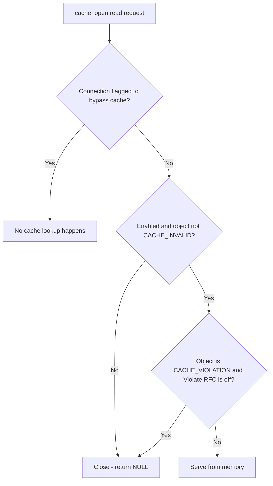

Open **Configure → Application Setup → Accelerators → Caching**. This section sits under the **Accelerators** menu group alongside [Caching](/configuration/application_setup/accelerators/caching) and [Prefetching](/configuration/application_setup/accelerators/prefetching) — they interact, since a prefetched object is only useful if Caching later serves it.

The **Cache** section controls in-memory HTTP caching, refresh policy, and ICP parameters for forwarding.

## Core mechanics

### Refresh — first match wins

Walk Refresh rows top-down; first enabled row whose profiles match sets min/max age, validate, and cachable flag, then stops. `cachable=FALSE` sets `CACHE_INVALID` unless `CACHE_FORCE`.

<Warning>
  **Disk store is hard-disabled.** Disk store selection is inactive — new objects are memory-only regardless of Store row configuration.
</Warning>

{/* source: https://www.safesquid.com/md/cache.md */}
### Freshness semantics

What each Refresh age field actually does, once an entry has matched:

- **Minimum age** — guards against serving something that changed very recently: if the origin's Last-Modified is more recent than this many seconds ago, the object is not treated as safe to serve without revalidating.
- **Maximum age** — hard ceiling; SafeSquid expires the object this many seconds after caching regardless of the freshness the origin's own headers promised. `0` disables the ceiling.
- **Revalidate age** — applies only when the origin gave no explicit freshness guidance at all (no `Expires`, no `max-age`): fresh for this many seconds since caching, then must revalidate.
- **Last-Modified time factor** — last-resort heuristic, used only when the origin gave no freshness guidance but did supply a Last-Modified date: the longer ago the object was modified relative to when it was fetched, the longer it is assumed to stay fresh, scaled by this percentage.

### Violate RFC

Objects stored despite `no-cache` / `no-store` get `CACHE_VIOLATION`. When **Violate RFC** is off, reads return NULL (not served). When on, violation objects may be served.

{/* source: https://www.safesquid.com/md/cache.md */}
### Object size limits

- **Minimum file size** — an object smaller than this is discarded after the write completes rather than kept.
- **Maximum file size** — an object exceeding this during writing is discarded unless the matching Refresh entry forced caching regardless of size.

`0` disables either check.

{/* source: https://www.safesquid.com/md/cache.md */}
### Memory management

When memory used by cached objects exceeds **Memory cache size**, a cleanup pass evicts least-recently-used, currently-unread entries first, targeting Memory cache size minus **Memory free extra**. **Clean interval** is the minimum time between passes so cleanup does not run continuously under sustained pressure.

{/* source: https://www.safesquid.com/md/cache.md */}
### Cache bypass

If the connection was flagged elsewhere to bypass the cache, no cache lookup happens at all.

{/* source: https://www.safesquid.com/md/cache.md */}
### Manage cached objects

A regular-expression pattern plus "Delete matches" invalidates and removes every cached entry whose key matches, except an entry a client is actively reading at that moment, which is left alone rather than pulled out from under the reader.

{/* source: https://www.safesquid.com/md/cache.md */}
## Schema fields

### Global fields

- **Enabled (`cache_policy`)** — master switch. Off means no cache lookup and no write for any request.
- **Violate RFC (`violate_rfc`)** — see above.
- **Memory cache size (`maxmemsize`)** — accepts `K` / `M` / `G` suffixes.
- **Memory free extra (`memextra`)** — how far below the cache size a cleanup pass frees.
- **Minimum file size (`minsize`)** / **Maximum file size (`maxsize`)** — see Object size limits above.
- **Prefetch window (`prefetchwindow`)** — seconds after a Prefetching-driven fetch during which a second prefetch write for the same URL is rejected.
- **ICP port (`icpport`)** — UDP port for ICP query/reply used by Proxy chain peer selection; `0` leaves ICP unbound.
- **ICP timeout (`icptimeout`)** — milliseconds to wait for a peer's ICP reply; a slow peer is treated as down for that query.
- **Store balance method (`sbalancemethod`)** — FILL SIZE picks the store holding the least data; FILL PERCENT picks the store least full by percentage of its own quota. No effect while disk caching is disabled.
- **journal size (`journalsize`)** — `0` uses a default of 128,000 records.
- **Clean interval (`cleaninterval`)** — `0` uses a default of 30 seconds.

### Store entry fields (inactive — disk caching is disabled)

- **Enabled (`enabled`)**, **Comment (`comment`)**, **Profiles (`profiles`)** — as elsewhere.
- **Path (`path`)** — blank skips the entry.
- **Maximum disk size (`maxdisksize`)** — `0` is treated as unconfigured and skipped in selection.
- **Disk free extra (`diskextra`)** — free space targeted below the quota during cleanup.
- **MD5 integrity check (`md5`)** — verifies each object's content hash on read and invalidates on mismatch when disk caching is active. No effect today.

### Refresh entry fields

- **Cachable (`cachable`)** — off marks new matching objects invalid on arrival.
- **Minimum age (`minage`)**, **Maximum age (`maxage`)**, **Revalidate age (`validate`)**, **Last-Modified time factor (`lmfactor`)** — see Freshness semantics above.
- **Profiles (`profiles`)** — blank matches every connection.
- **Comment (`comment`)** — administrator note.

## Examples

Open **Configure → Application Setup → Accelerators → Caching → Refresh**. Row fields are
Enabled, Comment, Profiles, Cachable, Minimum/Maximum age, Revalidate age, and Last-Modified
time factor.

<Frame caption="Caching — Refresh rows">
  
</Frame>

<Tip>

### Uncachable profile on top

**Config:** Refresh row 1 profiles `uncachable`, cachable off; row 2 blank profiles, cachable on.

**Result:** Tagged connections get CACHE\_INVALID on new entries; others use row 2 ages.
</Tip>

<Tip>

### Violate RFC off

**Config:** violaterfc false; stored no-store object.

**Result:** Second client does not receive object from cache — miss to origin.
</Tip>

<Tip>

### Store row present

**Config:** Store enabled with path and quota.

**Result:** select\_store still NULL — memory-only in current builds.
</Tip>

## How to verify

1. Enable CACHE in `LOG_LEVEL`.
2. Repeat URL request; check Detailed logs for hit/miss.
3. Use Manage cached objects to inspect or purge entries.
{/* source: https://www.safesquid.com/md/cache.md */}
4. If an object you expect to be cached never shows as a hit, read the Refresh entries top to bottom — a broader entry above the intended one can be winning, exactly as in any other first-match list.
