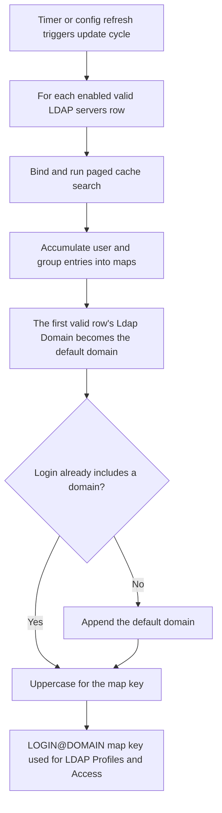

The **LDAP** section syncs directory users and groups into memory for Access LDAP Profiles and LDAP bind authentication.

## Core mechanics

### Full sync — all valid servers

Each enabled valid **LDAP servers** row binds and runs a paged cache load in one update cycle. Maps accumulate entries from every successful server.

### Default @domain

First valid row's **Ldap Domain** becomes the default domain. Logins without `@` get `@domain` appended and uppercased for map keys.

### Auth — first matching server

Authentication walks servers until the domain and **Ldap Basedn** match; stops on bind success or invalid credentials.

### ldapgroupfilter

Stored in config but not used in search code — groups come from **Group Identifier** attributes and DN OUs.

## Examples

Open **Configure → Application Setup → Integrate LDAP → LDAP servers**. Each row carries the
connection fields plus **Ldap Domain**, **Ldap Basedn**, **Login Attributes**, and **Group
Identifier** shown here (the Ldap Password row is redacted from this capture). **Ldap Basedn**
is a distinct field from **Ldap Domain** — enter it in LDAP format, for example `dc=domain,dc=local`
or, for a domain like `test1.testdomain1.com`, `dc=testdomain1,dc=com`.

<Frame caption="Integrate LDAP — LDAP servers row">
  
</Frame>

<Tip>

### Active Directory

**Config:** domain corp.example.com, login attributes sAMAccountName, group identifier memberOf.

**Result:** Cache keys like JDOE@CORP.EXAMPLE.COM; group strings for LDAP Profiles after sync.
</Tip>

<Tip>

### Bare username

**Config:** default domain corp.example.com; user logs in jane.

**Result:** Lookup JANE@CORP.EXAMPLE.COM in maps.
</Tip>

<Tip>

### Section off

**Config:** global Enabled off.

**Result:** Maps cleared; auth returns incomplete; LDAP Profiles never match.
</Tip>

## How to verify

1. Open **LDAP Entries** after cache thread runs.
2. Enable LDAP + SECURITY logs.
3. Sign in; confirm LDAP profile application in Detailed logs.
