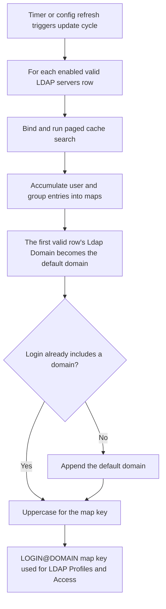

The **LDAP** section syncs directory users and groups into memory for Access LDAP Profiles and LDAP bind authentication.

LDAP integration is the foundation for regulating web access by role or group membership rather than by IP address alone. The cached identity it builds feeds Access restrictions' **LDAP Profiles**, LDAP sign-in, and every downstream policy that must tell one user apart from another. The sync runs on a timer, and whenever configuration changes.

## Core mechanics

### Full sync — all valid servers

Each enabled valid **LDAP servers** row binds and runs a paged cache load in one update cycle. Maps accumulate entries from every successful server.

### Default @domain

First valid row's **Ldap Domain** becomes the default domain. Logins without `@` get `@domain` appended and uppercased for map keys.

If the user signs in with an explicit domain (for example `jane@other.com`), that domain is used for the lookup instead of the default suffix, matched against whichever server entry's **Ldap Domain** corresponds to it.

If the computed `LOGIN@DOMAIN` key is not found in the cache, SafeSquid makes an on-demand single-user lookup against the directory before giving up — this is what covers a user created after the last full sync.

### Auth — first matching server

Authentication walks servers until the domain and **Ldap Basedn** match; stops on bind success or invalid credentials.

### ldapgroupfilter

Stored in config but not used in search code — groups come from **Group Identifier** attributes and DN OUs. The group list is built from two sources combined and de-duplicated: the values of the **Group Identifier** attributes (commas within a value are replaced with spaces), plus the OU components of the user's own DN (same comma replacement). That combined list is what Access restrictions' **LDAP Profiles** field performs an exact-string match against.

## What makes an entry valid

An **LDAP servers** entry participates in sync and sign-in only once it has a non-zero **Ldap Port**, an **Ldap Basedn**, an **Ldap Domain**, and at least one **Login Attributes** value. If **Host Name** is set it must exactly equal this appliance's own hostname, otherwise the entry is invalid on this node — which is how you pin one directory entry to one proxy in a multi-node deployment. An invalid entry is skipped silently: it never appears under LDAP Entries and plays no part in sign-in.

## Schema Fields

### Global

- **Enabled (`ldap_enabled`)** — master switch for the whole section.

### LDAP servers entry

- **Enabled (`enabled`)** — this entry is skipped for sync and sign-in when off.
- **Comment (`comment`)** — administrator note.
- **Host Name (`ldaphost`)** — if set, must exactly equal this appliance's own hostname, or the entry is invalid on this node.
- **Ldap FQDN\IP (`ldapip`)** — an FQDN, or the `FQDN\IP` form (backslash then a literal IP) when a Kerberos/keytab script specifically needs the IP form.
- **Ldap Port (`ldapport`)** — TCP port for the directory connection; must be greater than `0` for the entry to be valid.
- **Use SSL (`ldapssl`)** — connect over LDAPS (encrypted) instead of plain LDAP.

  <Warning>
  Without a CA certificate configured for LDAP, an LDAPS connection still proceeds **without verifying the directory server's certificate**. Supply a CA certificate for a properly verified connection.
  </Warning>

- **Ldap Bind Method (`ldapmethod`)** — Simple, NTLM, or Negotiate; where NTLM/Negotiate are unavailable on the platform or build, the bind falls back to Simple regardless of the selection.
- **Query Record Limit (`ldaplimit`)** — page size for the bulk sync and the upper bound for any single search; a single-user lookup temporarily uses a limit of `1` regardless of this setting.
- **Ldap User Filter (`ldapuserfilter`)** — an LDAP filter fragment combined with a per-attribute test built from Login Attributes, used for both the full sync and single-user lookups.
- **Ldap Group Filter (`ldapgroupfilter`)** — stored in configuration but not used by the current search logic that builds group lists; group membership comes from Group Identifier attributes and DN-derived OU components instead.
- **Ldap Username (`ldapusername`)** / **Ldap Password (`ldappassword`)** — the service account used to bind for directory search. May be blank on a directory allowing anonymous bind. Store the password with the Encrypt Password utility, never as plain text; an entry whose stored password fails to decrypt is treated as invalid.
- **Ldap Basedn (`ldapbasedn`)** — the base DN to search under; the entire subtree beneath it is searched.
- **Ldap Domain (`ldapdomain`)** — the domain suffix appended to logins with no `@`, and the key used to route a sign-in to the right server when more than one directory is configured.
- **Login Attributes (`ldaploginattr`)** — one or more directory attributes used as login identifiers (for example `sAMAccountName`, `UserPrincipalName`, or `uid`).
- **Group Identifier (`ldapgroupid`)** — one or more attributes read from each user entry and merged into that user's cached group list (for example `memberOf` or `member`).

## Examples

Open **Configure → Application Setup → Integrate LDAP → LDAP servers**. Each row carries the
connection fields plus **Ldap Domain**, **Ldap Basedn**, **Login Attributes**, and **Group
Identifier** shown here (the Ldap Password row is redacted from this capture). **Ldap Basedn**
is a distinct field from **Ldap Domain** — enter it in LDAP format, for example `dc=domain,dc=local`
or, for a domain like `test1.testdomain1.com`, `dc=testdomain1,dc=com`.

<Frame caption="Integrate LDAP — LDAP servers row">
  
</Frame>

<Tip>

### Active Directory

**Config:** domain corp.example.com, login attributes sAMAccountName, group identifier memberOf.

**Result:** Cache keys like JDOE@CORP.EXAMPLE.COM; group strings for LDAP Profiles after sync.
</Tip>

<Tip>

### Bare username

**Config:** default domain corp.example.com; user logs in jane.

**Result:** Lookup JANE@CORP.EXAMPLE.COM in maps.
</Tip>

<Tip>

### Granting access by cached group membership

**Config:** an Access restrictions Allow-list entry sets LDAP Profiles to the exact group string from the user's `memberOf` values (spaces, not commas).

**Result:** the entry matches on the pass that re-checks Access restrictions with credentials present, once the user's identity is known from a prior authentication or from Kerberos/SSO.
</Tip>

<Tip>

### Section off

**Config:** global Enabled off.

**Result:** Maps cleared, every server connection closed, and auth returns incomplete; LDAP sign-in and LDAP Profiles matching behave as though no directory were configured, until the section is re-enabled **and a sync completes**.
</Tip>

## How to verify

1. Open **LDAP Entries** after cache thread runs. Its **Refresh** option forces a re-sync instead of waiting for the next cycle — the page waits a few seconds, then reloads.
2. Enable LDAP + SECURITY logs.
3. Sign in; confirm LDAP profile application in Detailed logs.
4. Cross-check the group strings offered in Access restrictions' LDAP Profiles picker against LDAP Entries — they must match exactly, spaces rather than commas.
5. If a server never appears to sync, re-check Ldap Basedn, Ldap Domain, and Login Attributes — any one missing makes the entry silently invalid — and, on a multi-node deployment, that Host Name matches this appliance.
