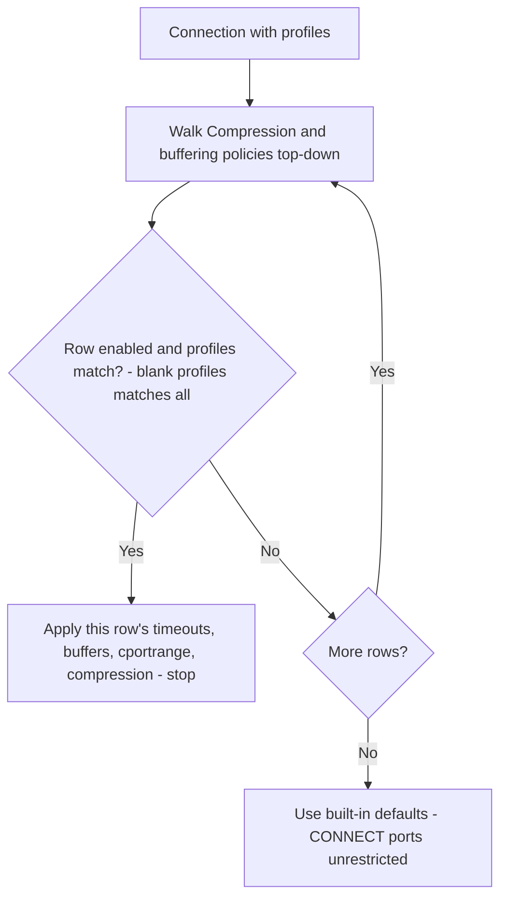

The **General** section sets global hostname, connection pool, debug headers, and per-connection compression/buffering policy rows.

## Core mechanics

### First matching policy row

Each getter walks **Compression and buffering policies** top-down. The first enabled row whose `profiles` match wins. Empty profiles match all. No match → built-in defaults.

{/* source: https://www.safesquid.com/md/general.md */}
That one matching entry supplies every timing, buffering, and compression value for the connection — values are never mixed across entries, and no entry below it is consulted. It is strictly first-match, not cumulative.

### CONNECT ports (cportrange)

The CONNECT port check applies only when a row matched. Port must be in the row list or CONNECT is blocked. When no row matched, all CONNECT ports are allowed (unless blocked elsewhere).

{/* source: https://www.safesquid.com/md/general.md */}
<Warning>
  **A policy list with no catch-all leaves CONNECT unrestricted.** If every Compression and buffering policies row is scoped to a narrow Profiles value, or the list has no catch-all row at all, CONNECT is completely unrestricted for any connection that matches nothing. If you need CONNECT restricted for all traffic, keep an always-matching row (blank Profiles) last, with the CONNECT ports you intend to enforce.
</Warning>

### Compression and chunked buffering

`compressin` zero → identity-only upstream Accept-Encoding; non-zero → full encodings (TRUE and AUTO behave the same today). `bufferchunked`: 0 never, 2 always, 1 encoded-only when Content-Encoding is identity.

{/* source: https://www.safesquid.com/md/general.md */}
### Buffer and compression caveats

`maxdbuffer` only applies when Content-Length is known and the body is not chunked — a chunked or Content-Length-less response streams through without full buffering regardless of the configured size. `bufferwait` is the interval between re-sends of the "downloading" holding page while a large response is still buffering. Compress outgoing is effectively always on for SafeSquid's own Web interface, regardless of what the matched entry says — only traffic to external origins honours the matched entry's Compress outgoing setting.

## Global fields

Open **Configure → Application Setup → System configuration → Global**.

<Frame caption="System configuration — Global fields">
  
</Frame>

{/* source: https://www.safesquid.com/md/general.md */}
- **Proxy hostname (`hostname`)** — Identity in Via and Kerberos scripts; blank uses system hostname. Setting it to your organization's single LDAP domain name lets users log in without typing the domain themselves.
- **Connection pool size / timeout (`poolsize` / `pooltimeout`)** — Resizes upstream `serverpool` immediately on config update. When the pool is full the oldest pooled connection is dropped to make room; the idle clock resets each time a pooled connection is reused.
- **Send Debugging Headers To (`dheaders`)** — CLIENT, SERVER, BOTH, or NONE — see [Debug headers](/configuration/start_here/debug_response_headers).
- **Dynamic Categorization (`catreferer`)** — Referer categories applied to dependency requests, so a permitted page's sub-resources render instead of showing broken pieces.

## Compression and buffering policies (entry fields)

{/* source: https://www.safesquid.com/md/general.md */}
- **Enabled (`enabled`)** — disabled entries are skipped during the top-to-bottom walk.
- **Comment (`comment`)** — administrator note; not evaluated.
- **Profiles (`profiles`)** — blank matches every connection; a profile prefixed with `!` applies the entry when that profile is absent.
- **Connection timeout (`ctimeout`)** — seconds allowed for the outbound connection to the origin server and its I/O before timing out.
- **Header timeout (`timeout`)** — seconds allowed for the client to finish sending its request headers.
- **Keepalive timeout (`keeptimeout`)** — seconds an idle client connection is kept open for reuse.
- **Maximum download buffer size (`maxdbuffer`)** — largest response body SafeSquid will fully buffer for inspection.
- **Maximum upload buffer size (`maxubuffer`)** — largest client upload SafeSquid will buffer for inspection.
- **Buffer wait time (`bufferwait`)** — seconds between re-sends of the "downloading" holding page while a large response is still buffering.
- **CONNECT ports (`cportrange`)** — ports allowed for HTTP CONNECT (tunneled HTTPS) when this entry matches. For example: `443,563`.
- **Always compress mimetype (`encodemime`)** — comma-separated regular expressions matched against the response's Content-Type.
- **Compress outgoing (`compressout`)** — gzip-compress eligible responses toward the client.
- **Compress incoming (`compressin`)** — `FALSE`, `TRUE`, or `AUTO`; controls the Accept-Encoding SafeSquid advertises upstream.
- **Buffer Chunked Responses (`buffer_chunked`)** — `NEVER`, `ENCODED`, or `ALWAYS`.
- **Add X-Forwarded-For header (`xforwardedfor`)** — when on, upstream requests include the client's address in `X-Forwarded-For`.
- **Add Via header (`via`)** — when on, upstream requests include a `Via` header naming this proxy hop.

## Connection pool (view)

{/* source: https://www.safesquid.com/md/general.md */}
A read-only Web UI panel showing the connections currently held open in the pool, or awaiting reuse. Useful for confirming **Connection pool size** and **Connection pool timeout** are sized correctly under real load.

## Examples

Open **Configure → Application Setup → System configuration → Compression and buffering
policies**. Row fields include Connection/Header/Keepalive timeout, Maximum download/upload buffer
size, Buffer wait time, CONNECT ports, and the compression fields.

<Frame caption="System configuration — Compression and buffering policies row">
  
</Frame>

<Tip>

### CONNECT HTTPS only

**Config:** First matching row cportrange `443` only.

**Result:** CONNECT to 443 allowed; other ports blocked with security-restrictions template.
</Tip>

<Tip>

### Profile-specific buffering

**Config:** Row 1 profiles `text-filter`, maxdbuffer 128K above catch-all maxdbuffer 0.

**Result:** Text-filter connections buffer up to 128K; others stream without full download buffer — and a streamed response never reaches the downloaded-body scanners (SqScan, Clam antivirus, Image analyzer, Text analyzer, ICAP). See [Architecture and request pipeline](/configuration/start_here/architecture) for the verified buffered-vs-streamed scanning test.
</Tip>

<Tip>

### No row match

**Config:** All policy rows disabled for connection.

**Result:** CONNECT port check allows any port; default timeouts apply.
</Tip>

{/* source: https://www.safesquid.com/md/general.md */}
<Tip>

### A catch-all placed first blocks a specific entry

**Config:** Entry 1 (top) — Profiles blank, CONNECT ports `80,443,21,1025-65535`. Entry 2 (below) — Profiles `text-filter`, Maximum download buffer size `128M`.

**Result:** every connection matches entry 1 first, because it has no Profiles restriction — entry 2 never applies to anything. The fix is to move entry 2 above entry 1, so `text-filter` connections get its buffer size before the catch-all claims them.
</Tip>

## How to verify

1. Test CONNECT to allowed and blocked ports.
2. Enable Trace Entry on a policy row; check native logs.
3. Debug headers CLIENT in browser devtools when enabled.
