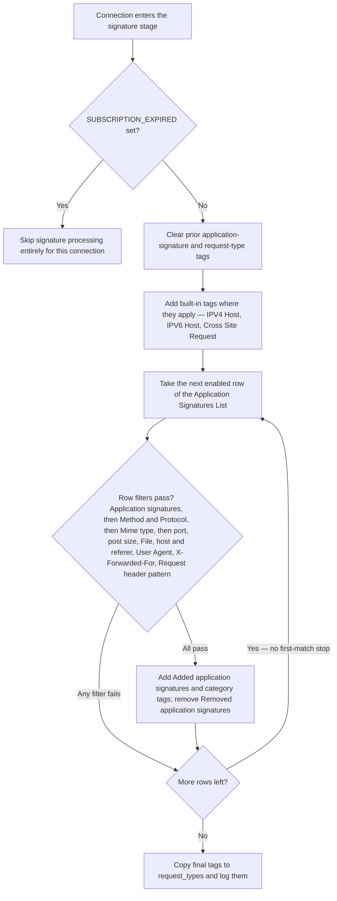

<Warning>
  **This section does not appear in the Configure console.** Verified 2026-09-04 against `http://safesquid.cfg`, build `2026.0627.1344.3`: the section is absent from the console's own section registry, not merely hidden from the menu. It is kept here as legacy and reference material, not a current UI path. Confirm against your own build before pointing an administrator at it.
</Warning>

The **Application Signatures** section tags each HTTP request with application signature strings (for example Webmail, BitTorrent, Chrome). Other sections match those tags with exact string compare — especially [Access Profiles](/configuration/restriction_policies/access_profiles) (Request Types field) and [Request Types](/configuration/custom_settings/request_types).

<Note>
Vendor signature databases download on the appliance update schedule. See [startup.ini](/configuration/start_here/startup_ini) UPDATE settings, [Cloud / categorisation feeds](/configuration/start_here/cloud_feeds), and [Subscription](/configuration/infrastructure_and_access/subscription) (expired subscription skips all signature processing).
</Note>

## Core mechanics

### Processing order

1. If `SUBSCRIPTION_EXPIRED` is set, processing is skipped entirely for that connection.
2. Prior application-signature and request-type tags are cleared.
3. Built-in tags may be added: `IPV4 Host`, `IPV6 Host`, `Cross Site Request`.
4. **Application Signatures List** is walked top to bottom. **Every** enabled rule whose tests pass may add or remove tags — there is no first-match stop.
5. Tags from earlier rules in the same pass are visible to later rules via the **Application signatures** prerequisite field.
6. Final tags are copied to `request_types` and logged as application signatures.

Tags added by an earlier row are visible to later rows through the **Application signatures**
prerequisite field, which is why the walk is cumulative rather than first-match.

### Global Enabled quirk

The section global **Enabled** switch is stored in configuration but request-time matching checks only each rule's own **Enabled** flag. Per-rule Enabled off skips that row; global off does not stop the signature loop by itself.

### Inner filter order (per row)

For each enabled row, filters run in fixed order; any failure skips to the next row:

1. **Application signatures** — prerequisite tags (exact / `!` match, same engine as Access Profiles).
2. **Method**, **Protocol** — exact; missing header when field set → skip row.
3. **Mime type** — regex on request `Content-Type`.
4. **Port range list**, post data size gates, **File**, host/referer regex fields, **User Agent**, **X-Forwarded-For**, **Request header pattern**.
5. On match: add **Added application signatures** and **category** tags; remove listed **Removed application signatures**.

<Warning>
**Post data size:** when `Content-Length` is present, the rule is *skipped* when `content_length > minimum` or `content_length < maximum` (optional fields must be active). No Content-Length → min/max checks are not applied.
</Warning>

<Warning>
**URL commands** are loaded from configuration but not evaluated — leave blank.
</Warning>

### Application Categories List

Category definition rows are saved to the local dev XML for UI autocomplete. Runtime category tags come from the **category** field on Application Signatures List rules, not from the Categories list alone.

{/* source: https://www.safesquid.com/md/applicationSignatures.md */}
<Note>
Application Categories List **Enabled** off means the category definition is not loaded into the in-memory category list on the next configuration reload. Neither On nor Off applies a category to live traffic by itself — that still requires an Application Signatures List entry whose **category** field references the same name.
</Note>

{/* source: https://www.safesquid.com/md/applicationSignatures.md */}
## Schema fields

Each Application Signatures List entry field, its internal name, and what it actually tests:

| Field | Internal name | Tests |
|---|---|---|
| Application signatures | `app_signatures` | Prerequisite — signature(s) already present (or, with `!`, absent) before this entry's other conditions are checked |
| Method | `method` | Request's HTTP method, exact match |
| Protocol | `protocol` | Request's protocol (`HTTP`, `HTTPS`, `FTP`), exact match |
| Mime type | `mime` | Regex against the request's Content-Type header |
| Port range list | `portrange` | Request's destination port against the listed port(s)/range(s) |
| Minimum Post Data Size | `postdata_min_length` | Content-Length ceiling — see the Post data size warning above |
| Maximum Post Data Size | `postdata_max_length` | Content-Length floor — see the Post data size warning above |
| File | `file` | Regex against the URL path |
| Registered Domain | `registered_domain` | Regex against the request host's registered domain |
| Host Name | `hostname` | Regex against the request's fully-qualified hostname |
| Referer Domain Name | `referer_domain` | Regex against the referrer's registered domain |
| Referer Host Name | `referer_host` | Regex against the referrer's fully-qualified hostname |
| Referer | `referer` | Regex against the full Referer header |
| User Agent | `user_agent` | Regex against the User-Agent header |
| X-Forwarded-For | `xforwardedfor` | Regex against the X-Forwarded-For header |
| Request header pattern | `requestheader` | Regex against the raw request headers |
| Added application signatures | `add_app_signatures` | Signature values added to the connection on match |
| Removed application signatures | `remove_app_signatures` | Signature values removed from the connection on match, applied after additions |
| category | `group` | Category values added to the connection's signatures on match, same mechanism as Added application signatures |
| Comment | `comment` | Administrator note; not read by the matching engine |
| Enabled | `enabled` | When off, this entry is skipped in the top-to-bottom pass |

Removals are applied **after** additions on the same matching entry — an entry that both adds and removes the same signature name ends with it removed.

Where a tested value is absent from the request (for example, no Referer header when a Referer-based field is set), the entry is skipped.

## Examples

<Tip>

### Tag webmail from vendor rule

Vendor database row matches host and User-Agent; adds `Webmail`.

**Result:** Access Profiles matching Request Types or application signature `Webmail` apply webmail policy.
</Tip>

<Tip>

### Custom rule on top of vendor tags

- Prerequisite `Webmail`, Host Name `mail\.partner\.com`
- Added application signatures `Partner-Webmail`

**Result:** only partner webmail gets the extra tag; generic webmail keeps `Webmail` only.
</Tip>

<Tip>

### Category tag for reporting

On match, **category** `SocialMedia` is added to application signatures (same tag list).

**Result:** policies and logs can match category name `SocialMedia` without a separate Categories list row.
</Tip>

## How to verify

1. Check **Reports → Modules Status** for application signature load/download state.
2. Reproduce a request; read Detailed logs column `application_signatures`.
3. Enable **Trace Entry** on a rule where available; confirm tags in Native PROFILE logs.
4. Debug header `X-SafeSquid-Application-Signatures` when Send Debugging Headers To includes CLIENT — see [Debug response headers](/configuration/start_here/debug_response_headers).

## See also

- [Request Types](/configuration/custom_settings/request_types)
- [Access Profiles](/configuration/restriction_policies/access_profiles)
- [Subscription](/configuration/infrastructure_and_access/subscription)
- [Cloud / categorisation feeds](/configuration/start_here/cloud_feeds)
- [Logging and troubleshooting](/configuration/start_here/logging)
