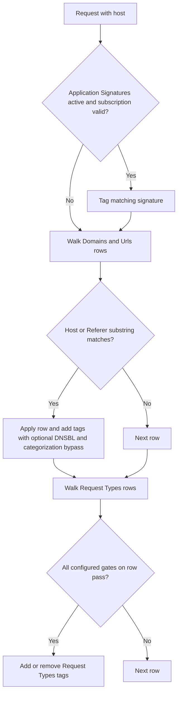

The **Request Types** section labels HTTP requests with tags consumed by [Access Profiles](/configuration/restriction_policies/access_profiles) and other filters. It does not block traffic.

Request Types only ever inspects the **request** side — what the client sent. It has no visibility into what the destination returns; that is Response Types. So it can tell you what destination and what kind of activity a client is attempting, but never what was actually delivered, and it must not be relied on for that.

## Core mechanics

### Browsing vs. activity tagging

A Request Types entry can gate on a label an earlier Request Types entry already applied, and inspect the URL path to add a narrower label only when a specific activity is detected within that already-tagged destination — for example separating "browsing and searching a video site" from "actually playing a video on it", by testing whether the path contains the internal call the site's player fires only on playback. Access Profiles can then allow the broad label while denying the narrow one. This is the capability a flat site-category allow/deny cannot express.

### Processing order

The section does not evaluate any entry at all if the connection has no host to test against.

1. Application Signatures (unless subscription expired).
2. **Domains and Urls** — substring match; every matching row applies.
3. **Request Types** rows — all gates must pass; every match applies. Where two entries act on the same label, whichever runs later wins — an entry lower in the list can remove a label an entry above it just added.

### Domains and Urls

Tab-prefixed host+path substring find — not regex. Empty domain list or empty add/remove → row skipped. **Match:** Host, Referer, or Both.

### Smart TLD

When Host Name regex misses and Smart TLD is on, same regex retried against site name (host without public suffix).

<Warning>
**urlcommand field:** parsed in configuration but never evaluated at runtime. Use **Protocol** or **File** instead.
</Warning>

<Warning>
**Minimum/Maximum Post Data Size:** when `Content-Length` is present, the rule is *skipped* when `content_length > minimum` or `content_length < maximum` (optional fields must be active). No Content-Length → min/max checks are not applied. Given how easily this reads backwards, prefer **Method**, **Content type**, and **File** for production rules and treat these size fields as a secondary refinement. `0` disables each test.
</Warning>

## Schema Fields

### Global

- **Enabled** (`enabled`) — off means no labels are added or removed here at all and neither entry list is evaluated.

### Domains and Urls entry

- **Enabled** (`enabled`), **Comment** (`comment`) — standard entry controls.
- **Domains and URLs** (`hosts`) — a list of needles separated by comma, space, tab, newline, or semicolon, searched as plain substrings against host/TLD plus path — not a regular expression, not a wildcard; do not include a scheme prefix or a `*`.
- **Match** (`where`) — Host, Referer, or Both.
- **Added / Removed Request Types** — labels applied when a needle matches.
- **Bypass DNSBL and Categorization** — skips DNS Blacklist checking and website categorization for a matching connection. When more than one matching Domains and Urls entry sets this differently, the last matching entry's setting takes effect.

An entry with an empty needle list, or with neither Added nor Removed Request Types set, is skipped — it can never match.

### Request Types entry

- **Enabled** (`enabled`), **Comment** (`comment`), **Trace Entry** — standard entry controls.
- **Request Types** — the input gate; supports `!` negation, blank ignores the gate.
- **Method** — an exact match, not a regular expression; multiple selected methods are OR'd.
- **Protocol** — also exact, also OR'd.
- **Content type** — a regular expression; commas act as alternation.
- **Port range list** — comma list of ports and/or hyphenated ranges; not CIDR.
- **Minimum / Maximum Post Data Size** — see the Warning above for how these two actually compare.
- **File** — a regular expression against the URL path.
- **Host Name** — a regular expression against the host.
- **Smart TLD** — retries the Host Name expression against the host with its public suffix stripped; see above.
- **Referer**, **User Agent**, **X-Forwarded-For** — a regular expression against that request header.
- **Request header pattern** — a regular expression against the raw request headers.
- **Added / Removed Request Types** — Removed runs after Added on the same entry.

Content type, File, Referer, User Agent, X-Forwarded-For, and Request header pattern each cause the entry to be **skipped** when the field is set but the thing it tests is absent. That is why an entry can appear never to fire.

## Examples

Open **Configure → Custom Settings → Request Types**. Three sub-tabs: **Global**, **Domains and
Urls**, and **Request Types** — the row list shown here, with Request Types (input gate),
Minimum/Maximum Post Data Size, Smart TLD, and Added Request Types per row.

<Frame caption="Request Types — Request Types rows">
  
</Frame>

<Tip>

### Uncachable query URLs

**Config:** File `(cgi-bin|\?)`, add `uncachable_req`.

**Result:** URLs with query string tagged; cache policies can skip storage.
</Tip>

<Tip>

### CONNECT method

**Config:** Method CONNECT, add `uncachable_req`.

**Result:** tunnel requests tagged.
</Tip>

<Tip>

### Skip categorization

**Config:** Domains needle `partner.example`, Bypass DNSBL and Categorization on.

**Result:** matching host bypasses DNSBL and category lookup.
</Tip>

## How to verify

1. **Trace Entry** on one row; native logs show Added/Removed tags.
2. Detailed logs `request_profiles` column — confirm which labels actually landed, in case an earlier or later entry altered what you expected.
3. If an entry using the post-data size fields behaves unexpectedly, re-check which direction each field filters before assuming the entry is broken.
4. To confirm a browse-vs-activity pair, test both a plain destination request and one matching the specific-activity pattern, confirming only the second picks up the narrower label.
