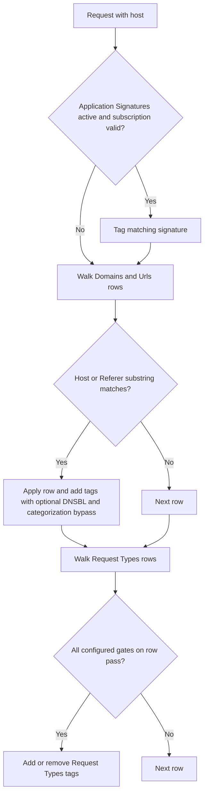

The **Request Types** section labels HTTP requests with tags consumed by [Access Profiles](/configuration/restriction_policies/access_profiles) and other filters. It does not block traffic.

## Core mechanics

### Processing order

1. Application Signatures (unless subscription expired).
2. **Domains and Urls** — substring match; every matching row applies.
3. **Request Types** rows — all gates must pass; every match applies.

### Domains and Urls

Tab-prefixed host+path substring find — not regex. Empty domain list or empty add/remove → row skipped. **Match:** Host, Referer, or Both.

### Smart TLD

When Host Name regex misses and Smart TLD is on, same regex retried against site name (host without public suffix).

<Warning>
**urlcommand field:** parsed in configuration but never evaluated at runtime. Use **Protocol** or **File** instead.
</Warning>

<Warning>
**Minimum/Maximum Post Data Size:** when `Content-Length` is present, the rule is *skipped* when `content_length > minimum` or `content_length < maximum` (optional fields must be active). No Content-Length → min/max checks are not applied.
</Warning>

## Examples

Open **Configure → Custom Settings → Request Types**. Three sub-tabs: **Global**, **Domains and
Urls**, and **Request Types** — the row list shown here, with Request Types (input gate),
Minimum/Maximum Post Data Size, Smart TLD, and Added Request Types per row.

<Frame caption="Request Types — Request Types rows">
  
</Frame>

<Tip>

### Uncachable query URLs

**Config:** File `(cgi-bin|\?)`, add `uncachable_req`.

**Result:** URLs with query string tagged; cache policies can skip storage.
</Tip>

<Tip>

### CONNECT method

**Config:** Method CONNECT, add `uncachable_req`.

**Result:** tunnel requests tagged.
</Tip>

<Tip>

### Skip categorization

**Config:** Domains needle `partner.example`, Bypass DNSBL and Categorization on.

**Result:** matching host bypasses DNSBL and category lookup.
</Tip>

## How to verify

1. **Trace Entry** on one row; native logs show Added/Removed tags.
2. Detailed logs `request_profiles` column.
