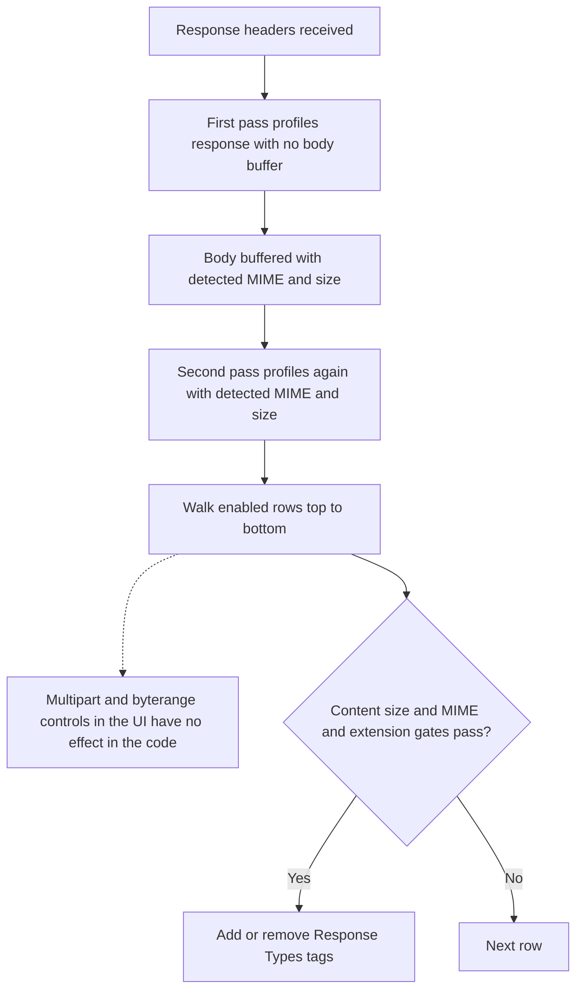

The **Response Types** section labels HTTP responses for [Access Profiles](/configuration/restriction_policies/access_profiles) and content filters. It does not block by itself.

This is the only section that can answer whether a response is actually an executable, an archive, or an image — Request Types, which only ever sees the outbound request, cannot determine that, because the true nature of a response is only knowable once the destination has replied. A security administrator who wants to block downloads by actual file type, not by what the URL merely suggests, depends on this section for that label.

## Core mechanics

### Two-pass evaluation

1. On response headers — response profiling runs with no body buffer.
2. On buffered body — hook runs again with detected MIME and size.

Every matching enabled row applies; no first-match stop.

{/* source: https://www.safesquid.com/md/respProfiles.md */}
{/* NEEDS-SME-REVIEW: legacy source states the multipart/byterange controls are stored but never read at runtime. Not reproduced by live test in this repo — the console section was confirmed present (Global · Response Types tabs, 2026-09-07) but the control's inertness was not exercised. Confirm against the build before this is treated as settled. */}
<Warning>
The **multipart** and **byterange** controls appear in the row form but are reported by the
legacy documentation as having no effect in the code — they are stored and never read. Do not
build a policy that depends on either one.

**Missing:** this is a legacy-source claim that has not been reproduced by a live test on the
current build, unlike the comparable Speed Limits **Action** field. Treat it as a reason to
avoid depending on these two controls, not as a confirmed defect, and escalate to the SME
before quoting it to a customer.
</Warning>

### Content size

Non-zero min/max tested against body buffer size when present, and against Content-Length when CL flag set. Zero disables each test.

### MIME and extension

MIME regex tries response Content-Type header, then detected body type. Extension regex tries URL (query stripped), then attachment filename.

## Schema Fields

### Global

- **Enabled** (`res_policy`) — off, no labels are added or removed here at all.

### Response Types entry

- **Enabled** (`enabled`), **Comment** (`comment`) — standard entry controls.
- **Trace Entry** (`profile_tracing`) — logs each label this entry adds or removes.
- **Response Types** (`res_types`) — gates on a label an earlier entry already applied; supports `!` negation, blank ignores the gate.
- **Content type** (`mime`) — tried against the actual Content-Type header first, then against a body-detected type if that doesn't match; skipped if neither is available.
- **File Extension** (`file_extension`) — tried against the request URL path with the query string removed first, then against the response's attachment filename from a Content-Disposition header.
- **Transfer Encoding Chunk** (`transfer_encoding_chunk`) — YES applies only to a chunked response, NO only to non-chunked, ANY ignores chunking.
- **Minimum / Maximum Content Size** — see [Content size](#content-size) above.
- **Response header pattern** (`responseheader`) — a regular expression against raw response headers; skipped if raw headers are unavailable.
- **Added / Removed Response Types** (`add_res_types` / `remove_res_types`) — Removed runs after Added on the same entry.

A Response Types-driven DENY in Access Profiles blocks the download by exactly the same mechanism as a request-side DENY — the same HTTP 451 block — not a weaker or partial block. This holds even in a buffered-response configuration, where SafeSquid may already have retrieved the full body from the destination before the client-side block is applied.

## Examples

Open **Configure → Custom Settings → Response Types**. Row fields are Enabled, Comment, Trace
Entry, **Content type** (the MIME-pattern field referenced below), Transfer Encoding Chunk,
Minimum/Maximum Content Size, and Added Response Types.

<Frame caption="Response Types — Response Types rows">
  
</Frame>

<Tip>

### Text for keyword filter

**Config:** MIME `(^text/|script$)`, add `text_res`.

**Result:** HTML/JS/text responses tagged.
</Tip>

<Tip>

### Images

**Config:** MIME `^image/`, add `image_res`.

**Result:** image Content-Types tagged for image filter policies.
</Tip>

<Tip>

### Large images

**Config:** MIME `^image/`, min size 1048576, add `large-image`.

**Result:** skipped below 1 MiB; tagged at or above threshold.
</Tip>

## How to verify

1. **Trace Entry**; fetch test URL; check native logs.
2. Detailed logs — `response_profiles`, `download_content_types`.
3. To confirm a Response Types DENY blocks as strongly as a request-side DENY, trigger one against a large download and verify the client's transfer is cut off with the HTTP 451 page, even though SafeSquid may have already retrieved some or all of the body from the origin in a buffered configuration.
