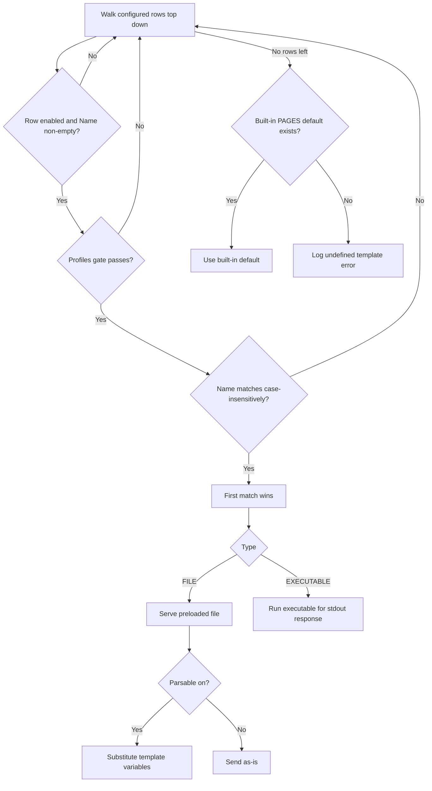

The **Templates** section configures block pages and error bodies served when SafeSquid denies traffic or returns configured errors.

## Core mechanics

### Resolution order

1. Walk configured rows top-down.
2. Skip disabled or empty Name.
3. **Profiles** gate must pass (blank = any).
4. Case-insensitive Name match — **first match wins**.
5. Else built-in `PAGES[]` defaults.
6. Else log undefined template error.

### FILE vs EXECUTABLE

- **FILE** — Preloaded at config load from Name path or File fallback. MIME blank → `application/octet-stream`.
- **EXECUTABLE** — Run at send time; stdout must be HTTP response (`ENABLE_EXTERNAL` required).

### Send

The block template uses the caller status or the row Response code. Adds `X-SafeSquid-Template` header. HTML built-ins may inject stylesheet.

## Examples

Open **Configure → Custom Settings → Templates → Manage templates**. Row fields are Enabled,
Comment, Name, File, Mime type, Response code, Type, and Parsable — the built-in `blocked` and
`error` templates ship enabled by default.

<Frame caption="Templates — Manage templates rows">
  
</Frame>

<Tip>

### Branded block page

**Config:** Name `company-block`, FILE, Parsable on, code 403.

**Result:** Access Profiles Deny serves HTML with substituted variables.
</Tip>

<Tip>

### Profile-specific block

**Config:** two rows same Name `block`; row A Profiles `staff` above row B blank profiles.

**Result:** staff connections get staff template first.
</Tip>

## How to verify

1. Trigger block referencing template name.
2. DEBUG + TEMPLATE native logs.
3. Check `X-SafeSquid-Template` response header.
