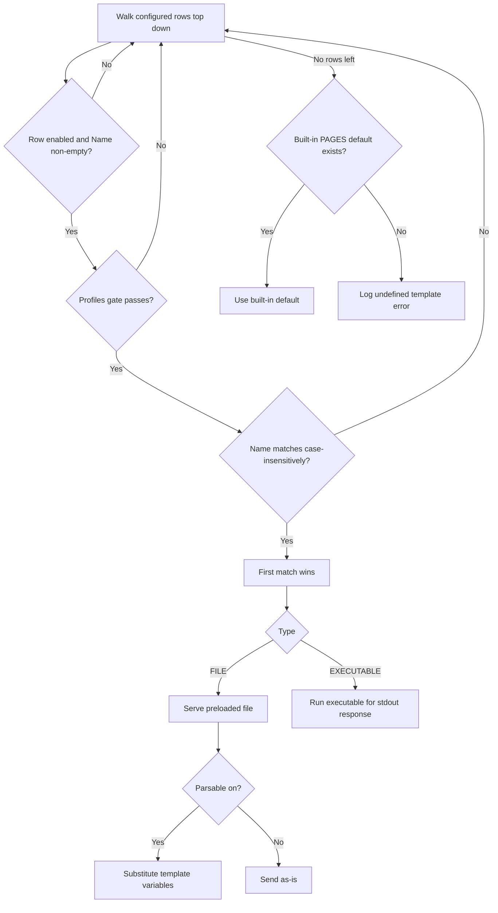

The **Templates** section configures block pages and error bodies served when SafeSquid denies traffic or returns configured errors. Other sections never embed page content themselves — they ask Templates for a page by name (for example a block page named `blocked`), and this section resolves the name to a file. That indirection is what lets you replace default block pages with branded versions without touching the sections that trigger them.

## Core mechanics

### Resolution order

1. Walk configured rows top-down.
2. Skip disabled or empty Name.
3. **Profiles** gate must pass (blank = any).
4. Case-insensitive Name match — **first match wins**.
5. Else built-in `PAGES[]` defaults.
6. Else log undefined template error.

### FILE vs EXECUTABLE

- **FILE** — Preloaded at config load from Name path or File fallback. MIME blank → `application/octet-stream`.
- **EXECUTABLE** — Run at send time; stdout must be HTTP response (`ENABLE_EXTERNAL` required).

### Send

The block template uses the caller status or the row Response code. Adds `X-SafeSquid-Template` header. HTML built-ins may inject stylesheet.

## Schema Fields

Templates has no section-wide global setting — every field lives on the entry.

- **Enabled** — when off, this entry is ignored when SafeSquid resolves a template name.
- **Comment** — an operator note; does not affect matching or behavior.
- **Profiles** — blank matches every connection; when several entries share a Name, the first enabled entry whose Profiles match wins.
- **Name** — case-insensitive match against the requested name; a blank Name is always skipped.
- **File** — a relative path resolves under the templates directory.
- **Mime type** — blank defaults to a generic binary type for a FILE entry; for EXECUTABLE, Content-Type comes from the program's own response instead.
- **Response code** — zero means SafeSquid uses whatever status the triggering event supplied, or a built-in default if none was given — this makes explicit the zero-case behind the Send section's "caller status or row Response code" statement above.
- **Type** — FILE or EXECUTABLE; see FILE vs EXECUTABLE above for the behavior difference.
- **Parsable** — on: `%variable%` placeholders substituted with connection details before sending; off: bytes sent as-is.

## Routing a block into an isolated session

SafeSquid can route a denied user into an isolated browsing session instead of a dead-end block page. This is a three-part chain across three sections, with Templates supplying the final piece:

1. A curated domain list in Request Types marks isolation-worthy hosts with a dedicated Request Type — the built-in catalog's example is named **RBI ONLY**.
2. An Access Profiles entry matches that Request Type, sets Action to Deny, and additionally adds an isolation Profile (the built-in catalog's example is named **RBI**) — the connection is still denied, but now carries a marker for special handling.
3. A Templates entry gated to that isolation Profile maps the block to a dedicated isolation-session page instead of the generic block page — this is the step that actually routes into the isolated session.

For the isolation page to render cleanly, pair the isolation Profile with one that strips the response's own Content-Security-Policy first (the built-in catalog's example is named **Drop Original CSP** — see [Header filter](/configuration/restriction_policies/privacy_control/header_filter), which documents the CSP-merge behavior), and give the isolation service's own domain its own Access Profiles entry allowing it through, or the isolated session itself gets blocked before it loads.

## Examples

Open **Configure → Custom Settings → Templates → Manage templates**. Row fields are Enabled,
Comment, Name, File, Mime type, Response code, Type, and Parsable — the built-in `blocked` and
`error` templates ship enabled by default.

<Frame caption="Templates — Manage templates rows">
  
</Frame>

<Tip>

### Branded block page

**Config:** Name `company-block`, FILE, Parsable on, code 403.

**Result:** Access Profiles Deny serves HTML with substituted variables.
</Tip>

<Tip>

### Profile-specific block

**Config:** two rows same Name `block`; row A Profiles `staff` above row B blank profiles.

**Result:** staff connections get staff template first.
</Tip>

<Tip>

### Falling back to a built-in default

**Config:** no entry configured for a name like `error`.

**Result:** SafeSquid serves its own compiled-in default page rather than failing with no response at all.
</Tip>

<Tip>

### Executable template

**Config:** Type EXECUTABLE, File pointing to a small server-side script, Parsable off.

**Result:** at send time SafeSquid runs the script and forwards whatever HTTP response it prints to standard output — useful for a block page that needs to look something up dynamically before rendering.
</Tip>

## How to verify

1. Trigger block referencing template name.
2. DEBUG + TEMPLATE native logs.
3. Check `X-SafeSquid-Template` response header.
4. Check native logs for "template not found" errors after a configuration change.
5. A file changed on disk after the configuration was last applied needs a configuration reload before a FILE entry picks up the change.

## Related sections

- Access Profiles — a Deny action invokes a block template by name.
- [Header filter](/configuration/restriction_policies/privacy_control/header_filter) — the Drop Original CSP pattern that keeps an isolation or block page's own CSP from merging incorrectly with the destination's.
