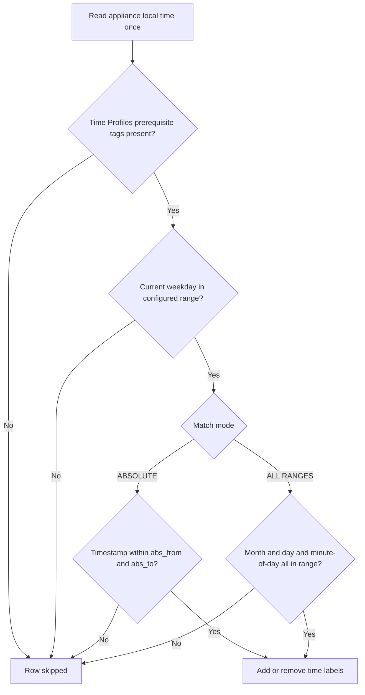

The **Time Profiler** section tags connections with time labels from the appliance local clock. [Access Profiles](/configuration/restriction_policies/access_profiles) **Time Schedule** matches these tags. Every enabled entry that matches applies — this is not first-match-wins — and a later entry's condition can even depend on a label an earlier entry just added. Time Profiler runs early in request processing, before Request Types and Access Profiles, so its labels are already available by the time those sections evaluate the connection.

## Core mechanics

### Row gate order

1. **Time Profiles** prerequisite tags (`profile_find`).
2. **Weekday range** — always enforced (Sunday = 0 … Saturday = 6).
3. **Match mode** — ABSOLUTE timestamp window or ALL RANGES (month + day + minutes-from-midnight).
4. Add/remove time labels — Added Time profiles apply before Removed Time profiles on the same entry.

<Warning>
**Weekday active flag** is stored but not checked — weekday bounds always apply. Set explicit 0–6 or 1–5 ranges; template default 0 alone matches Sunday only.
</Warning>

<Warning>
**A backwards hour range matches nothing.** If the configured start hour is later than the end hour (for example 17 to 9, intending "evening through morning"), the resulting time-of-day window can end up empty rather than wrapping past midnight — the entry silently never matches. Split an overnight window into two entries instead: one from the start hour to 23:59, one from 00:00 to the end hour.
</Warning>

### Match modes

- **ABSOLUTE** — Single start/end timestamp from configured month, day, hour, minute fields.
- **ALL RANGES** — Current month, day-of-month, and time-of-day must each fall in inclusive windows.

## Schema Fields

### Global fields

- **Enabled** — off: no labels are added or removed for any connection, and downstream Time Schedule matching has nothing to see.

### Entry fields

- **Enabled (`enabled`)** — disabled entries are skipped entirely.
- **Comment (`comment`)** — an operator note describing why this entry exists.
- **Trace Entry (`profile_tracing`)** — logs each label this entry adds or removes to native logs.
- **Time Profiles (`timeprofiles`)** — a prerequisite gate on a label from an earlier entry; `!` negation supported; blank ignores it.
- **Month range**, **Day range**, **Weekday range**, **Hour range**, **Minute range** — inclusive bounds. Combine into one minutes-since-midnight window in ALL RANGES mode, or all five together build the single start/end timestamp in ABSOLUTE mode.
- **Time match mode** — see Match modes above.
- **Added Time profiles** / **Removed Time profiles** — labels attached or taken off the connection when this entry matches.

## Layering Time Profiles

Because every matching entry applies, a specific label can be built from a general one across several entries — an early entry adds a broad label like `weekend`, a later entry restricts itself to connections already carrying `weekend` in its own Time Profiles field and adds a narrower label like `weekend-evening` on top. This lets Access Profiles gate on the specific label without repeating the weekday/hour logic downstream.

## Examples

Open **Configure → Custom Settings → Time Profiler → Time profiles**. Row fields are Enabled,
Comment, Trace Entry, Month/Day/Weekday/Hour/Minute range, Time match mode, and Added Time
profiles.

<Frame caption="Time Profiler — Time profiles rows">
  
</Frame>

<Tip>

### Business hours

**Config:** Weekday Mon–Fri, hours 9–17, ALL RANGES, add `business-hours`.

**Result:** tag present weekdays 09:00–17:59 local time.
</Tip>

<Tip>

### Lunch window

**Config:** Weekday 1–5, hours 12–13, add `LUNCH_TIME`.

**Result:** Access Profiles can Allow/Deny based on lunch tag.
</Tip>

<Tip>

### Absolute maintenance window

**Config:** Time match mode ABSOLUTE, month/day/hour/minute fields set to a specific weekend's start and end, Added Time profiles `maintenance`.

**Result:** suited to a one-time exception rather than a recurring weekly pattern.
</Tip>

<Tip>

### Layering a narrower label on a broader one

**Config:** entry A adds `weekend` on weekend days; entry B below it, gated on `weekend` as a prerequisite, adds `weekend-evening` during evening hours.

**Result:** Saturday-night traffic carries both labels.
</Tip>

## How to verify

1. Test inside and outside window with **Trace Entry**.
2. Detailed logs `time_profiles` column.
3. Confirm appliance timezone and clock.
