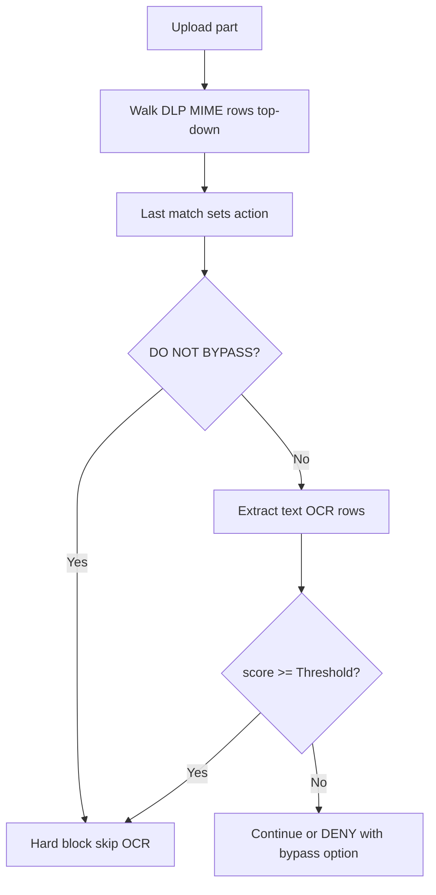

<Frame caption="Upload DLP flow">
  
</Frame>

## Overview

The `DLP` section inspects **uploaded** content and can block sensitive data leaving the network. MIME-based DLP policies set allow or block actions; OCR policies score text extracted from uploads against a global Threshold.

DLP runs on the request (upload) path only — not on downloaded responses. Access **Bypass** with DLP skips inspection; Access **Allow bypassing** can soften a DENY block when a valid bypass cookie is present.

{/* source: https://www.safesquid.com/md/dlp.md */}
Because the MIME layer only sees declared content type, pair a MIME allow entry (for example, allowing spreadsheet uploads) with a matching destination restriction in Access Profiles — otherwise allowing a common upload type through DLP is effectively blanket permission to upload that type anywhere, defeating the control.

## Core Mechanics (C++ Source Validation)

MIME regex compile (commas → `|`), policy walk, OCR scoring.

### MIME policy — last match wins

Unlike most SafeSquid lists, DLP MIME rows use **last matching enabled row wins**. Each row whose POSIX regex matches the uploaded part's MIME type overwrites the action as the walk continues top to bottom.

### OCR scoring

Unless MIME action is already **DO NOT BYPASS**, SafeSquid extracts text once (`text/*` uses text extraction; `image/*` uses OCR). Enabled OCR rows are walked while score \< Threshold; each keyword regex match adds Weight. Score ≥ Threshold → **DO NOT BYPASS**.

{/* source: https://www.safesquid.com/md/dlp.md */}
Modern zip-based Office documents (`.docx`, `.xlsx`, `.pptx`) are unarchived directly: their real paragraph or cell text is extracted with no OCR needed, and any images embedded inside the document are separately OCR'd for text they contain.

<Warning>
**Legacy binary Office formats (`.doc`, `.xls`, `.ppt` — pre-2007) and PDF are not zip containers, so the unarchive-and-extract step cannot open them.** They pass through as a single unmodified block of data — neither their text nor any embedded images are inspected. This is a known gap in today's content inspection, not something a configuration change can work around.
</Warning>

### Bypass severity

**DENY** may be bypassed with Allow bypassing and a valid bypass cookie. **DO NOT BYPASS** is never bypassed.

## Processing flow

## Schema Fields

### Global fields

- **Enabled (enabled)** — Master switch for upload inspection and OCR scoring.
- **Threshold (threshold)** — OCR keyword weights summed per upload; total ≥ Threshold yields DO NOT BYPASS.

### DLP policy rows

- **Upload Content type (mime)** — POSIX regex against part MIME. Commas become alternation (`|`). Blank matches all.
- **Profiles (profiles)** — Connection must match listed Access Profile tags.
- **Action (action)** — ALLOW, DENY, or DO NOT BYPASS.
{/* source: https://www.safesquid.com/md/dlp.md */}
  The content-inspection layer can still escalate ALLOW or DENY to DO NOT BYPASS once the keyword score crosses Threshold; it never downgrades an existing DO NOT BYPASS.
- **Comment (comment)** — Block reason when Action is DENY or DO NOT BYPASS.

### OCR policy rows

- **Search For (keyword)** — POSIX regex against extracted text.
- **Weight (score)** — Added on match. Weight 0 skips the row.

## Examples

Open **Configure → Real time content security → DLP → DLP policies** (sibling tabs: Global,
OCR policies). Row fields are Enabled, Comment, Profiles, Upload Content type, and Action.

<Frame caption="DLP — DLP policies rows">
  
</Frame>

### Block PDF uploads

- **Configuration:** Upload Content type `application/pdf`, Action DENY, Comment `PDF uploads not permitted`.
- **Result:** any upload part whose MIME matches is blocked with that comment as reason.

### OCR keyword threshold

- **Configuration:** Threshold 100; OCR row `confidential` Weight 60; OCR row `internal use only` Weight 50.
- **Result:** image upload containing both phrases scores 110 → DO NOT BYPASS at Threshold 100.

### Last match overrides allow

- **Configuration:** Row A blank MIME ALLOW; Row B below `image/` DO NOT BYPASS.
- **Result:** image uploads match both; row B wins (last match) and hard-blocks. Non-image uploads match only row A unless OCR scores high enough.

{/* source: https://www.safesquid.com/md/dlp.md */}
### Legacy document format bypasses content inspection

- **Configuration:** Threshold 100; an OCR row looking for a sensitive keyword; a user uploads a `.doc` file (legacy binary Word format) containing that keyword in its body text.
- **Result:** the MIME layer's action for `.doc` applies as configured, but the content-inspection layer cannot open the legacy binary format to extract its text, so the keyword is never seen and never contributes to the score. This is a known limitation of the pre-2007 Office formats and PDF, not a misconfiguration — a policy relying on keyword detection alone should not be assumed to cover these formats.

## How to verify

1. Upload test content through a profile without DLP bypass.
2. Enable DLP in `LOG_LEVEL` for native `dlp:` lines.
3. **Reports → Detailed logs** — filter name DLP with action and score.
4. Pair Access BYPASS + DLP checkbox to confirm skip path.

{/* source: https://www.safesquid.com/md/dlp.md */}
5. Test keyword scoring with `.docx`/`.xlsx`/`.pptx` uploads — testing with `.doc`/`.xls`/`.ppt` or PDF does not exercise the content-inspection layer at all, by design.
