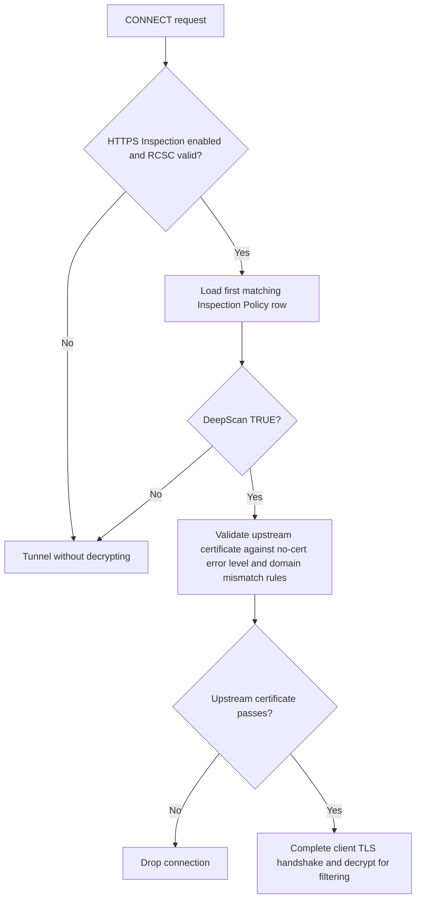

## Overview

HTTPS Inspection controls CONNECT handling and optional TLS man-in-the-middle (Deep Scan) for HTTP inside HTTPS. Requires a valid RCSC (root CA) loaded from activation; the policy engine returns no policy when the section is off or misconfigured. Enabled Master switch ( ssl\_policy ). Off: no inspection policy applies. Inspection Policies Profile rows; first match wins. Sets Deep Scan, no-certificate, domain-mismatch, and max SSL error level for that CONNECT. Setup Stored server/ passphrase rows (see field help — not read by current runtime setup code). SSL Certs/Cache Download, upload, or refresh RCSC files and view SSL session/context cache. On CONNECT, deep\_scan\_check() loads the first matching Inspection

By default, general web traffic should be fully verified and fully inspected. The realistic exception is internal or development infrastructure whose certificates are self-signed, whose issuing chain is incomplete, or that is simply expired. Rather than relaxing verification globally, scope the relaxation to the specific traffic that needs it — ideally via a Request Type built for those internal hosts — rather than opening it up for everyone.

## Core Mechanics (C++ Source Validation)

- **Deep Scan (MITM)**: The connection evaluator determines if `deepscan` is enabled for the connection. If true, SafeSquid performs full Man-in-the-Middle interception by generating a forged, trusted certificate for the client using the defined Root CA, enabling inspection of the encrypted payload.
- **Upstream Validation**: SafeSquid builds an OpenSSL certificate store and verification parameters to validate the upstream origin server’s certificate against known CA authorities.
- **Strict Error Handling**: Handlers validate domain mismatches (`block_domain_mismatch`), missing certificates (`block_no_cert`), and maximum allowable OpenSSL error levels (`max_error_level`). Failures drop the connection to prevent MITM attacks from malicious servers.

## Section fields

The console splits HTTPS Inspection into three tabs. There is **no Setup tab** — the Setup rows
described under SSL Certs/Cache below are configuration the current build never reads.

<Tabs>
  <Tab title="Global">

    ## Global field

    - **Enabled (enabled)**: Master switch for HTTPS Inspection. Off: The policy engine returns NULL and the inspection engine never enables Deep Scan. On: policies apply only when RCSC setup succeeds.

  </Tab>

  <Tab title="Inspection Policies">

    ## Row fields

    Every field here is per-connection tuning on an Inspection Policy row. The first matching
    enabled row from the top wins for each CONNECT — this is first-match-wins, **not
    cumulative like Access Profiles**: only the first matching entry governs a given CONNECT,
    and entries below it are never consulted for that connection.

    - **Enabled (enabled)**: When disabled, this row is skipped. First matching enabled row wins for each CONNECT.
    - **Comment (comment)**: Operator note only; not used in SSL verification logs.
    - **Profiles (profiles)**: Connection must match at least one listed profile (Access Profiles engine). Leave blank for all connections. Negated tags ( !profile ) skip the row when that profile is present. The engine stops at the first matching row from the top.
    - **DeepScan (deepscan)**: When TRUE, the inspection engine returns TRUE and SafeSquid performs a client TLS handshake on CONNECT, decrypting HTTP for inspection. When FALSE, CONNECT is tunneled without decrypting; upstream SSL checks in this row are not applied to tunneled traffic. Use FALSE for non-HTTP TLS (Drive, Subversion, WinSCP, etc.).
    - **Block Access to Sites that do not have an SSL Certificate (block\_no\_cert)**: When TRUE (default), upstream validation blocks if the upstream presents no certificate. When FALSE, connections without a server certificate are allowed to continue (logged at DEBUG).
    - **Acceptable Errors in SSL Verification (block\_err\_level)**: Maximum OpenSSL verification error SafeSquid tolerates on the upstream certificate. Upstream validation blocks when error limits are exceeded. Level 0 is strictest — only a fully valid chain passes. Choosing a level tolerates that condition and everything listed above it in strictness; anything below it still blocks. Hostname and IP mismatch are also gated by Block domain mismatch separately.
    - **Block domain mismatch in the web-site SSL certificate (block\_domain\_mismatch)**: When TRUE (default), hostname or IP mismatch errors from OpenSSL block the connection. When FALSE, X509\_V\_ERR\_HOSTNAME\_MISMATCH and X509\_V\_ERR\_IP\_ADDRESS\_MISMATCH are explicitly allowed even if they exceed the acceptable error level.

    ## How CONNECT is handled

    1. On CONNECT, the inspection engine loads the first matching Inspection Policy row.
    2. When Deep Scan is **FALSE**, CONNECT is forwarded as a tunnel without decrypting application data.
    3. When Deep Scan is **TRUE** and RCSC is valid, SafeSquid completes a client-side TLS handshake and decrypts HTTP for filtering.
    4. Before decrypting, the validation engine checks the upstream certificate (no cert, error level, domain mismatch rules).
    5. Deep Scan only works when the tunneled protocol is HTTP; many non-HTTP TLS clients break when forced through inspection.

  </Tab>

  <Tab title="SSL Certs/Cache">

    Certificate files live here. The **Setup** rows below were intended to carry the RCSC
    passphrase and cache sizing per node, but the current build does not read them — they are
    listed so an operator who finds them populated knows they have no effect.

    ### Setup row fields (stored, never read)

    - **Enabled (enabled)**: When disabled, this Setup row is skipped when the list is rebuilt on config reload. Note: rows are loaded into server\_config\_list but no runtime code in this tree reads that list (see ambiguities).
    - **Comment (comment)**: Operator note only; not referenced by SSL setup code.
    - **Proxy Host (proxy\_server)**: Intended to match this SafeSquid instance (hostname from startup parameters) so the row applies on the correct node.
    - **Encrypted Password (enc\_pwd)**: Encrypted passphrase for the RCSC private key, stored per Setup row. Runtime RCSC load uses the global activation password, not this field, in the current build.
    - **SSL Cache Store Size (ssl\_cache\_store\_size)**: Intended cap for outbound SSL context/session cache entries ( CTXcacheOUT ). Stored on each server\_config row but not applied by current cache code (cache sizing is internal to CTXcacheOUT ). Changing cache behaviour requires a restart when supported.
    - **appcontent (appcontent)**: No description provided.

    ## Code quirks — the Setup rows are not read at runtime

    <Warning>
    **Setup rows are not used by current SSL setup code.** Fields Proxy Host, Encrypted Password, and SSL Cache Store Size are loaded into the internal configuration loader decrypts and loads the root CA using the global activation password only — not Setup row passphrases. Cache sizing is internal to `CTXcacheOUT`; Setup SSL Cache Store Size is not applied. Treat Setup as operator reference until wired in code; use activation for the RCSC passphrase and SSL Certs/Cache for certificate files.
    </Warning>

  </Tab>
</Tabs>

## Examples

Open **Configure → Real time content security → HTTPS Inspection → Inspection Policies** (sibling
tabs: Global, SSL Certs/Cache). Row fields match the Inspection Policy fields listed above exactly.

<Frame caption="HTTPS Inspection — Inspection Policies rows">
  
</Frame>

<Tip>

### 1 — Inspect general web browsing

- Enabled: on, valid RCSC from activation
- Inspection row: Profiles blank, DeepScan TRUE, strict certificate checks
- Clients trust RCSC public cert

**Result:** HTTP inside HTTPS is decrypted and passed through the normal filter pipeline.
</Tip>

<Tip>

### 2 — Tunnel non-HTTP TLS (Drive, Git, RDP-over-TLS)

- Row A (top): Profiles for known non-HTTP apps, DeepScan FALSE
- Row B: Profiles blank, DeepScan TRUE

**Result:** matching non-HTTP CONNECT tunnels without decryption; general HTTPS still inspected via row B.
</Tip>

<Tip>

### 3 — Allow self-signed upstream with strict client trust

- Acceptable Errors: relaxed level for internal sites
- Block domain mismatch: TRUE for public sites, FALSE on a row matching internal host profiles

**Result:** internal servers with name mismatch may pass upstream validation while public sites remain strict.
</Tip>

<Tip>

### 4 — Scoped relaxation for internal development servers

- Inspection row, above the default: Profiles set to a label for known internal/development hosts, DeepScan TRUE, Acceptable Errors relaxed enough to tolerate a self-signed certificate or an incomplete local chain, Block domain mismatch left TRUE

**Result:** internal staging servers with a self-signed or incomplete-chain certificate pass Deep Scan without a certificate block, while Block domain mismatch staying on still catches a genuine hostname mismatch even on this relaxed entry — every connection outside that Profile still gets the strict default.
</Tip>

{/* source: https://www.safesquid.com/md/browser-configuration.md */}
<Warning>
**Turning on Deep Scan before clients trust the RCSC breaks HTTPS browsing for everyone behind it, not just for one site.** Test with one machine that already trusts the certificate before enabling Deep Scan network-wide.
</Warning>

## Recommended practice

- Deploy RCSC to all managed clients before enabling Deep Scan broadly.
- Use DeepScan FALSE rows for protocols that are not HTTP-over-TLS.
- Use SSL Certs/Cache to upload corporate roots and refresh caches after certificate changes.
- Do not rely on Setup Encrypted Password for RCSC unlock — use activation passphrase.

## How to verify

1. CONNECT to an HTTPS site; confirm filters (for example ClamAV) see decrypted content when DeepScan is TRUE.
2. Enable SSL log level for `SSLcertSection::` and certificate validation lines.
3. Check Detailed logs for CONNECT handling and upstream certificate errors.
4. SSL Certs/Cache → Cache Refresh after RCSC or trusted-CA changes.
5. Confirm a destination with a genuinely broken certificate (expired, wrong hostname, self-signed) is blocked under the strict default entry, and only passes through when routed to an entry whose Acceptable Errors and Block domain mismatch settings were deliberately relaxed for it.
