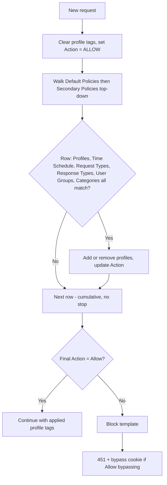

The **Access Profiles** section is the central content-policy hub. Access restrictions decide *who* connects; Access Profiles decide *what* they may fetch. It combines Time Profiler, Request Types, Response Types, categories, and User-Groups, then adds profile tags and sets Allow/Deny.

<Note>
Unlike Access restrictions (first match), **every** matching row in Default and Secondary Policies applies. Later rows see tags changed by earlier rows. A broad Deny early in the list is not final — a later, more specific Allow can still override it, and the reverse works too. The recommended shape is to deny broadly first and carve out specific exceptions after.
</Note>

## Profile pipeline

On each request (non-interface), SafeSquid builds label lists in this order before Access Profiles runs:

1. [Time Profiler](/configuration/custom_settings/time_profiler) → `time_schedules`
2. [Request Types](/configuration/custom_settings/request_types) → `request_types`
3. Domain categorization → `website_categories`
4. **Access Profiles** → `profiles` + `action`
5. [Response Types](/configuration/custom_settings/response_types) on response headers/body → updates `response_types`; Access Profiles runs again

Access restrictions **User-Groups** populate `user_groups` (not `profiles`). Access Profiles **User Groups** gate matches those tags.

## Core mechanics

### List order

1. Clear the connection's profile tags; set the action to **ALLOW**.
2. Walk **Default Policies** top-down — every match applies.
3. Walk **Secondary Policies** top-down — same cumulative rules.
4. Final action not Allow → block (bypass cookie may apply).

### Action values

- **Allow** — Default. Downstream sections use applied profile tags.
- **Deny** — Block. With Access **Allow bypassing**, temporary bypass cookie may be offered.
- **Do not bypass** — Hard block; no bypass cookie.
- **Inherit** — Keep action from earlier matching rows; use when row only adds/removes tags.

## Rule fields

All configured criteria on a row must match. Blank = any. Use `!` to negate tags in list fields.

- **Enabled** (`enabled`) — disabled entries are skipped entirely; they never match and never affect the connection.
- **Comment** (`comment`) — free text describing why the entry exists; also shown to the user as the block reason when this entry's Action sets Deny or Do not bypass.
- **Trace Entry** (`profile_tracing`) — writes a native log line every time this entry adds or removes a Profile label; switch it off again once testing is done.
- **Proxy instance** (`proxyhost`) — a regular expression matched against this appliance's own hostname, for deployments where several instances share one configuration but should apply different entries. Blank applies on every instance.
- **Applicable Profiles** — Tags on connection from earlier rows in this pass (list is cleared at start).
- **Time Schedule** — Tags from [Time Profiler](/configuration/custom_settings/time_profiler).
- **Request Types** — Tags from [Request Types](/configuration/custom_settings/request_types).
- **Response Types** — Tags from [Response Types](/configuration/custom_settings/response_types); requires response header when field set. Also skipped for a response confirmed empty (not chunked, Content-Length zero).
- **User Groups** — From Access restrictions. Non-blank + empty user\_groups → row skipped. Setting this field never by itself forces a login prompt.
- **Categories** — Domain categories; empty lookup tests as `UNCATEGORIZED`. When referer categorization is enabled, the referer's category is matched too.
- **Action** (`action`) — only changes the connection's running Action when it differs from the current Action and is not Inherit.
- **Added Profiles** / **Removed profiles** — labels applied when the entry matches. Added runs first, then Removed, on the same entry — so one entry can add one label and remove a different one, but cannot remove a label it just added. A label already present is not duplicated; removing a label that is not present has no effect.

### Default Policies vs. Secondary Policies

**Default Policies** is evaluated first, for every connection, on every pass. **Secondary Policies** runs after it, using the labels and Action Default Policies left behind — the natural home for scoped exceptions layered on top of a broad Default Policies deny.

## Examples

Open **Configure → Restriction Policies → Access Profiles**. Default Policies is the tab that
opens first; each row shows Enabled, Comment, Trace Entry, Categories or Request Types, Action, and
Added Profiles inline, and the right-hand panel restates the evaluation order.

<Frame caption="Access Profiles — Default Policies list">
  
</Frame>

<Tip>

### LAN users + category deny

**Config:** Default: User Groups `LAN_USERS`, add `users`, Inherit. Secondary: Categories `Social`, profiles `users`, Deny.

**Result:** LAN traffic tagged; Social category blocked with row comment as reason.
</Tip>

<Tip>

### Time-gated exception

**Config:** Time Profiler adds `LUNCH_TIME`; Secondary matches Time Schedule `LUNCH_TIME`, Allow streaming.

**Result:** exception only during lunch window local time.
</Tip>

<Tip>

### Response-side deny

**Config:** Response Types adds `executable_download`; Secondary matches that tag, Deny.

**Result:** may not match until response headers arrive and profile matching runs again.
</Tip>

## How to verify

1. **Reports → Detailed logs** — profiles, request/response/time profile columns.
2. Enable **Trace Entry** on one row; check native logs.
3. Debug headers — `X-SafeSquid-Profiles`, `X-SafeSquid-Access-Policy`.
4. If an expected label is missing, check whether an earlier entry's gates actually fit the connection — a skipped entry contributes nothing.
5. To confirm cumulative behaviour, deliberately place a Deny in Default Policies and a narrower Allow below it in Secondary Policies, and verify the connection is allowed — this is what most clearly distinguishes Access Profiles from Access restrictions.
6. When a block is unexpected, check the Comment recorded as the block reason and whether the Action was Deny or Do not bypass — a Do not bypass block will not respond to a bypass cookie even for a user who otherwise holds the Allow bypassing right.
