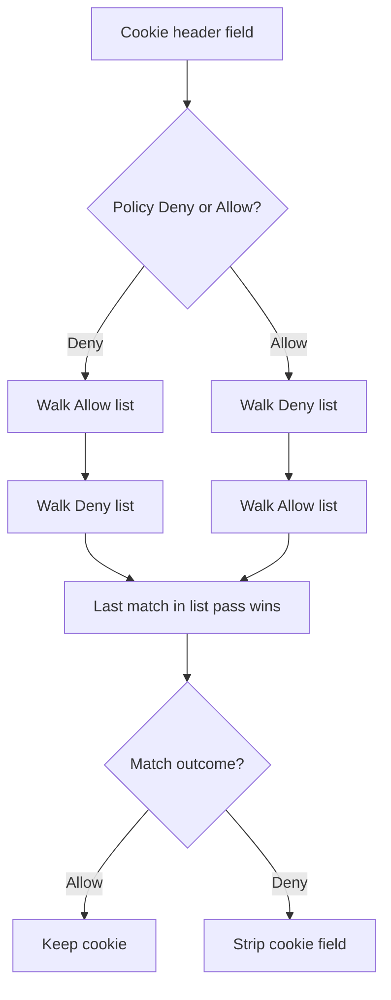

Open **Configure → Restriction Policies → Privacy control → Cookie filter**. This section sits under the **Privacy control** menu group alongside [Cookie filter](/configuration/restriction_policies/privacy_control/cookie_filter), [Header filter](/configuration/restriction_policies/privacy_control/header_filter) and [Elevated Privacy](/configuration/restriction_policies/privacy_control/elevated_privacy) — configure them together, since a Cookie filter allow row and an Elevated Privacy STANDARD row can otherwise fight over the same header.

The `Cookies-filtering` section (`safesquid-cookies-filtering(5)`) provides granular control over HTTP cookies passing between clients and servers.

## Core mechanics

Dual-list Allow/Deny walk, **last** match in pass wins — unlike most other sections' first-match rule.

- **Dual-List Policy Engine**: Cookie filtering operates on a Global Policy (Allow or Deny) combined with Allow/Deny override lists. If the global policy is set to `Allow`, SafeSquid first scans the Deny List (to block matching cookies) and then scans the Allow List (to explicitly permit exceptions).
- **Time-Based Evaluation**: Unlike other modules, the time profiles here (`limitmonths`, `limitdays`, etc.) are checked against the cookie's literal `Expires` attribute (`COOKIE_HAS_EXPIRES`), not the proxy's current system time.
- **Action**: Matches result in the cookie being silently stripped from the HTTP stream (`HEADER_FILTERED`).
{/* source: https://www.safesquid.com/md/cookies-filtering.md */}
- **Clear-Site-Data**: whenever any cookie is dropped from a connection, SafeSquid adds a `Clear-Site-Data: "*"` header, asking the browser to clear stored site data — a stronger cleanup than simply not forwarding the one cookie field.

### How SafeSquid processes the lists

1. If Policy is **Deny**, SafeSquid walks **Allow** first, then **Deny**.
2. If Policy is **Allow**, SafeSquid walks **Deny** first, then **Allow**.
3. Within each list, every enabled matching row is evaluated; the **last** match in that list pass sets the outcome (not first-match like Access restrictions).
4. Each `Cookie` header field is processed separately; denied fields are erased from the header list.
5. Domain, path, and expiry filters on a row apply only when Direction is **IN** (Set-Cookie). The live request/response header hooks call filtering with outbound (`Cookie`) direction only — Set-Cookie rows are configured for server→browser cookies but are not applied by the active `filter_cookies` path in this tree.

<Warning>
  **Order matters.** Put specific host or profile rules above broad catch-alls. Because the last match in a list pass wins, a lower row can override an upper row in the same list.
</Warning>

<Warning>
  **IN direction is configured but not enforced.** Domain/Path/expiry filters on IN (Set-Cookie) rows are evaluated in code, but the active `filter_cookies` path only calls filtering for OUT (browser→server `Cookie`) direction. Do not rely on an IN row to block a server's `Set-Cookie` in the current build.
</Warning>

{/* source: https://www.safesquid.com/md/cookies-filtering.md */}
## Section fields

The console splits Cookie filter into three tabs. **Allow** and **Deny** use an identical row
form — only their position in the walk and the meaning of a match differ — so the row fields are
documented once, under **Allow**.

<Tabs>
  <Tab title="Global">

    ## Global fields

    - **Enabled (`cookie_enable`)** — off means `Cookie` and `Set-Cookie` headers pass through unmodified.
    - **Policy (`policy`)** — the walk-order selector described above, and also the default action when no configured row matches a cookie: **Allow** forwards it, **Deny** strips it.

  </Tab>

  <Tab title="Allow">

    ## What an Allow row does

    A matching Allow row keeps the cookie field. With Policy **Deny**, the Allow list is walked
    **first** and is the only thing that lets a cookie through; with Policy **Allow**, it is
    walked **second** and can restore a field the Deny pass stripped. The **last** matching row
    in the pass wins, so a lower row overrides a higher one.

    ## Row fields

    - **Profiles** — Limit the row to connections that carry these Access Profile tags. Blank ignores profiles. Prefix `!` negates a tag.
    {/* source: https://www.safesquid.com/md/cookies-filtering.md */}
    - **The built-in `Read Only` profile** is meant for Deny rows: apply it to a connection and matching cookies are blocked, so the user cannot stay signed in to that site. See the `cookie_profiles` catalog in [Suggested profiles](/configuration/custom_settings/suggested_profiles).
    - **Direction** — **OUT** — browser→server `Cookie` headers (what the live hooks filter). **IN** — server→browser `Set-Cookie` (domain, path, expiry tests in code; not invoked by current hooks). **BOTH** — either direction when filtering runs.
    - **Domain / Path** — Regular expressions. Used for Direction IN when Set-Cookie filtering runs. For OUT rows, only profiles and direction are tested.
    {/* source: https://www.safesquid.com/md/cookies-filtering.md */}
    - **Domain regex accepts pipe-separated alternatives** — for example `safesquid.com|google.com`. Applies only when Direction is IN, per the warning above.
    - **Expiry ranges / Time match mode** — Apply only to Set-Cookie with a parseable `Expires` attribute. **ABSOLUTE** — one continuous window from start through end fields. **ALL RANGES** — expiry must satisfy every configured range at once.
    {/* source: https://www.safesquid.com/md/cookies-filtering.md */}
    - **Expiry range fields (internal names)** — `year`, `month`, `day`, `weekday`, `hour`, `minute` — inclusive bounds tested against the cookie's own `Expires` attribute, not the appliance clock. For example, an hour range of 1–10 matches a cookie that expires between 1 AM and 10 AM. Configured but not enforced today — see the IN direction warning above.
    {/* source: https://www.safesquid.com/md/cookies-filtering.md */}
    - **`comment`** — an operator note only; does not affect matching.

  </Tab>

  <Tab title="Deny">

    ## What a Deny row does

    A matching Deny row strips the cookie field from the header list and adds
    `Clear-Site-Data: "*"` to the connection. With Policy **Deny** the Deny list is walked
    **second**, so it can revoke something the Allow pass permitted; with Policy **Allow** it is
    walked **first**. Last match in the pass wins.

    The built-in **Read Only** profile is intended for Deny rows: apply it to a connection and
    matching cookies are blocked, so the user cannot stay signed in to that site.

    Rows use the same form as the Allow list — see the **Allow** tab for every field.

  </Tab>
</Tabs>

## Examples

Open **Configure → Restriction Policies → Privacy control → Cookie filter**. The **Global**
sub-tab holds the Enabled switch and the Policy (Allow/Deny); **Allow** and **Deny** are
separate sub-tabs holding the override row lists.

<Frame caption="Privacy control — Cookie filter Global tab">
  
</Frame>

<Tip>

### Deny by default, allow intranet SSO cookies

- Policy: **Deny**
- Allow row: Profiles `Staff`, Direction OUT, Domain `corp\.example\.com`

**Result:** staff users keep `Cookie` headers for `corp.example.com`; all other outbound cookies on matching requests are stripped and `Clear-Site-Data: "*"` is added when any cookie is dropped.
</Tip>

<Tip>

### Last match in Allow list wins

- Policy: **Deny**
- Allow row 1 (top): Domain `.*` — permits all
- Allow row 2 (below): Profiles `Guest`, Direction OUT — no domain

**Result:** for Guest connections, row 2 is the last Allow match and permits cookies; for others, row 1 is the last Allow match.
</Tip>

## How to verify

1. From a test client, browse a site that sets cookies and watch the browser devtools Network tab for request `Cookie` headers upstream of SafeSquid.
2. Open **Reports → Detailed logs**; look for `filter_name` related to cookies and native `cookie:` lines when COOKIE is enabled in `LOG_LEVEL`.
3. Check debug response header `X-Cookie-Filter` on the connection (`Dropped-Cookie-Out` when cookies were stripped).
4. Enable **Trace Entry** on one row to confirm profile and domain matching in Native logs.
{/* source: https://www.safesquid.com/md/cookies-filtering.md */}
5. Confirm the appliance and the browser agree on direction — **OUT** is what the browser sends, **IN** is what the website sets. A Domain or Path filter that never seems to match is most often pointed at the wrong Direction.
