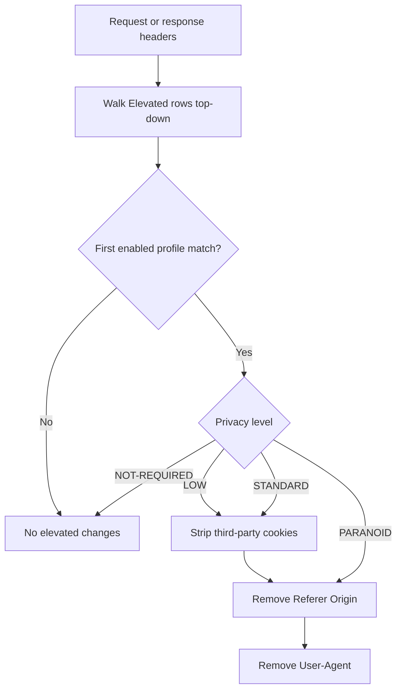

Open **Configure → Restriction Policies → Privacy control → Elevated Privacy**. This section sits under the **Privacy control** menu group alongside [Cookie filter](/configuration/restriction_policies/privacy_control/cookie_filter), [Header filter](/configuration/restriction_policies/privacy_control/header_filter) and [Elevated Privacy](/configuration/restriction_policies/privacy_control/elevated_privacy) — configure them together, since a Cookie filter allow row and an Elevated Privacy STANDARD row can otherwise fight over the same header.

The `Elevated` section reduces cross-site tracking by stripping third-party cookies and selected tracking headers. Without it, third-party cookies and related trackers can follow users from site to site.

## Core mechanics

### First match wins

On each request and response header pass, enabled Elevated policy rows are walked top to bottom. The **first** matching row sets the privacy level for that connection; later rows are skipped.

### Privacy levels (action field)

- **NOT-REQUIRED** — No stripping; bypass elevated privacy.
- **LOW** — Drop third-party Cookie and Set-Cookie when cookie flag set.
- **STANDARD** — LOW plus remove Referer and Origin on outgoing requests.
- **PARANOID** — STANDARD plus remove User-Agent (may break browser-variant sites).

Changes are logged to the privacy log and Detailed logs with filter name Elevated-Privacy. Debug header `X-Elevated-Privacy` reports level when Send Debugging Headers includes client.

{/* source: https://www.safesquid.com/md/elevated.md */}
### Global fields

- **Enabled (`enabled`)** — master switch. When off, request and response header processing exits without changing any headers.

### Important entry fields

- **Profiles (`profiles`)** — limits the row to connections carrying the listed Access Profiles; blank matches every connection.
- **Privacy Levels (`action`)** — NOT-REQUIRED, LOW, STANDARD, or PARANOID, applied when this row is the first match.
- **Comment (`comment`)** — operator note only; does not affect matching.

## Examples

Open **Configure → Restriction Policies → Privacy control → Elevated Privacy → Elevated
policies**. Rows are tested top to bottom; the first enabled match sets the level for the
connection.

<Frame caption="Privacy control — Elevated Privacy policy rows">
  
</Frame>

<Tip>

### Paranoid for guests, bypass for staff

- **Configuration:** Row A Profiles STAFF NOT-REQUIRED; Row B blank PARANOID.
- **Result:** staff keep full headers; others get paranoid stripping.
</Tip>

<Tip>

### Cookie-only for marketing

- **Configuration:** Profiles MARKETING USERS, Privacy Levels LOW.
- **Result:** only third-party cookies stripped; Referer and User-Agent remain.
</Tip>

{/* source: https://www.safesquid.com/md/elevated.md */}
<Tip>

### Standard privacy for everyone

- **Configuration:** One row, Profiles blank, Privacy Levels STANDARD.
- **Result:** every connection has third-party cookies dropped and Referer/Origin removed from outgoing requests.
</Tip>

<Tip>
  Start with LOW or STANDARD before PARANOID — removing User-Agent breaks some applications. Place NOT-REQUIRED bypass rows above broad PARANOID rows.
</Tip>

## How to verify

1. Browse multi-site flow; inspect request headers upstream of proxy.
2. Check `privacy.log` under Reports.
3. Enable elevated log level for native privacy lines.
4. Debug header `X-Elevated-Privacy` on client when configured.
