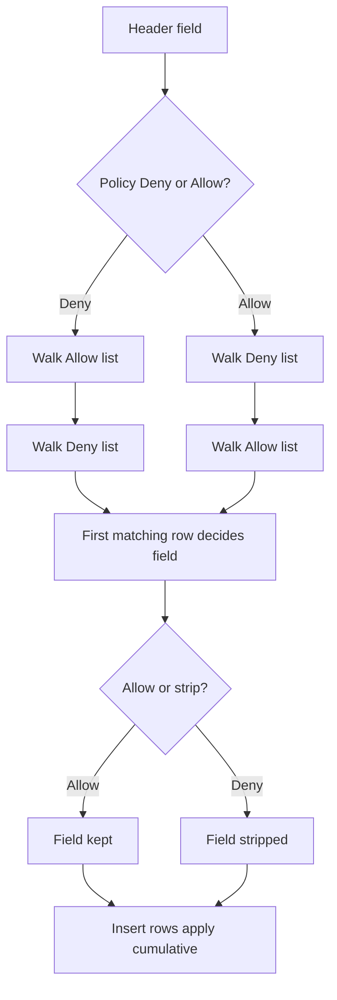

Open **Configure → Restriction Policies → Privacy control → Header filter**. This section sits under the **Privacy control** menu group alongside [Cookie filter](/configuration/restriction_policies/privacy_control/cookie_filter), [Header filter](/configuration/restriction_policies/privacy_control/header_filter) and [Elevated Privacy](/configuration/restriction_policies/privacy_control/elevated_privacy) — configure them together, since a Cookie filter allow row and an Elevated Privacy STANDARD row can otherwise fight over the same header.

The `Header-filtering` section (`safesquid-header-filtering(5)`) allows administrators to strip out or inject HTTP headers into client requests or server responses.

## Core mechanics

Allow/Deny list order (**first** match wins, unlike Cookie filter's last-match rule), Insert with variable expansion.

- **Dual-List Policy Engine**: Header filtering utilizes a global Allow/Deny switch. If the global policy is set to `Allow`, SafeSquid first scans the Deny List to strip headers (`action = FALSE`), then evaluates the Allow List to preserve exceptions.
- **Insertion Engine**: Independent of the filter list, the `Insert` list injects entirely new headers into the stream. The inserted headers undergo variable expansion, meaning runtime variables (like usernames or IP addresses) can be dynamically injected into the header value.
- **Flags Targeting**: Both filter and insert rules target either the Request, Response, or Both (`which & flags`).

### How SafeSquid processes the lists

1. For each header field on the message being filtered:
2. If Policy is **Deny**, SafeSquid walks **Allow** first, then **Deny**.
3. If Policy is **Allow**, SafeSquid walks **Deny** first, then **Allow** (Allow can restore a field Deny removed, and vice versa on the second pass).
4. Within each list pass, the **first** matching row decides allow or strip for that field.
5. Stripped fields are removed and logged as `removed` in native header logs.
6. Insert runs after allow/deny. Both **Type** and **Value** must be non-empty; Value supports connection variables.
7. A field that is kept (not stripped) is logged as `allowed`, alongside the `removed` note in step 5.
8. Insert rows are cumulative, not first-match — more than one enabled, matching Insert row can add a header to the same message.

<Warning>
  **Order matters.** On Allow/Deny rows, put specific regexes above broad ones — first match in that list pass wins for each field.
</Warning>

{/* source: https://www.safesquid.com/md/header-filtering.md */}
## Section fields

The console splits Header filter into five tabs. **Allow** and **Deny** share one row form, so
the fields are documented once under **Allow**; **Insert** reuses the same fields with different
meanings, called out in that tab.

<Tabs>
  <Tab title="Global">

    ## Global fields

    - **Enabled (`enabled`)** — turns Header filter on or off for all connections, unless the matching Access entry's **Bypass** grants **Header filtering**.
    - **Policy (`policy`)** — the default outcome when no Allow/Deny row matches a header field: **Deny** strips it, **Allow** forwards it. It also decides which list is walked first (see step 2–3 above).

  </Tab>

  <Tab title="Allow">

    ## What an Allow row does

    A matching Allow row keeps the header field. With Policy **Deny** the Allow list is walked
    **first**; with Policy **Allow** it is walked **second**, where it can restore a field the
    Deny pass stripped. The **first** matching row in that pass decides the field — the opposite
    of Cookie filter's last-match rule — so put specific regexes above broad ones. A kept field
    is logged as `allowed`.

    ## Row fields

    {/* source: https://www.safesquid.com/md/header-filtering.md */}
    - **Enabled (`enabled`)** — disabled rows are skipped and never match.
    - **Comment (`comment`)** — operator note; shown only in the configuration, never to end users.
    - **Profiles** — Apply only when the connection has one of these profiles. Blank = all connections. Prefix `!` to skip connections that have a profile (for example `!Guest`).
    - **Type** — On Allow/Deny: regex on the header field name (for example `Referer`, `User-Agent`); blank matches any name. On Insert: literal header name to add (not a regex).
    - **Value** — On Allow/Deny: regex on the field value; blank matches any value. On Insert: header body with variables expanded.
    - **Applies to** — **CLIENT HEADER** — request headers (browser → origin). **SERVER HEADER** — response headers (origin → browser). Row must include the direction being filtered.
    {/* source: https://www.safesquid.com/md/header-filtering.md */}
    - **Internal field names** — Profiles is `profiles`, Type is `type`, Value is `value`, Applies to is `which`.
    - **Insert non-blank requirement** — both Type and Value must be non-blank for an Insert row to apply.

    {/* source: https://www.safesquid.com/md/header-filtering.md */}

  </Tab>

  <Tab title="Deny">

    ## What a Deny row does

    A matching Deny row strips the header field from the message and logs it as `removed` in the
    native header logs. With Policy **Deny** the Deny list is walked **second**; with Policy
    **Allow** it is walked **first**. First match in that pass wins.

    Stripping the destination's own `Content-Security-Policy` with a Deny row is a prerequisite
    for writing your own — see the **Insert** tab.

    Rows use the same form as the Allow list — see the **Allow** tab for every field.

  </Tab>

  <Tab title="Insert">

    ## What an Insert row does

    Insert runs **after** the allow/deny pass and adds entirely new headers rather than filtering
    existing ones. It is **cumulative, not first-match**: every enabled matching Insert row can
    add a header to the same message.

    Three fields behave differently here than on an Allow/Deny row:

    - **Type** — a literal header name to add, not a regex.
    - **Value** — the header body, with connection variables expanded at runtime, so a username
      or client IP can be injected dynamically.
    - Both **Type** and **Value** must be non-blank or the row does not apply.

    ## Content-Security-Policy tiers

    Content-Security-Policy (CSP) is a response header that controls what an already-loaded page is allowed to do — which hosts its scripts may connect to, whether it may embed frames, whether it may submit forms elsewhere. Insert rows can write one, which makes Header filter a meaningful defense even for destinations you have chosen to allow: a legitimate site can still be abused to run injected scripts, load third-party tracking, or exfiltrate data to an unexpected destination.

    <Warning>
      **Browsers combine multiple CSP headers by intersecting them**, taking whichever directive is more restrictive. A SafeSquid-authored CSP only takes clean effect if the destination's **own** `Content-Security-Policy` is stripped first with a Deny row. Skip that step and the browser merges the two — the practical result is usually **more** restrictive than intended, and pages can appear broken (missing fonts, broken widgets) for reasons that are not obvious from the Insert row alone.
    </Warning>

    SafeSquid's built-in Profile catalog offers three tiers of increasing openness, applied via an Access Profile and referenced from Insert rows:

    - **Minimal content access** — baseline. Same-origin scripts and forms only; `connect-src` and `script-src` are restricted to the page's own host, and violations are reported back to SafeSquid.
    - **Standard content access** — relaxes `connect-src` and `child-src` to the page's own host domain, while keeping the other directives as tight as the minimal tier.
    - **Full content access** — removes the added restriction once a connection is confirmed trustworthy.

    See the `header_filter_profiles` catalog in [Suggested profiles](/configuration/custom_settings/suggested_profiles), which names these same tiers plus `DROP ORIGINAL CSP`.

  </Tab>

  <Tab title="View headers">

    ## View headers

    {/* source: live UI verification, build 2026.0627.1344.3, 2026-09-08 */}
    A read-only, unfiltered table (**type** / **value** columns) showing the headers on the
    request that loaded the panel itself — Host, Proxy-Connection, Content-Length,
    X-Requested-With, User-Agent, Accept, Content-Type, Origin, Referer, Accept-Encoding,
    Accept-Language in this build. The console's own description calls these "example headers,"
    confirming the panel is a live worked example of one request rather than a running log across
    your traffic — use it to see the exact header names and casing your browser sends, to build
    Allow, Deny and Insert rows against real names instead of guessing them. No filter or export
    control is present.

  </Tab>
</Tabs>

## Examples

Open **Configure → Restriction Policies → Privacy control → Header filter**. Five sub-tabs:
**Global** (Enabled/Policy), **Allow**, **Deny**, **Insert**, and **View headers** — the last
lets you inspect real header names and values from a live connection before writing regexes.

<Frame caption="Privacy control — Header filter Global tab">
  
</Frame>

<Tip>

### Strip Referer on all users except marketing

- Policy: **Deny**
- Allow row: Profiles `Marketing`, Type `Referer`, Applies to CLIENT HEADER

**Result:** every client request loses the `Referer` field except connections with the Marketing profile, which keep it.
</Tip>

<Tip>

### Insert a custom request header

- Insert row: Type `X-Proxy-User`, Value `$_USERNAME_$`, Applies to CLIENT HEADER

**Result:** after filtering, matching connections get `X-Proxy-User` added to the forwarded request with the expanded username variable.
</Tip>

{/* source: https://www.safesquid.com/md/header-filtering.md */}
<Tip>

### Enforce a Content-Security-Policy correctly

- Deny row: strips the response's own `Content-Security-Policy` field on all connections.
- Insert row: applies the minimal-access CSP tier to all connections by default.
- Insert row: gated to a line-of-business Profile, applies the standard-access tier instead.

**Result:** every response gets a clean, SafeSquid-authored CSP instead of a merged one. Most sites run under the tight, same-origin-only policy; the one tool that needs to reach its own backend gets the slightly more permissive tier.
</Tip>

<Tip>

### Allow everything, hide the server banner

- Policy: **Allow**
- Deny row: Type `Server`, Applies to SERVER HEADER

**Result:** the `Server` field is stripped from every response, hiding the origin's web-server signature; all other fields pass through unless another Deny row matches.
</Tip>

## How to verify

1. Use **View headers** in the Web UI to capture real header names and values before writing regexes.
2. Enable HEADER in `LOG_LEVEL` and read native `removed:` / `added:` lines.
3. Open **Reports → Detailed logs** while reproducing from a known client.
4. Enable System configuration debug response headers (see [Debug response headers](/configuration/start_here/debug_response_headers)) to inspect policy outcomes on the wire.
{/* source: https://www.safesquid.com/md/header-filtering.md */}
5. Use browser devtools to confirm the `Content-Security-Policy` header a page actually received matches the tier you intended — a page that looks broken after adding a CSP entry is the classic symptom of the site's own CSP not having been stripped first.
