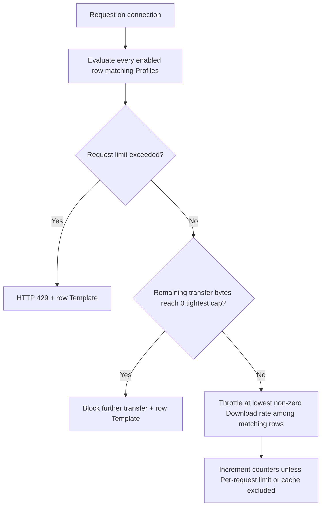

## Overview

The `Limits` section allows administrators to constrain bandwidth, connection counts, and data transfer sizes on a per-profile basis.

It shares bandwidth fairly and stops any single user or profile from consuming too much capacity. Unlike Access restrictions (first-match-wins) and System configuration's Compression and buffering policies (also first-match-wins), **Speed Limits is cumulative** — every enabled entry whose Profiles condition matches applies, not just the first.

## Core Mechanics (C++ Source Validation)

Token-bucket rate, quota counters, request cap enforcement.

- **Bandwidth Shaping**: SafeSquid utilizes a token-bucket mechanism. Connections are assigned to a specific `LimitGroup`. The traffic shaper enforces the `downloadrate` throttle globally across all connections in that group.
- **Quota Tracking**: Global and per-user transfer quotas (`maxdownloadbytes`, `maxuploadbytes`, `maxrequests`) are updated incrementally as payloads are flushed. Cached payloads (`CONNECTION_CACHING`) can be configured to bypass quota deductions (`LIMIT_CACHE`).
- **Enforcement**: If a connection violates `maxrequests`, the connection action is instantly set to block, serving the block template with a `LMS_TOO_MANY_REQUESTS` status and generating a `TCP_DENIED` log entry.

## Schema Fields

### Global Fields

- **Enabled (enabled)**: Toggles the entire Limits subsystem on or off.

### Rule-Based Fields (Per Connection Tuning)

- **Enabled (enabled)**: Toggles the specific rule.
- **Comment (comment)**: User description of the rule.
- **Profiles (profiles)**: The trigger condition. The rule applies if the connection has this tag. Blank matches every connection; a Profile written with a leading `!` matches connections that do not carry it.
- **Action (action)**: `Allow` or `Deny`. Verified on this build to have no runtime effect — see the note below.
- **Template (templ)**: Name of the block-page template shown when this entry matches. Blank uses `blocked`. Built-in examples: `maxbandwidth`, `maxrequests`.
- **Download transfer limit (maxdownloadbytes)**: Maximum bytes a client can download before being blocked, counted since the last counter reset (~10 s). `0` = no cap from this row for that direction.
- **Upload transfer limit (maxuploadbytes)**: Maximum bytes a client can upload before being blocked, counted since the last counter reset (~10 s). `0` = no cap from this row for that direction.
- **Request limit (maxrequests)**: Maximum number of HTTP requests allowed within the tracking window (~10 s). `0` = unlimited. Exceeded → HTTP 429.
- **Download rate (downloadrate)**: Bandwidth throttle (e.g., bytes per second) applied to downloads. `0` = no rate from this row. Lowest non-zero matching rate wins.
- **Adjust Transfer Limits (flags)**: Modifier flags for how limits are enforced or tracked.

## Troubleshooting

Check `/var/log/safesquid/native/safesquid.log` for limit enforcement messages. A client hitting a quota will typically receive a 429 with a specific limit-exceeded template.

## How SafeSquid processes the list

1. On each relevant request, every enabled row matching profiles is evaluated.
2. **Request limit** exceeded → HTTP 429 and the row Template block page, regardless of the row's **Action** field — see the note below.
3. **Download / upload transfer limits** — remaining bytes are the tightest cap among matching rows; when remaining reaches 0, further transfer on matching connections is blocked and the row's Template block page is shown (built-in example: `maxbandwidth`).
4. **Download rate** — lowest non-zero rate among matching rows wins for throttling.
5. **Adjust Transfer Limits** flags: Limit cache transfers (count cached responses), Per-request limit (do not accumulate row counters at connection end — each request gets full quota), Group limit (share download rate bucket across matching connections).
6. After connections complete, byte and request counters increment for matching rows (unless Per-request limit or cache exclusion applies); counters clear on the periodic reset.

<Note>
**Action has no runtime effect.** The console's own field help describes Action as enforced — set `Deny` and matching requests are blocked outright, set `Allow` and limits apply until a cap is reached — but a live behavioural test (a disposable profile tag, Action set to `Deny`, numeric caps set high enough to never trigger) showed the connection tagged and evaluated correctly, then proceeding past this section entirely rather than being blocked. Only the numeric caps (Download/Upload transfer limit, Request limit, Download rate) actually gate a connection; set `Action` to whichever value documents your intent, since either behaves identically.
</Note>

## Important entry fields

- **Profiles** — Limit to connections with these Access Profile tags. Typical tags: `RESTRICTED DOWNLOAD TRANSFER RATES`, `RESTRICTED UPLOAD TRANSFER RATES`.
- **Action** — Verified to have no runtime effect on this build; the console's own field help describes it as enforced, but only the numeric caps below actually block a connection. See the note above.
- **Template** — Block page shown when this entry matches. Blank uses `blocked`. This same field also covers download/upload transfer-limit overruns: the console names a `maxbandwidth` template for excessive bandwidth, paired with `maxrequests` for excessive requests — both are shown to the user through this field, not a separate default/bypass path.
- **Download / Upload transfer limit** — Maximum bytes counted against this row since last counter reset (~10 s). `0` = no cap from this row for that direction.
- **Request limit** — Maximum requests counted since last reset. `0` = unlimited. Exceeded → HTTP 429.
- **Download rate** — Throttle in bytes/sec. `0` = no rate from this row. Lowest non-zero matching rate wins.
- **Adjust Transfer Limits** — Limit cache transfers, Per-request limit, Group limit — see processing order above.

## Examples

Open **Configure → Restriction Policies → Speed Limits → Set limits**. Each row shows Enabled,
Comment, Profiles, Action, Download/Upload transfer limit, Request limit, Download rate, and
Adjust Transfer Limits.

<Frame caption="Speed Limits — Set limits rows">
  
</Frame>

<Tip>

### 1 — Guest download cap and throttle

- Profiles: `Guest`
- Download transfer limit: 50 MB, Download rate: 512000 bytes/sec

**Result:** Guest connections download at most ~500 KB/s and stop receiving data once 50 MB is consumed within the current counter window; other profiles without matching rows are unaffected.
</Tip>

<Tip>

### 2 — Request flood cap

- Request limit: **100**, Template: `too-many-requests`

**Result:** after 100 counted requests in the reset window, the next matching request gets HTTP 429 and the template block page.
</Tip>

<Tip>

### 3 — Per-request 5 MB (not shared window)

- Download transfer limit: 5 MB, Adjust Transfer Limits: **Per-request limit**

**Result:** each single request may transfer up to 5 MB; counters are not accumulated at connection end for this row, so the cap applies per request rather than shared across the ~10 s window.
</Tip>

<Tip>

### 4 — Two matching rows tighten together

- Row A: Download rate 1 MB/s
- Row B: Download rate 256 KB/s, same profiles

**Result:** both rows match; lowest non-zero rate (256 KB/s) is applied; if both set byte caps, the tightest remaining bytes win.
</Tip>

## How to verify

1. Assign a test profile and reproduce large download or many parallel requests.
2. Enable LIMITS in `LOG_LEVEL` for native `limits:` download/upload limit and rate lines.
3. Open **Reports → Detailed logs**; blocked transfers show `filter_name` for limits and reason such as `Max Requests` or upload limit text.
4. Confirm counter reset behaviour by waiting ~10 seconds and retrying after hitting a window cap.
5. If an entry seems to have no effect at all, check the section-wide **Enabled** switch first, then confirm the entry's **Profiles** actually matches the connection under test — and remember **Action** has no bearing on whether the entry is active.
