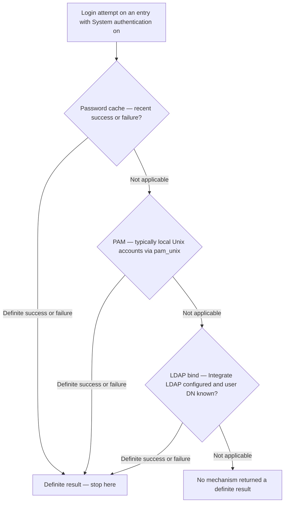

SafeSquid identifies users for logging, Access Profiles, and LDAP-based rules. Without authentication, many deployments still work by IP — but Detailed logs show anonymous users and group-based policy is harder.

<Note>
Configure authentication switches in **Access restrictions**. Configure the directory in **Integrate LDAP**. New users: finish [First configuration](/configuration/start_here/first_configuration) (IP allow) before adding auth.
</Note>

## Three mechanisms

- **Kerberos / SSO** — Global setting in Access restrictions. When enabled, the browser can sign in with Kerberos Single Sign-On — users do not type credentials in Access entries. Requires a valid keytab at `/usr/local/safesquid/security/HTTP.keytab` and correct domain setup.
- **System authentication** — Per-entry setting. The browser prompts for username and password; SafeSquid validates through PAM (`/etc/pam.d/safesquid`) and optionally LDAP. Use when Kerberos / SSO is off.
- **User name / Password (entry)** — Fixed credentials on an Access row when neither Kerberos / SSO nor System authentication is used for that entry. Fine for a lab admin account; avoid for large user populations.

## Which should I choose?

- **Active Directory domain, browsers joined** — prefer Kerberos / SSO
- **No SSO yet, local or LDAP passwords** — System authentication on Allow entries
- **Single test account** — entry User name / Password

## Kerberos / SSO

The Web UI shows **Kerberos / SSO** (internal tag `ntlm`).

- When enabled, SafeSquid offers Negotiate (GSSAPI/Kerberos) on authenticated connections.
- After success, the username comes from the Kerberos ticket and is logged in Detailed logs.
- When `SUBSCRIPTION_EXPIRED` is set, some modules (Application Signatures, SSqore) skip processing — see [Subscription](/configuration/infrastructure_and_access/subscription).
- If the keytab is missing at startup, Negotiate is not offered even when the UI setting is on.
{/* source: https://www.safesquid.com/md/auth.md */}
- **Silent failure, no error anywhere.** A missing or invalid keytab produces no error anywhere in the Web UI — the global switch simply has no practical effect. Clients fall through silently to whatever fallback the matching entry provides (System authentication, a fixed User name/Password), or an outright deny if the entry required identity and offers none.
- **Independent of licensing.** An expired subscription can stop licensed modules such as Application Signatures and cloud categorisation from processing a request further, but it does not itself affect Kerberos / SSO's ability to authenticate the user — these are independent checks.

<Tip>

### Example — turn on SSO after IP allow works

1. Confirm clients already work with an IP-based Allow entry.
2. Install and verify `HTTP.keytab`; restart SafeSquid if needed.
3. Enable **Kerberos / SSO** globally in Access restrictions.
4. Browse again; Detailed logs should show the domain username instead of anonymous.
</Tip>

## System authentication

Enable **System authentication** on an Access Restrictions entry (internal tag `pamauth`). For each login attempt SafeSquid tries, in order:

1. Password cache (recent successful or failed attempts)
2. PAM — typically local Unix accounts via `pam_unix`
3. LDAP bind — when Integrate LDAP is configured and the user DN is known

Cache size and expiry: `PASSWORD_CACHE_SIZE` and `PASSWORD_CACHE_EXPIRE_TIME` in `startup.ini`. View entries under **Reports → Password Cache**.

The order is fixed and evaluation stops at the first **definite** result. A definite *failure*
ends the chain — only a "not applicable" outcome, such as no LDAP configured, falls through to
the next mechanism.

{/* source: https://www.safesquid.com/md/auth.md */}
The three checks always run in that fixed order for a given challenge, and SafeSquid stops at the first one that returns a definite result. A definite failure at one step is **not** passed through to the next step — only a "not applicable" result (for example, no LDAP configured) moves on. While System authentication is on for an entry, that entry's own **Password** field is never read at all — **User name** becomes purely a regular-expression filter restricting *who may use this entry*, not a password check.

A stale cached *failure* keeps blocking an already-corrected login until it naturally expires — clearing **Reports → Password Cache** is the standard first step after fixing a password or a directory problem.

<Tip>

### Example — PAM login for the office range

- Allow entry: IP `192.168.10.0-192.168.10.255` (hyphen range, not CIDR)
- **System authentication** — on
- **User name** — blank (any PAM user) or a regex of allowed names
- **Password** — leave blank so PAM checks the secret

**Result:** browser shows a proxy login; success populates username in logs and policies.
</Tip>

## Entry username and password

- **Kerberos / SSO off, System authentication off** — set User name and Password on the entry; the challenge must match exactly.
- **System authentication on** — list allowed usernames (regex allowed); leave Password blank so PAM or LDAP checks the secret.
- **Kerberos / SSO on** — leave credentials blank on entries; the browser handles sign-in.

## Integrate LDAP

1. Add and enable at least one **LDAP servers** entry.
2. Confirm users and groups in **LDAP Entries**.
3. Use **LDAP Profiles** on Access Restrictions or other policy rows.

LDAP matches directory users and groups to rules, and acts as an authenticator after PAM when System authentication is enabled.

{/* source: https://www.safesquid.com/md/auth.md */}
A successful LDAP bind proves the password only — it says nothing on its own about which Access entry or which Access Profile then applies. That still depends on the User-Groups and LDAP Profiles matching Access restrictions performs separately.

<Tip>

### Example — allow only the “ProxyUsers” LDAP group

- Default Access Policy: Deny
- Allow entry: LDAP Profiles match your ProxyUsers profile, System authentication or Kerberos as appropriate

**Result:** only directory members of that group get through, even if they are on the office IP range.
</Tip>

## When is a login prompt shown?

SafeSquid challenges the browser when the matching Access entry has:

- Kerberos / SSO enabled globally and Negotiate has not succeeded yet, or
- System authentication enabled, or
- User name filled in on the entry.

If the entry matches only by IP or interface and none of the above apply, the connection may proceed without a prompt.

{/* source: https://www.safesquid.com/md/auth.md */}
The prompt itself is the browser's own native credential dialog, not a page SafeSquid renders.

## Username without a prompt

SafeSquid can assign a username when:

- Kerberos / SSO succeeds
- An IP-to-user map applies (for example VPN clients)
- The client already sent matching Basic credentials for a fixed User name / Password entry

The username appears in Detailed logs; **Add to User-Groups** on the Access entry feeds downstream policies.

## Where authentication runs

Authentication runs early in the pipeline (after Time Profiler and Request Types, before Speed Limits and content filters). Until it completes, SafeSquid may reply with HTTP 407 (proxy) or 401 with `Proxy-Authenticate` or `WWW-Authenticate`. After success, Access rights, Bypass, and User Groups from the matching entry are applied.

{/* source: https://www.safesquid.com/md/auth.md */}
Once identity is known, Access restrictions re-walks the same Allow/Deny list with that identity now available — this is the only reason an entry that tests only **LDAP Profiles** can ever match; on the first, identity-less pass it has nothing to test.

## Common problems

- **Repeated login prompts** — Check Kerberos / SSO, SPN, keytab, and clock skew. Clear Password Cache.
- **Valid user denied** — Confirm Allow list match, LDAP Profiles, Interface, and IP. In Detailed logs look for access-related `filter_name`. Also confirm a broader entry above it in the list isn't matching first — see [Access restrictions](/configuration/application_setup/access_restrictions)'s first-match-wins rule.
- **PAM failures** — Review `/etc/pam.d/safesquid`. Native log lines start with `pam:`.
- **LDAP failures** — Enable LDAP in LOG\_LEVEL. Verify Integrate LDAP and LDAP Entries.
{/* source: https://www.safesquid.com/md/auth.md */}
- **PAM keeps failing for a known-good desktop account.** A valid desktop account is not automatically a valid PAM account on this appliance — confirm the account is actually usable for a login on the appliance itself.
- **LDAP login fails even though PAM succeeds.** A missing LDAP directory sync is indistinguishable from a bad password from the browser's point of view — check the user actually appears under LDAP Entries before assuming the password is wrong.

{/* source: https://www.safesquid.com/md/auth.md */}
## Verify a successful login

Check **Reports → Password Cache** immediately after a successful login — a fresh entry there confirms the cache step is populating correctly.

## See also

- [First configuration](/configuration/start_here/first_configuration)
- [Access restrictions](/configuration/application_setup/access_restrictions)
- [Logging and troubleshooting](/configuration/start_here/logging)
- [Integrate LDAP](/configuration/application_setup/integrate_ldap)
- [Access Profiles](/configuration/restriction_policies/access_profiles)
